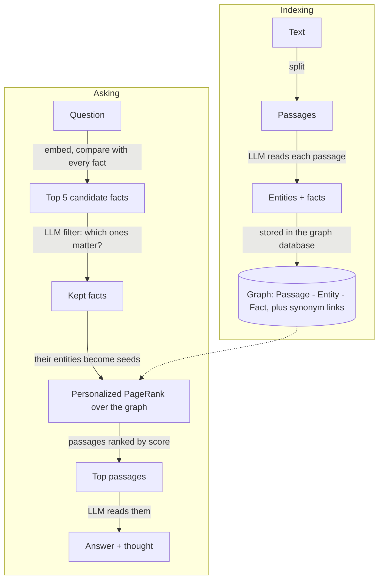

# A Hip Hypno-HippoRAG Implementation


hippo (aka hypno-hipporag) is a memory system you can run on your own machine. You give it text (notes, documents, a whole git repository), it builds a small knowledge graph out of the facts in that text, and later you ask it questions in plain English. It answers from what it remembers and shows you *why*: which facts it matched, which parts of the graph lit up, and which passages it read. It is a portable implementation of [HippoRAG](https://github.com/OSU-NLP-Group/HippoRAG) (HippoRAG 2) that runs on one machine: an embedded graph database ([LadybugDB](https://ladybugdb.com), one file under `data/`), Ollama for the models, and a small web UI on top. It also speaks MCP, so Claude Code, Claude Desktop or Cursor can use it as a tool.

## Run it

You need Python 3.11+ and [Ollama](https://ollama.com) running on your machine. There is no database to install: the graph lives in `data/hippo.lbug`.

```bash
git clone https://github.com/MattMakes/hippo.git
cd hippo
python -m venv .venv && source .venv/bin/activate
pip install -e .
hippo serve
```

Prefer containers? `./hippo up` does the same with Docker (and starts an Ollama container if your machine has none); see "Run in Docker" below. If you have [just](https://just.systems), `just` lists one recipe per way of running hippo: `just ladybug` and `just neo4j` in Docker, `just dev` and `just dev-neo4j` without it (see [Choosing a backend](#choosing-a-backend)).

Then:

1. Open http://localhost:8000.
2. Click **Load the sample** on the Library page. It indexes a tiny made-up company guide (`samples/acme_robotics.md`). The first time, hippo also downloads the two models it needs (`qwen3:8b` and `nomic-embed-text`, about 6 GB); the header shows the progress.
3. Go to **Ask** and type: *Who designed the Orion arm?*

The CLI works alongside the server: `hippo sources`, `hippo ask "Where is Boulder?"`, `hippo index notes.md`, `hippo settings`, `hippo users`, `hippo user add ...`. The database file belongs to one process at a time, so while `hippo serve` is running these commands talk to it over its JSON API instead of opening the file themselves. Once users exist that server wants to know who you are: put your token (Account page) in `HIPPO_TOKEN`, in `.env` or your shell. Your whole memory is that one file: copy it to back it up (with hippo stopped, so the write-ahead log `hippo.lbug.wal` has been folded in), delete it to start over. The empty `hippo.lbug.lock` next to it is how a second hippo notices the file is in use.

Everything listens on this machine only: `hippo serve` binds port 8000 (the UI, API and MCP) to `127.0.0.1`. hippo has no login and Ollama has no password, so if you want to open the UI from another computer, put a proxy that asks for a password in front of it, then set `HIPPO_HOST=0.0.0.0` (or `HIPPO_BIND` under compose) and `HIPPO_ALLOWED_HOSTS` in `.env`.

### Run in Docker

You need Docker (Desktop is fine). If you already run Ollama on your machine, hippo will use it; if not, it starts one in a container.

```bash
./hippo up          # or: just ladybug
```

The launcher prints which graph store it is starting. Other launcher commands: `./hippo down`, `./hippo logs`, `./hippo pull-models`, `./hippo test`, `./hippo ps`. Anything else is passed to the CLI inside the container, e.g. `./hippo sources` or `./hippo ask "Where is Boulder?"`. The graph file is in `./data` on your machine, bind-mounted into the container.

### Choosing a backend

hippo can keep its graph in one of two places. Both hold exactly the same graph, every store method behaves the same, and the same test suite passes on both (and on the in-memory fake), so nothing above the store knows or cares which one is in use. The choice is operational.

| | LadybugDB (default, `HIPPO_STORE=ladybug`) | Neo4j (`HIPPO_STORE=neo4j`) |
| --- | --- | --- |
| What it is | An embedded database in one file, `data/hippo.lbug`, opened inside the hippo process | A separate server, in Docker or installed yourself |
| Install | Nothing extra; `pip install -e .` brings the driver | `pip install -e ".[neo4j]"` plus a Neo4j 5, or the Docker profile |
| Start | `hippo serve`, `just dev`, `./hippo up`, `just ladybug` | `just neo4j` (Docker), or `just neo4j-db` then `just dev-neo4j` |
| Processes | One at a time may hold the file. While `hippo serve` runs, the CLI talks to it over the API; `hippo mcp` over stdio only works with the server stopped | Any number. `hippo serve`, `hippo mcp` and the CLI can all run at once |
| Looking at the graph by hand | The Graph page (3D, searchable, filterable) | The Graph page, plus the Neo4j Browser at http://localhost:7474 with ad hoc Cypher |
| Uniqueness of usernames and tokens | Checked by the store in Python (the database enforces only primary keys) | Database constraints |
| Entity name search | Scans entity names; fine into the tens of thousands of entities | A text index |
| On disk | `hippo.lbug`, plus `hippo.lbug.wal` while running (folded in on a clean stop) and an empty `hippo.lbug.lock` | The `neo4j_data` Docker volume, or your server's data directory |
| Back up | Stop hippo, copy `hippo.lbug` | Neo4j's own tools, or copy the volume |
| Memory | Tens of megabytes, in-process | A JVM; compose gives it 1.5 GB |
| Version pin | `real_ladybug` is pinned to 0.15.x: the store works around two quirks of that binding, described at the top of `src/hippo/store/ladybug.py`; check them before moving on | Any Neo4j 5 driver |

Two things are the same on both sides and worth knowing: a memory built in one backend is not moved to the other (switching `HIPPO_STORE` starts you with an empty graph in the new store), and the graph shape is identical except that LadybugDB has no `HAS_ROLE` edge; users point at their role by id, and nothing outside the store package reads that edge.

To use Neo4j, set `HIPPO_STORE=neo4j` in `.env` (or run `just neo4j`, which sets it for that start). Without Docker, point `NEO4J_URI` / `NEO4J_USER` / `NEO4J_PASSWORD` at your server. With Docker, the launcher starts a Neo4j container, writes a random `NEO4J_PASSWORD` into `.env` on the first run and prints it.

Everything listens on this machine only: port 8000 (the UI, API and MCP) and, under compose, 11434 (Ollama) and 7474/7687 (Neo4j, if used) are bound to `127.0.0.1`. hippo is open until you create the first user (see [Users and roles](#users-and-roles)) and Ollama has no password, so if you want to open the UI from another computer, create users first, put a proxy that speaks HTTPS in front of it, then set `HIPPO_HOST=0.0.0.0` (or `HIPPO_BIND` under compose) and `HIPPO_ALLOWED_HOSTS` in `.env`.

## A tour

| Page | URL | What it is for |
| --- | --- | --- |
| Library | `/` | Everything hippo remembers. Add a file, a zip, pasted text or a git URL; watch indexing progress; delete sources. |
| Source | `/sources/{id}` | One source: its passages and the entities and facts the model pulled out of each. For a repository, what the parser found, and an "In the code graph" panel under each symbol passage: its signature, relations, tests and commits. "Make sample questions" writes an evaluation set about it. |
| Ask | `/ask` | Type a question, get the answer, the model's reasoning, the top passages, the facts it kept and the seed entities. Paste a stack trace or an identifier and a **Code graph** card shows the relations behind the answer, separating what the question named from what similarity also reached. "Analyze this question" goes deeper. |
| Graph | `/graph` | The whole memory you can see as a 3D picture. Search names, filter by source or kind — symbols, data objects and commits included — colour by tier, kind, source or **subsystem**, then type a question and watch activation spread to the passages it picks. Click a symbol for its signature, callers, callees, tests and commits. Admins can view it as any tier below them. |
| Users | `/users` | The access ladder: roles top to bottom with what each tier sees, the users, and the role editor. See [Users and roles](#users-and-roles). |
| Account | `/account` | Who you are, what your role may do, your API/MCP token, change password. |
| Evals | `/evals` | Question sets (yours or generated) and the history of every run: accuracy, exact match, F1, recall. |
| Set | `/evals/sets/{id}` | The questions of one set (add, delete), run it, see past runs. |
| Run | `/evals/runs/{id}` | One run: summary cards and a per-question table (answer, verdict, metrics, latency). Every row links to its analysis. |
| Analyze | `/analyze/{result_id}`, or the "Analyze this question" link on any answer | The deep dive: candidate facts, the filter's reply, seeds, a picture of the graph, ranked passages with a one-sentence "why", and a panel to tweak settings and re-run the search without touching anything. For a code question it also shows which symbols were seeded and why, and the relations it walked. |
| Changesets | `/changesets` | Edits you saved from the analyze page (setting changes, entity boosts, edge weights, synonyms). Apply or delete them. |
| Settings | `/settings` | Ollama and graph store status, model downloads, the retrieval knobs with one-line explanations. |

There is also a JSON API under `/api` (docs at `/api/docs`) and a CLI:
`hippo serve | mcp | pull-models | index <path-or-git-url> | ask "<question>" | sources | settings | users | user add|token|role|remove`,
plus four commands over an indexed repository: `hippo path A B`, `hippo blast SYMBOL`, `hippo raises SYMBOL EXCEPTION`, `hippo history SYMBOL`.

## Users and roles

hippo starts **open**: until the first user exists, anyone who reaches the port sees everything, exactly as before. Create a user (Users page, or `./hippo user add alice`) and the door closes: every page, `/api` call and MCP call then needs a sign-in (username and password in the browser, or `Authorization: Bearer <token>` for scripts and MCP clients; each user's token is on their Account page). The first user is always the top role, and the browser that created it is signed in as them.

Access is a **ladder** of roles ordered by rank. The five seeded roles:

| Role | Rank | Sees | May |
| --- | --- | --- | --- |
| Arch admin | 40 | everything | everything, including roles and other admins |
| Regional admin | 30 | its tier and below | manage users below it, add and manage sources, tune the graph (settings, changesets), run evals |
| Local admin | 20 | its tier and below | manage users below it, add and manage sources, run evals |
| Local assistant | 10 | its tier and below | add sources |
| Individual | 0 | what is open to everyone, plus their own | add sources |

Roles are editable on the Users page: rename them, move them up or down the ladder, change what they may do, add new tiers between existing ones (ranks are spaced by ten for that), delete unused ones.

**What "sees" means.** Every source names the lowest role that may see it ("Local admin and above", or "Everyone"). A user sees a source when their rank is at least the source's, or when they added it. Passages follow their source; an entity or fact is visible when at least one visible passage mentions or states it. That rule is applied in two places, and both must agree:

* in Cypher, on every store read that returns sources, passages, entities or facts (a hidden node can never come back from the database), and
* in memory, on the graph the search runs on: before a question is asked, the graph is cut down to the caller's visible nodes, so Personalized PageRank cannot spread activation *through* a hidden passage, let alone rank it.

When you add a source you pick who may see it (your own tier by default; you cannot restrict a source to a tier above your own). Sources from before there were users are open to everyone until you change them in the Library. The Users page shows, for every tier, how many sources and passages it can see, and the Graph page can be viewed "as" any tier below yours to check.

## How it works, in plain words

HippoRAG borrows an idea from how the brain is thought to store memories:

* The **neocortex** holds the raw experiences. For hippo that is the text passages you upload.
* The **hippocampus** holds a light index of those experiences: the names of things and how they relate. For hippo that is a graph of entities and facts (triples like `["Orion arm", "was designed by", "Marcus Lee"]`).
* Remembering is **spreading activation**: you think of a few things and activation flows along the links to related memories. For hippo that is Personalized PageRank started from the entities in your question.

Indexing (once per source) and asking (every question) look like this:



Step by step:

1. **Index.** Text is cut into passages of about 1500 characters. For each passage the LLM lists the named entities, then writes facts as `[subject, predicate, object]` triples. Passages, entities and facts become nodes in the graph; a passage is linked to the entities it mentions, and two entities are linked when a fact joins them. Entity names that mean the same thing (by embedding similarity) get a synonym link, e.g. `usa` ~ `united states`.
2. **Question to facts.** Your question is embedded and compared with every fact. The five most similar facts are candidates.
3. **LLM filter.** The LLM looks at those candidates and keeps only the ones that really help answer the question (the paper calls this recognition memory). If it keeps none, hippo falls back to plain embedding search.
4. **PPR.** The entities of the kept facts become seed nodes. Each seed's weight is the fact's similarity score, divided by how many passages mention that entity (a name that appears everywhere is a weak clue). Passages also get a tiny seed weight from their own similarity to the question. Personalized PageRank spreads that activation across the graph.
5. **Passages.** Passages are ranked by their PageRank score.
6. **Answer.** The LLM reads the top five and answers after a short "Thought:".

Every step is recorded in a trace, which is what the Analyze page shows.

## Code

Give hippo a git repository or a zip of one and it does something different from the six steps above. Prose gets its facts from the language model; **code gets its facts from a parser**, because a parser already knows what a function calls and a language model only guesses. Prose sources are untouched by every word of this section: without a code graph the chunker, the indexer and the search behave exactly as they always have.

**Two languages, plus the SQL beside them.** Python (`.py`, `.pyi`) and TypeScript/JavaScript (`.ts`, `.tsx`, `.js`, `.jsx`, `.mjs`, `.cjs`), parsed with tree-sitter, plus `.sql` files. Every other language keeps today's behaviour — line windows read by the model — and gets no code edges. That is "unsupported rather than half-supported": a Go file in a Python repo is still indexed and still searchable, it just has no call graph.

**One passage per symbol.** Instead of 1500-character windows that cut a function in half, each module header, class header, function and method becomes its own passage, titled `path :: module.qualname (lines a-b)` — for example `pyapp/orders.py :: pyapp.orders.OrderService.place (lines 16-23)`. A body too long for one passage is split at its own top-level statements into `(part N)`, never mid-expression.

**The model never reads a function body.** It sees a symbol's docstring or doc-comment when that is at least 80 characters long, README and markdown, and commit messages. Never bodies, never DDL. Extracting facts costs two model calls per passage at index time, so this is most of the saving: in a repository only the documented symbols cost anything. Measured on hippo's own repository: 3,789 passages, of which 1,514 need a model call and 2,275 skip it entirely.

**Budget real time for a real repository.** Those 1,514 calls are the cost, and a local model is not fast: about 16-21 seconds per passage measured here with `HIPPO_OPENIE_WORKERS=1` on a busy machine, which projects to roughly seven hours for one pass over hippo itself. That is expected, not a fault — indexing is once per source, and everything after it is fast. Two knobs shorten it: `HIPPO_OPENIE_WORKERS` (how many calls hippo makes at once) and Ollama's own `OLLAMA_NUM_PARALLEL` (how many it will actually run at once). Raising the first past the second buys nothing. If you are pointing hippo at a large monorepo for the first time, start it and go and do something else.

**What the parser writes.** Two new kinds of node beside the entities:

* **Symbols** — modules, classes, functions and methods, with their path, line range, signature, docstring, and whether they are a test.
* **Data objects** — the tables, columns, collections, graph labels and relationship types the code actually talks to, read out of SQL, MongoDB and Cypher string literals *inside the repository's own files* and out of its `.sql` files.

and ten kinds of edge between them, each carrying a confidence (`omega`, 0 to 1) and the rule that produced it (its *provenance*):

| Edge | Means | Confidence |
| --- | --- | --- |
| `CONTAINS` | module holds this class, class holds this method, table holds this column | 1.00 |
| `IMPORTS` | direct path / through a re-export / a wildcard import | 0.95 / 0.90 / 0.60 |
| `INVOKES` | calls, resolved in the same file / through an import or a base class / by a unique bare name | 1.00 / 0.90 / 0.50 |
| `INHERITS`, `OVERRIDES` | subclass, and a method that shadows its base's | 0.90 |
| `RAISES`, `CATCHES` | raises or catches an exception class defined in this repository | 0.90 |
| `TESTED_BY` | a test imports it / names it in its file name / mentions it | 0.85 / 0.75 / 0.60 |
| `READS`, `WRITES` | uses a table, collection or label, from a parsed literal / a bare identifier | 0.85 / 0.60 |

Plus the edges that tie the code graph to the prose one: `DEFINED_IN` (a symbol to the passage that defines it), `REFERS_TO` (a README or commit passage back to a symbol it names), and synonym links between a prose entity and a symbol, so asking about "the order service" reaches `OrderService`.

**A call it cannot justify produces no edge.** Not a guess with a low score — nothing. A call into the standard library, a third-party package, or a name the resolver cannot bind is left out, and only *counted*, per file, so you can see how big the gap is (`meta["code"]["unresolved_calls"]` on the source, and `unresolved_calls_total` beside it).

**What you see.** The Source page's `code` meta records what the parser found: `symbols`, `languages` (which of the three it actually parsed), `data_objects`, `edges` and `edges_by_kind`, `files_parsed`, `files_skipped` (by reason: too big, unsupported, parse error), `unresolved_calls` and `unresolved_calls_total`, `truncated`, and — for a repository — `commits`, `modifies` and `history_skipped`. `GET /api/status` has a `code` card summing the same things across the whole memory — `symbols`, `data_objects`, `code_edges`, `commits`, `languages`, `unresolved_calls`, `history_skipped` — beside the entity and fact counts it always reported. Every value is zero or empty until you index a repository.

**Safety rails.** Extraction stops at 5,000 files or 50,000 symbols per source (`truncated` then says so), and a file over 512 KiB keeps its line windows rather than being parsed. These are constants, not knobs — the same class as the 20,000-passage ceiling. The knobs are on the Settings page and in [the table below](#settings-you-can-change-on-the-settings-page): eleven of them, all named `code_*`, and **none of them is an environment variable**.

### Asking about code

Everything above is indexing. The other half is what happens when your question *contains* code.

**The question is read for names before it is embedded.** A question can carry an identifier, a pasted stack trace, a fenced snippet or a diff hunk. hippo pulls the code nodes out of all four and starts the graph search from them directly, instead of hoping a fact happened to mention them:

* an identifier — `OrderService.place`, a backticked `` `place` ``, or a bare word *written as code* (`PascalCase`, `camelCase`, `snake_case`, `ALL_CAPS`);
* a **stack trace** — `File "pyapp/orders.py", line 18, in place`, `at fn (path:12:4)`, or a plain `path.py:18`. Frames are resolved by path and by the line falling inside a symbol's range, and they get lighter the further out from the innermost one they are;
* the trailing `SomeError:` line of a traceback, matched against the exception classes in the repository;
* a **fenced block**, tokenised the same way, and a **unified diff**, whose hunks map to the symbols whose lines they touch.

A word that matches more than ten symbols seeds nothing at all and is recorded as ambiguous — better than silently picking eight arbitrary ones. A word that matches three splits its weight three ways.

**A long paste no longer drowns the question.** A question with a traceback in it is split: the prose half is what gets embedded and what the fact filter reads, so forty lines of frames cannot swamp one query vector; the model still receives the whole question when it writes the answer, and names are read from both halves. A one-line question with no fenced block is not split at all and takes exactly the path it always did.

**Naming a function brings its passage to where the model will read it,** and makes that symbol the most activated node in the graph. A stack trace still seeds the search even when no fact survives the filter — which is the case the old pipeline could only answer by falling back to plain similarity search.

**The answer gets a Code graph block.** When the question named code, the model is shown one extra passage of typed relations, in a fixed grammar under a one-line legend:

```
pyapp.orders.OrderService.place -[INVOKES 1.00 same_file]-> pyapp.billing.total
pyapp.orders.OrderService.save -[WRITES 0.85 sql_literal]-> orders
Tests: test_place
Subsystems: pyapp.orders.OrderService: pyapp.orders.OrderService.place, pyapp.orders.OrderService.save
```

It is cut at `code_triples_chars` on a line boundary. It is not a real passage: it never appears in the answer's list of sources.

**And one more pass by the model, when code was named.** `code_select` (on by default) shows the model the passages around the ones it is about to read — a wider window on purpose, so that dropping one promotes a passage the model never saw into its place rather than just shuffling the same list. A dropped passage sinks below the rest but is never removed, and a failed or unparsable reply keeps everything. It only runs when the question *named* code, and the rule for that is about how you wrote the word, not about what the memory holds: a question of ordinary English words costs nothing extra even on a repository.

Every one of these is off on a memory with no code in it, and can be switched off on one that has: see [the settings table](#settings-you-can-change-on-the-settings-page). `docs/FIDELITY.md` adaptation 15 states the guarantee precisely and says which test checks it.

### Asking the graph directly

Some questions do not want an answer written for them — they want a fact a call graph knows exactly. Four tools walk the graph and never call the model, so they are fast and give the same answer every time. Each is a CLI command, an MCP tool and a JSON endpoint:

| Question | CLI | MCP tool |
| --- | --- | --- |
| How does this end up calling that? | `hippo path A B` | `hippo_explain_path` |
| What could a change here break? | `hippo blast SYMBOL [--depth N]` | `hippo_blast_radius` |
| Where can this error come from? | `hippo raises SYMBOL EXCEPTION` | `hippo_exception_path` |
| Which commits touched this? | `hippo history SYMBOL [--limit N]` | `hippo_history` |

```console
$ hippo path OrderService.place billing.total
How pyapp.orders.OrderService.place reaches pyapp.billing.total:
pyapp.orders.OrderService.place -[INVOKES 0.90 via_import]-> pyapp.billing.total
```

The `0.90` is how sure the resolver is and `via_import` is the rule that earned it — here, `place` calls `total` through a name it imported.

Name a symbol however you like — fully qualified (`pyapp.orders.OrderService.place`), module-relative (`OrderService.place`) or bare (`place`) — as long as it picks out one. If it does not, nothing is guessed: you get the candidates and an exit code of 2.

```console
$ hippo blast log
error: 'log' could mean any of: pyapp.orders.OrderService.log, pyapp.store.Base.log, tsapp.models.base.Base.log
  pyapp.orders.OrderService.log
  pyapp.store.Base.log
  tsapp.models.base.Base.log
```

Over HTTP the same four live under `/api/code` (plus `/api/code/symbols?q=` to search names), where an unknown name is a 404, an ambiguous one a 409 carrying `candidates`, and a blank argument a 400. Every answer also carries `lines`: the same thing already rendered for a person to read. `docs/MCP.md` has a request and response for each.

**And the answer itself says more now.** `hippo_search`, `hippo_ask` and the JSON `/api/search` and `/api/ask` all gained the same five keys — `seed_symbols`, `paths`, `tests`, `history` and `code_graph` — from one shared helper, so a client moving between them sees the same shape. They are always present, so nothing has to branch on whether the memory holds code, and empty unless the question named some.

### Git history

Add a source as a **git repository** (not a zip, not a folder) and hippo also reads its history: the last 200 first-parent commits by default, as `code_history_depth` says.

Each commit becomes a node and a passage — titled `commit c9be063124: Total, invoice and log in place`, holding the message and a `Touched:` line naming the symbols it changed. The model reads the message only — never the diff, and never the `Touched:` line, whose names hippo wrote itself. Commits are chained newest to oldest, and each is linked to the symbols it actually touched, so `hippo history OrderService.place` answers "which commits changed this function?" exactly rather than approximately.

That precision has a cost worth knowing about. A commit's diff is intersected with the symbol ranges **as they were at that commit**, not as they are now — which means re-parsing each touched file at each commit. A function that has since moved down the file is still credited correctly. Two budgets keep that bounded: `code_git_timeout_s` per commit and `code_history_total_s` for the whole pass. Whatever was read is kept, and the number of commits a budget cost you shows up as `history_skipped` on the source and in the status card. If history cannot be read at all — no git, no repository, a bare checkout — that is a logged warning and an empty history, never a failed index.

One thing to plan for: the depth is fixed when the repository is **cloned**, not when it is read. hippo clones `code_history_depth + 1` commits, because a shallow clone's oldest commit has no parent to diff against. Raising the setting later only takes effect the next time that source is indexed.

### Known limitations

* **A big repository can hit a wall it used to fit through.** One passage per symbol makes about 2.4-3× as many passages as 1500-character line windows did for the same code, and a source over 20,000 passages is refused outright, not truncated. Measured: hippo's own `src/hippo` goes from ~335 windows to 807 passages (4% of the ceiling) and django from ~3,946 to 12,317 (62%), but pandas is 33,975 symbols and is **rejected**, where its line windows fitted before. If a repository used to index and no longer does, that is why; index a subdirectory instead.
* **Reload cost grows with the graph.** Every graph-version bump — each index job, each applied changeset — reloads every stored vector. One passage *and* one name vector per symbol doubles that count for code: at the 20,000-passage ceiling it is 40,000 vectors, about 117 MiB re-read on each bump.
* **Boosts and tuned weights do not survive a re-index.** Re-indexing a source deletes its code nodes and writes them fresh, so a boost or a hand-set edge weight on a symbol is gone. (Prose has its own version of this: an entity that loses its last mention is swept, taking its synonym and tuned edges with it. Neither is new here.)
* **Cypher and SQL are read as literals only.** Indexing hippo itself finds `Settings`, `Passage` and `Source` in `MATCH` and `MERGE` string literals; it does not find tables declared by an f-string-interpolated `CREATE NODE TABLE {name}(...)`. "The databases our code talks to" means the literals in the code, not schema introspection.
* **Writing a very large graph is slow.** Inserting 200,000 relationships was measured at 537 s on one machine, against 13.6 s for 100,000 — the cost of looking up both endpoints is sharply scale-sensitive. Writes go in batches of 5,000. A repository big enough to feel this hits the 20,000-passage wall first.
* **History stops at renames.** A commit is attributed to a symbol by intersecting its diff with the symbol's line ranges *at that commit*, so line drift is not a source of error. But rename detection is off, so a symbol's history before it was renamed or moved to another file is not attributed to it. Commits that exceed `code_git_timeout_s`, or that fall outside the whole-pass `code_history_total_s`, are skipped and counted in `history_skipped`.
* **A hard question can run out of answer budget.** The model gets 1024 tokens to think and answer in. On a question it cannot settle, a small local model can spend all of them reasoning and never write the `Answer:` line — and then what you see is its raw thinking, cut off mid-sentence, presented as the answer. It looks like broken output and is really the model failing to conclude. Asking something narrower usually fixes it.
* **Symbol seeds are not badged on the Graph page.** Type a question there and the light-up animation heats the symbols it seeded like any other activated node, but only *entity* seeds get the seed badge — the endpoint behind it reports entity seeds alone. The symbols are all in the Analyze page's seed table; the badge is phase 2.
* **You can see how many calls did not resolve, not which.** `unresolved_calls` is a count per file. The leaderboard that would name them — so you could write a binding rule for the ones that matter — is phase 2.
* **The tests cannot show the noise improvement.** The fake model the test suite uses barely produces triples from code at all, so the tests prove the *number* of model calls fell, not that the facts got cleaner. That one you have to see on a real model.

## Evaluate and dig in

* **Question sets.** On a source page click *Make sample questions*: hippo writes single-passage questions and two-passage ("multi-hop") questions whose answers need facts from both. For a repository it also writes **code** questions ("What does X call?") and **commit** questions ("What changed in the commit ...?"), both derived from the graph rather than from the model, so their expected answers are facts and not guesses. Or write your own on the Evals page, one `question | answer` per line.
* **Runs.** *Run this set* asks every question, has the LLM judge the answer against the expected one (correct / partially correct / incorrect), and computes exact match, F1 and recall of the gold passages. Runs are history: they are never modified, so you can compare before and after a change.
* **Analyze.** Open any result. You see what the search did, the graph around the question, and why each passage ranked where it did.
* **Simulate.** In the *Tweak & simulate* panel change a setting, force a fact in or out, boost an entity, or change an edge weight, and re-run the search on the spot. A diff table shows how passage ranks moved. Nothing is saved.
* **Was the code graph worth it?** A run can be repeated with code retrieval switched off — the four settings from [the table above](#settings-you-can-change-on-the-settings-page) at zero — and the two summaries compared. Two extra numbers come back on a code run: how often the question actually seeded a symbol, and, for commit questions, how much of what a commit really changed the search found.
* **Changesets.** If a simulation helped, save it as a changeset and apply it from the Changesets page. Setting changes, entity boosts and edge weights are applied to the real graph; fact in/out toggles are per-question and are not saved.

## Use it from Claude / Cursor (MCP)

hippo serves MCP at `http://localhost:8000/mcp` with nine tools. Five are about the memory as a whole —
`hippo_search`, `hippo_ask`, `hippo_remember`, `hippo_sources`, `hippo_whoami` — and four answer
structural questions about indexed source code: `hippo_explain_path`, `hippo_blast_radius`,
`hippo_exception_path`, `hippo_history`.

```bash
claude mcp add --transport http hippo http://localhost:8000/mcp
```

Once users exist, add your token: `claude mcp add --transport http hippo http://localhost:8000/mcp --header "Authorization: Bearer <token>"`. Every tool then works on the part of the memory you may see.

Claude Desktop and Cursor setups, the stdio alternative (`hippo mcp`) and example calls are in [docs/MCP.md](docs/MCP.md).

## Configuration

Everything is an environment variable (see `.env.example`; `docker compose` reads a `.env` file automatically). Defaults live in `src/hippo/config.py`.

| Variable | Default | Meaning |
| --- | --- | --- |
| `HIPPO_STORE` | `ladybug` | Where the graph lives: `ladybug` is an embedded LadybugDB file, `neo4j` a Neo4j server. |
| `HIPPO_DB_PATH` | *(empty)* | The LadybugDB file; empty means `<HIPPO_DATA_DIR>/hippo.lbug`. |
| `NEO4J_URI` | `bolt://localhost:7687` | (`HIPPO_STORE=neo4j`) Where Neo4j is (`bolt://neo4j:7687` inside compose). |
| `NEO4J_USER` | `neo4j` | (`HIPPO_STORE=neo4j`) Neo4j user. |
| `NEO4J_PASSWORD` | `hippo-password` | (`HIPPO_STORE=neo4j`) Neo4j password. `./hippo up` writes a random one to `.env` on the first run; Neo4j keeps the password it was created with. |
| `OLLAMA_URL` | `http://localhost:11434` | Where the models run. `./hippo up` sets this for you. |
| `HIPPO_LLM_MODEL` | `qwen3:8b` | The chat model: extracts facts, filters facts, answers, judges. |
| `HIPPO_EMBED_MODEL` | `nomic-embed-text` | The embedding model. Changing it means re-indexing everything. |
| `HIPPO_NUM_CTX` | `8192` | Context window asked of Ollama (qwen3's default 4k is too small). |
| `HIPPO_LLM_TIMEOUT` | `600` | Seconds to wait for one LLM reply. |
| `HIPPO_DATA_DIR` | `./data` | The graph file, uploaded files and cloned repos (`/app/data` in the container). |
| `HIPPO_MAX_UPLOAD_BYTES` | `50000000` | Biggest upload or pasted text (50 MB); bigger ones are refused. |
| `HIPPO_MAX_TEXT_CHARS` | `20000000` | Most text one source may turn into (20 M characters, about 13,000 passages); past that the source fails as "too large". Zips are also limited to 5,000 readable files and 50 MB unpacked. |
| `HIPPO_OPENIE_WORKERS` | `2` | Parallel LLM calls while extracting facts. |
| `HIPPO_CHUNK_SIZE` | `1500` | Passage size in characters. |
| `HIPPO_CHUNK_OVERLAP` | `150` | Overlap between neighbouring passages. |
| `HIPPO_HOST` | `127.0.0.1` | Address `hippo serve` listens on (this machine only; hippo is open until users exist). docker-compose sets `0.0.0.0` inside the container and publishes the port on `HIPPO_BIND`. |
| `HIPPO_PORT` | `8000` | Web server port. |
| `HIPPO_BIND` | `127.0.0.1` | (compose only) The address port 8000 is published on. `0.0.0.0` opens it to the network; do that only behind an authenticating proxy. |
| `HIPPO_ALLOWED_HOSTS` | *(empty)* | Extra host names or IPs the UI and `/mcp` answer to, comma-separated (`localhost`, `127.0.0.1` and `[::1]` always work). Other names are refused to stop websites you visit from reaching your memory; add your LAN name or IP here if you open hippo from another machine, or `*` to switch the check off. |
| `HIPPO_TOKEN` | *(empty)* | (`hippo mcp` only) The user token the stdio MCP server acts as, once users exist. |

### Settings you can change on the Settings page

These are **not** environment variables. They are stored in the graph itself and edited at `/settings`, or through `GET`/`PUT /api/settings`, so a change takes effect without a restart. The defaults are in `store/base.py` (`DEFAULT_SETTINGS`), and every value is range-checked on the way in (`SETTING_RULES`).

| Setting | Default | Meaning |
| --- | --- | --- |
| `linking_top_k` | 5 | How many facts we pull for a question, and how many entities we start the graph search from. |
| `passage_node_weight` | 0.05 | How much a passage's own similarity to the question counts as a starting point (0.05 = a whisper). |
| `damping` | 0.5 | How far activation travels along the graph: 0.5 stays close to the seeds; 0.9 wanders far. |
| `node_specificity` | on | Entities mentioned in many passages get a smaller starting weight (like IDF for search). |
| `synonymy_threshold` | 0.8 | Embedding similarity above which two names get linked as synonyms (used while indexing). |
| `retrieval_top_k` | 200 | How many passages a search returns and keeps in the trace. |
| `qa_top_k` | 5 | How many passages the model reads before answering. |

The code graph adds eleven more. All of them are inert on a memory with no code source, and setting the first four to `0 / 0 / 0 / off` makes a memory that *does* hold code rank a prose question exactly as if the code had never been indexed:

| Setting | Default | Range | Meaning |
| --- | --- | --- | --- |
| `code_structural_scale` | 1.0 | 0.0–3.0 | Multiplier on every code-touching edge weight; 0 = no code vertex reaches the graph search at all. Capped at 3.0 so a code edge can never outrank three facts. |
| `code_seed_weight` | 1.0 | 0.0–10.0 | Anchor seed mass; 0 = ignore symbols named in the question. |
| `code_dense_seeds` | 5 | 0–20 | Code passages similar to the question that also seed their symbol. |
| `code_select` | on | on/off | The extra keep/drop/expand pass by the model, when code seeds fired. |
| `code_theta` | 0.5 | 0.0–1.0 | Minimum confidence for the path tools and the answer block (never the graph search). |
| `code_triples_chars` | 1500 | 0–8000 | Size cap of the Code graph block shown to the model. |
| `code_community_boost` | 0.0 | 0.0–1.0 | Post-search score bonus for passages in a seed's subsystem. Off by default. |
| `code_expand_max` | 10 | 0–20 | Neighbours fetched per "expand", confidence 0.75 and above. |
| `code_history_depth` | 200 | 0–2000 | First-parent commits read per repo source; 0 disables history. |
| `code_git_timeout_s` | 10 | 1–120 | Per-commit `git show` budget; a timeout skips that commit. |
| `code_history_total_s` | 120 | 10–3600 | Whole-pass budget for reading history; stops early and keeps what it read. |

The last three are read once, while indexing, and never again by a search — so the Analyze page's simulate panel refuses them rather than showing a slider that cannot change a ranking.

## Development & tests

```bash
uv venv .venv && source .venv/bin/activate     # or: python -m venv .venv, or: just venv
pip install -e ".[dev]"
ruff check . && ruff format --check .          # just lint
pytest tests/unit -q                           # just test (LadybugDB), just test-fake, just test-neo4j, just test-all
```

The unit tests need no servers: by default the `store` fixture opens a real embedded LadybugDB in a temporary file for every test, and `tests/conftest.py` provides a rule-based `FakeOllama` that understands the "X <relation> Y." sentences of the sample corpus. The whole pipeline (index, search, answer, judge) runs in-process.

`HIPPO_TEST_STORE` picks the store the same tests run against: `ladybug` (the default), `fake` (the in-memory `FakeStore`, the quickest) or `neo4j` (a real Neo4j at `NEO4J_URI`, which is emptied before every test, so never point it at a memory you care about). CI runs all three: `.github/workflows/ci.yml` runs `ruff`, the unit tests on Python 3.11 and 3.12 with the LadybugDB and fake stores, and the same tests once more against a `neo4j:5.26-community` service container.

## Where the code lives

```
src/hippo/
  config.py         settings from environment variables
  ollama.py         the Ollama client (chat, JSON-constrained chat, embeddings, pulls)
  prompts.py        every prompt, with the JSON schema it expects back
  context.py        AppContext: config + store + ollama + jobs + the in-memory graph
  ask.py            search(ctx, q) -> Trace ; ask(ctx, q) -> (Trace, Answer)
  store/            all Cypher: sources, passages, entities, facts, evals, changesets (LadybugDB and Neo4j)
    code.py         the code graph's half of it: symbols, data objects, commits and their edges
  remote.py         the CLI's client for a running server (the database file is single-process)
  hipporag/         the algorithm: openie -> indexer -> graph_index (PPR) -> retriever -> answerer
    anchors.py      what a question says about code: identifiers, stack frames, exceptions, fences, diffs
    paths.py        deterministic walks over the code graph: call paths, blast radius, the answer block
  codegraph/        the parser: tree-sitter + sqlglot -> symbols, data objects and typed edges (no model, no store)
  ingest/           readers (txt, md, pdf, docx, epub, html, code), chunker, git repos, the indexing job
  evals/            metrics, the LLM judge, question generation, the run runner
  analysis/         explain a result, simulate changes, save/apply changesets
  web/              FastAPI app, routes, Jinja templates, static files
    routes/code.py  the /api/code endpoints: symbol search, call path, blast radius, exception path, history
  mcp_server.py     the nine MCP tools (HTTP at /mcp and stdio)
  cli.py            the `hippo` command
tests/
  fakes/            FakeStore, FakeOllama
  unit/             fast tests, on an embedded LadybugDB file by default (the fake and real Neo4j in CI too)
docs/CONTRACTS.md   the function signatures each package exposes
```

## Fidelity to HippoRAG

hippo follows the reference implementation step for step (same prompts, same defaults, same PPR call, same edge weights on prose) and adapts a few things for a small local model and a database instead of pickled files. The code graph is one of those adaptations, and its settings turn it off completely. The full list, with reasons, is in [docs/FIDELITY.md](docs/FIDELITY.md).

## Credits

The method and the prompts come from the HippoRAG authors at the OSU NLP group (Bernal Jiménez Gutiérrez, Yiheng Shu, Yu Su and colleagues):

* [HippoRAG: Neurobiologically Inspired Long-Term Memory for Large Language Models](https://arxiv.org/abs/2405.14831) (NeurIPS 2024)
* [From RAG to Memory: Non-Parametric Continual Learning for Large Language Models](https://arxiv.org/abs/2502.14802) (ICML 2025)

Code: https://github.com/OSU-NLP-Group/HippoRAG. hippo is MIT licensed.
