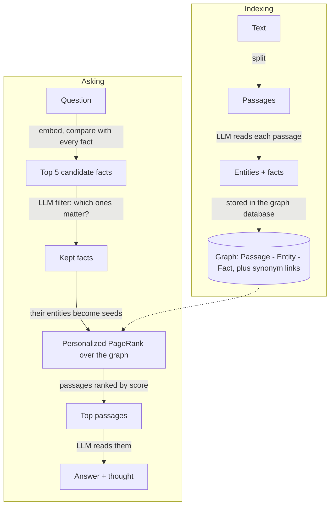

# hippo

hippo is a memory you can run on your own machine. You give it text (notes,
documents, a whole git repository), it builds a small knowledge graph out of
the facts in that text, and later you ask it questions in plain English. It
answers from what it remembers and shows you *why*: which facts it matched,
which parts of the graph lit up, and which passages it read. It is a portable
implementation of [HippoRAG](https://github.com/OSU-NLP-Group/HippoRAG)
(HippoRAG 2) that runs on one machine: an embedded graph database
([LadybugDB](https://ladybugdb.com), one file under `data/`), Ollama for the
models, and a small web UI on top. It also speaks MCP, so Claude Code, Claude
Desktop or Cursor can use it as a tool.

## Run it

You need Python 3.11+ and [Ollama](https://ollama.com) running on your
machine. There is no database to install: the graph lives in
`data/hippo.lbug`.

```bash
git clone https://github.com/MattMakes/hippo.git
cd hippo
python -m venv .venv && source .venv/bin/activate
pip install -e .
hippo serve
```

Prefer containers? `./hippo up` does the same with Docker (and starts an
Ollama container if your machine has none); see "Run in Docker" below. If you
have [just](https://just.systems), `just` lists one recipe per way of running
hippo: `just ladybug` and `just neo4j` in Docker, `just dev` and `just
dev-neo4j` without it (see [Choosing a backend](#choosing-a-backend)).

Then:

1. Open http://localhost:8000.
2. Click **Load the sample** on the Library page. It indexes a tiny made-up
   company guide (`samples/acme_robotics.md`). The first time, hippo also
   downloads the two models it needs (`qwen3:8b` and `nomic-embed-text`,
   about 6 GB); the header shows the progress.
3. Go to **Ask** and type: *Who designed the Orion arm?*

The CLI works alongside the server: `hippo sources`, `hippo ask "Where is
Boulder?"`, `hippo index notes.md`, `hippo settings`, `hippo users`, `hippo
user add ...`. The database file belongs to one process at a time, so while
`hippo serve` is running these commands talk to it over its JSON API instead
of opening the file themselves. Once users exist that server wants to know
who you are: put your token (Account page) in `HIPPO_TOKEN`, in `.env` or
your shell.
Your whole memory is that one file: copy it to back it up (with hippo
stopped, so the write-ahead log `hippo.lbug.wal` has been folded in), delete
it to start over. The empty `hippo.lbug.lock` next to it is how a second hippo
notices the file is in use.

Everything listens on this machine only: `hippo serve` binds port 8000 (the
UI, API and MCP) to `127.0.0.1`. hippo has no login and Ollama has no
password, so if you want to open the UI from another computer, put a proxy
that asks for a password in front of it, then set `HIPPO_HOST=0.0.0.0` (or
`HIPPO_BIND` under compose) and `HIPPO_ALLOWED_HOSTS` in `.env`.

### Run in Docker

You need Docker (Desktop is fine). If you already run Ollama on your machine,
hippo will use it; if not, it starts one in a container.

```bash
./hippo up          # or: just ladybug
```

The launcher prints which graph store it is starting. Other launcher
commands: `./hippo down`, `./hippo logs`, `./hippo pull-models`,
`./hippo test`, `./hippo ps`. Anything else is passed to the CLI inside the
container, e.g. `./hippo sources` or `./hippo ask "Where is Boulder?"`. The
graph file is in `./data` on your machine, bind-mounted into the container.

### Choosing a backend

hippo can keep its graph in one of two places. Both hold exactly the same
graph, every store method behaves the same, and the same test suite passes
on both (and on the in-memory fake), so nothing above the store knows or
cares which one is in use. The choice is operational.

| | LadybugDB (default, `HIPPO_STORE=ladybug`) | Neo4j (`HIPPO_STORE=neo4j`) |
| --- | --- | --- |
| What it is | An embedded database in one file, `data/hippo.lbug`, opened inside the hippo process | A separate server, in Docker or installed yourself |
| Install | Nothing extra; `pip install -e .` brings the driver | `pip install -e ".[neo4j]"` plus a Neo4j 5, or the Docker profile |
| Start | `hippo serve`, `just dev`, `./hippo up`, `just ladybug` | `just neo4j` (Docker), or `just neo4j-db` then `just dev-neo4j` |
| Processes | One at a time may hold the file. While `hippo serve` runs, the CLI talks to it over the API; `hippo mcp` over stdio only works with the server stopped | Any number. `hippo serve`, `hippo mcp` and the CLI can all run at once |
| Looking at the graph by hand | The Graph page (3D, searchable, filterable) | The Graph page, plus the Neo4j Browser at http://localhost:7474 with ad hoc Cypher |
| Uniqueness of usernames and tokens | Checked by the store in Python (the database enforces only primary keys) | Database constraints |
| Entity name search | Scans entity names; fine into the tens of thousands of entities | A text index |
| On disk | `hippo.lbug`, plus `hippo.lbug.wal` while running (folded in on a clean stop) and an empty `hippo.lbug.lock` | The `neo4j_data` Docker volume, or your server's data directory |
| Back up | Stop hippo, copy `hippo.lbug` | Neo4j's own tools, or copy the volume |
| Memory | Tens of megabytes, in-process | A JVM; compose gives it 1.5 GB |
| Version pin | `real_ladybug` is pinned to 0.15.x: the store works around two quirks of that binding, described at the top of `src/hippo/store/ladybug.py`; check them before moving on | Any Neo4j 5 driver |

Two things are the same on both sides and worth knowing: a memory built in
one backend is not moved to the other (switching `HIPPO_STORE` starts you
with an empty graph in the new store), and the graph shape is identical
except that LadybugDB has no `HAS_ROLE` edge; users point at their role by id,
and nothing outside the store package reads that edge.

To use Neo4j, set `HIPPO_STORE=neo4j` in `.env` (or run `just neo4j`, which
sets it for that start). Without Docker, point `NEO4J_URI` / `NEO4J_USER` /
`NEO4J_PASSWORD` at your server. With Docker, the launcher starts a Neo4j
container, writes a random `NEO4J_PASSWORD` into `.env` on the first run and
prints it.

Everything listens on this machine only: port 8000 (the UI, API and MCP) and,
under compose, 11434 (Ollama) and 7474/7687 (Neo4j, if used) are bound to
`127.0.0.1`. hippo is open until you create the first user (see
[Users and roles](#users-and-roles)) and Ollama has no password, so if you
want to open the UI from another computer, create users first, put a proxy
that speaks HTTPS in front of it, then set `HIPPO_HOST=0.0.0.0` (or
`HIPPO_BIND` under compose) and `HIPPO_ALLOWED_HOSTS` in `.env`.

## A tour

| Page | URL | What it is for |
| --- | --- | --- |
| Library | `/` | Everything hippo remembers. Add a file, a zip, pasted text or a git URL; watch indexing progress; delete sources. |
| Source | `/sources/{id}` | One source: its passages and the entities and facts the model pulled out of each. "Make sample questions" writes an evaluation set about it. |
| Ask | `/ask` | Type a question, get the answer, the model's reasoning, the top passages, the facts it kept and the seed entities. "Analyze this question" goes deeper. |
| Graph | `/graph` | The whole memory you can see as a 3D picture. Search names, filter by source or kind, then type a question and watch activation spread from the seed entities along the graph to the passages it picks. Admins can view it as any tier below them. |
| Users | `/users` | The access ladder: roles top to bottom with what each tier sees, the users, and the role editor. See [Users and roles](#users-and-roles). |
| Account | `/account` | Who you are, what your role may do, your API/MCP token, change password. |
| Evals | `/evals` | Question sets (yours or generated) and the history of every run: accuracy, exact match, F1, recall. |
| Set | `/evals/sets/{id}` | The questions of one set (add, delete), run it, see past runs. |
| Run | `/evals/runs/{id}` | One run: summary cards and a per-question table (answer, verdict, metrics, latency). Every row links to its analysis. |
| Analyze | `/analyze/{result_id}`, or the "Analyze this question" link on any answer | The deep dive: candidate facts, the filter's reply, seeds, a picture of the graph, ranked passages with a one-sentence "why", and a panel to tweak settings and re-run the search without touching anything. |
| Changesets | `/changesets` | Edits you saved from the analyze page (setting changes, entity boosts, edge weights, synonyms). Apply or delete them. |
| Settings | `/settings` | Ollama and graph store status, model downloads, the retrieval knobs with one-line explanations. |

There is also a JSON API under `/api` (docs at `/api/docs`) and a CLI:
`hippo serve | mcp | pull-models | index <path-or-git-url> | ask "<question>" | sources | settings | users | user add|token|role|remove`.

## Users and roles

hippo starts **open**: until the first user exists, anyone who reaches the
port sees everything, exactly as before. Create a user (Users page, or
`./hippo user add alice`) and the door closes: every page, `/api` call and MCP
call then needs a sign-in (username and password in the browser, or
`Authorization: Bearer <token>` for scripts and MCP clients; each user's
token is on their Account page). The first user is always the top role, and
the browser that created it is signed in as them.

Access is a **ladder** of roles ordered by rank. The five seeded roles:

| Role | Rank | Sees | May |
| --- | --- | --- | --- |
| Arch admin | 40 | everything | everything, including roles and other admins |
| Regional admin | 30 | its tier and below | manage users below it, add and manage sources, tune the graph (settings, changesets), run evals |
| Local admin | 20 | its tier and below | manage users below it, add and manage sources, run evals |
| Local assistant | 10 | its tier and below | add sources |
| Individual | 0 | what is open to everyone, plus their own | add sources |

Roles are editable on the Users page: rename them, move them up or down the
ladder, change what they may do, add new tiers between existing ones (ranks
are spaced by ten for that), delete unused ones.

**What "sees" means.** Every source names the lowest role that may see it
("Local admin and above", or "Everyone"). A user sees a source when their
rank is at least the source's, or when they added it. Passages follow their
source; an entity or fact is visible when at least one visible passage
mentions or states it. That rule is applied in two places, and both must
agree:

* in Cypher, on every store read that returns sources, passages, entities or
  facts (a hidden node can never come back from the database), and
* in memory, on the graph the search runs on: before a question is asked, the
  graph is cut down to the caller's visible nodes, so Personalized PageRank
  cannot spread activation *through* a hidden passage, let alone rank it.

When you add a source you pick who may see it (your own tier by default; you
cannot restrict a source to a tier above your own). Sources from before there
were users are open to everyone until you change them in the Library. The
Users page shows, for every tier, how many sources and passages it can see,
and the Graph page can be viewed "as" any tier below yours to check.

## How it works, in plain words

HippoRAG borrows an idea from how the brain is thought to store memories:

* The **neocortex** holds the raw experiences. For hippo that is the text
  passages you upload.
* The **hippocampus** holds a light index of those experiences: the names of
  things and how they relate. For hippo that is a graph of entities and facts
  (triples like `["Orion arm", "was designed by", "Marcus Lee"]`).
* Remembering is **spreading activation**: you think of a few things and
  activation flows along the links to related memories. For hippo that is
  Personalized PageRank started from the entities in your question.

Indexing (once per source) and asking (every question) look like this:



Step by step:

1. **Index.** Text is cut into passages of about 1500 characters. For each
   passage the LLM lists the named entities, then writes facts as
   `[subject, predicate, object]` triples. Passages, entities and facts become
   nodes in the graph; a passage is linked to the entities it mentions, and two
   entities are linked when a fact joins them. Entity names that mean the same
   thing (by embedding similarity) get a synonym link, e.g. `usa` ~ `united states`.
2. **Question to facts.** Your question is embedded and compared with every
   fact. The five most similar facts are candidates.
3. **LLM filter.** The LLM looks at those candidates and keeps only the ones
   that really help answer the question (the paper calls this recognition
   memory). If it keeps none, hippo falls back to plain embedding search.
4. **PPR.** The entities of the kept facts become seed nodes. Each seed's
   weight is the fact's similarity score, divided by how many passages
   mention that entity (a name that appears everywhere is a weak clue).
   Passages also get a tiny seed weight from their own similarity to the
   question. Personalized PageRank spreads that activation across the graph.
5. **Passages.** Passages are ranked by their PageRank score.
6. **Answer.** The LLM reads the top five and answers after a short "Thought:".

Every step is recorded in a trace, which is what the Analyze page shows.

## Evaluate and dig in

* **Question sets.** On a source page click *Make sample questions*: hippo
  writes single-passage questions and two-passage ("multi-hop") questions
  whose answers need facts from both. Or write your own on the Evals page,
  one `question | answer` per line.
* **Runs.** *Run this set* asks every question, has the LLM judge the answer
  against the expected one (correct / partially correct / incorrect), and
  computes exact match, F1 and recall of the gold passages. Runs are history:
  they are never modified, so you can compare before and after a change.
* **Analyze.** Open any result. You see what the search did, the graph
  around the question, and why each passage ranked where it did.
* **Simulate.** In the *Tweak & simulate* panel change a setting, force a
  fact in or out, boost an entity, or change an edge weight, and re-run the
  search on the spot. A diff table shows how passage ranks moved. Nothing is
  saved.
* **Changesets.** If a simulation helped, save it as a changeset and apply it
  from the Changesets page. Setting changes, entity boosts and edge weights
  are applied to the real graph; fact in/out toggles are per-question and are
  not saved.

## Use it from Claude / Cursor (MCP)

hippo serves MCP at `http://localhost:8000/mcp` with five tools:
`hippo_search`, `hippo_ask`, `hippo_remember`, `hippo_sources`, `hippo_whoami`.

```bash
claude mcp add --transport http hippo http://localhost:8000/mcp
```

Once users exist, add your token: `claude mcp add --transport http hippo
http://localhost:8000/mcp --header "Authorization: Bearer <token>"`. Every
tool then works on the part of the memory you may see.

Claude Desktop and Cursor setups, the stdio alternative (`hippo mcp`) and
example calls are in [docs/MCP.md](docs/MCP.md).

## Configuration

Everything is an environment variable (see `.env.example`; `docker compose`
reads a `.env` file automatically). Defaults live in `src/hippo/config.py`.

| Variable | Default | Meaning |
| --- | --- | --- |
| `HIPPO_STORE` | `ladybug` | Where the graph lives: `ladybug` is an embedded LadybugDB file, `neo4j` a Neo4j server. |
| `HIPPO_DB_PATH` | *(empty)* | The LadybugDB file; empty means `<HIPPO_DATA_DIR>/hippo.lbug`. |
| `NEO4J_URI` | `bolt://localhost:7687` | (`HIPPO_STORE=neo4j`) Where Neo4j is (`bolt://neo4j:7687` inside compose). |
| `NEO4J_USER` | `neo4j` | (`HIPPO_STORE=neo4j`) Neo4j user. |
| `NEO4J_PASSWORD` | `hippo-password` | (`HIPPO_STORE=neo4j`) Neo4j password. `./hippo up` writes a random one to `.env` on the first run; Neo4j keeps the password it was created with. |
| `OLLAMA_URL` | `http://localhost:11434` | Where the models run. `./hippo up` sets this for you. |
| `HIPPO_LLM_MODEL` | `qwen3:8b` | The chat model: extracts facts, filters facts, answers, judges. |
| `HIPPO_EMBED_MODEL` | `nomic-embed-text` | The embedding model. Changing it means re-indexing everything. |
| `HIPPO_NUM_CTX` | `8192` | Context window asked of Ollama (qwen3's default 4k is too small). |
| `HIPPO_LLM_TIMEOUT` | `600` | Seconds to wait for one LLM reply. |
| `HIPPO_DATA_DIR` | `./data` | The graph file, uploaded files and cloned repos (`/app/data` in the container). |
| `HIPPO_MAX_UPLOAD_BYTES` | `50000000` | Biggest upload or pasted text (50 MB); bigger ones are refused. |
| `HIPPO_MAX_TEXT_CHARS` | `20000000` | Most text one source may turn into (20 M characters, about 13,000 passages); past that the source fails as "too large". Zips are also limited to 5,000 readable files and 50 MB unpacked. |
| `HIPPO_OPENIE_WORKERS` | `2` | Parallel LLM calls while extracting facts. |
| `HIPPO_CHUNK_SIZE` | `1500` | Passage size in characters. |
| `HIPPO_CHUNK_OVERLAP` | `150` | Overlap between neighbouring passages. |
| `HIPPO_HOST` | `127.0.0.1` | Address `hippo serve` listens on (this machine only; hippo is open until users exist). docker-compose sets `0.0.0.0` inside the container and publishes the port on `HIPPO_BIND`. |
| `HIPPO_PORT` | `8000` | Web server port. |
| `HIPPO_BIND` | `127.0.0.1` | (compose only) The address port 8000 is published on. `0.0.0.0` opens it to the network; do that only behind an authenticating proxy. |
| `HIPPO_ALLOWED_HOSTS` | *(empty)* | Extra host names or IPs the UI and `/mcp` answer to, comma-separated (`localhost`, `127.0.0.1` and `[::1]` always work). Other names are refused to stop websites you visit from reaching your memory; add your LAN name or IP here if you open hippo from another machine, or `*` to switch the check off. |
| `HIPPO_TOKEN` | *(empty)* | (`hippo mcp` only) The user token the stdio MCP server acts as, once users exist. |

Retrieval knobs (`linking_top_k`, `passage_node_weight`, `damping`,
`node_specificity`, `synonymy_threshold`, `retrieval_top_k`, `qa_top_k`) are
stored in the graph and changed on the Settings page, not through the environment.

## Development & tests

```bash
uv venv .venv && source .venv/bin/activate     # or: python -m venv .venv, or: just venv
pip install -e ".[dev]"
ruff check . && ruff format --check .          # just lint
pytest tests/unit -q                           # just test (LadybugDB), just test-fake, just test-neo4j, just test-all
```

The unit tests need no servers: by default the `store` fixture opens a real
embedded LadybugDB in a temporary file for every test, and `tests/conftest.py`
provides a rule-based `FakeOllama` that understands the "X <relation> Y."
sentences of the sample corpus. The whole pipeline (index, search, answer,
judge) runs in-process.

`HIPPO_TEST_STORE` picks the store the same tests run against: `ladybug` (the
default), `fake` (the in-memory `FakeStore`, the quickest) or `neo4j` (a real
Neo4j at `NEO4J_URI`, which is emptied before every test, so never point it
at a memory you care about). CI runs all three: `.github/workflows/ci.yml`
runs `ruff`, the unit tests on Python 3.11 and 3.12 with the LadybugDB and
fake stores, and the same tests once more against a `neo4j:5.26-community`
service container.

## Where the code lives

```
src/hippo/
  config.py         settings from environment variables
  ollama.py         the Ollama client (chat, JSON-constrained chat, embeddings, pulls)
  prompts.py        every prompt, with the JSON schema it expects back
  context.py        AppContext: config + store + ollama + jobs + the in-memory graph
  ask.py            search(ctx, q) -> Trace ; ask(ctx, q) -> (Trace, Answer)
  store/            all Cypher: sources, passages, entities, facts, evals, changesets (LadybugDB and Neo4j)
  remote.py         the CLI's client for a running server (the database file is single-process)
  hipporag/         the algorithm: openie -> indexer -> graph_index (PPR) -> retriever -> answerer
  ingest/           readers (txt, md, pdf, docx, epub, html, code), chunker, git repos, the indexing job
  evals/            metrics, the LLM judge, question generation, the run runner
  analysis/         explain a result, simulate changes, save/apply changesets
  web/              FastAPI app, routes, Jinja templates, static files
  mcp_server.py     the four MCP tools (HTTP at /mcp and stdio)
  cli.py            the `hippo` command
tests/
  fakes/            FakeStore, FakeOllama
  unit/             fast tests, on an embedded LadybugDB file by default (the fake and real Neo4j in CI too)
docs/CONTRACTS.md   the function signatures each package exposes
```

## Fidelity to HippoRAG

hippo follows the reference implementation step for step (same prompts, same
defaults, same PPR call, same edge weights) and adapts a few things for a
small local model and a database instead of pickled files. The full list,
with reasons, is in [docs/FIDELITY.md](docs/FIDELITY.md).

## Credits

The method and the prompts come from the HippoRAG authors at the OSU NLP
group (Bernal Jiménez Gutiérrez, Yiheng Shu, Yu Su and colleagues):

* [HippoRAG: Neurobiologically Inspired Long-Term Memory for Large Language Models](https://arxiv.org/abs/2405.14831) (NeurIPS 2024)
* [From RAG to Memory: Non-Parametric Continual Learning for Large Language Models](https://arxiv.org/abs/2502.14802) (ICML 2025)

Code: https://github.com/OSU-NLP-Group/HippoRAG. hippo is MIT licensed.
