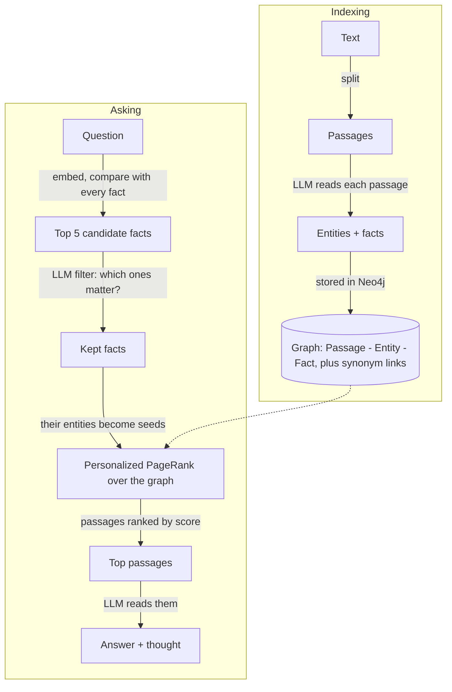

# hippo

hippo is a memory you can run on your own machine. You give it text (notes,
documents, a whole git repository), it builds a small knowledge graph out of
the facts in that text, and later you ask it questions in plain English. It
answers from what it remembers and shows you *why*: which facts it matched,
which parts of the graph lit up, and which passages it read. It is a portable
implementation of [HippoRAG](https://github.com/OSU-NLP-Group/HippoRAG)
(HippoRAG 2) that runs entirely in Docker: Neo4j for the graph, Ollama for
the models, and a small web UI on top. It also speaks MCP, so Claude Code,
Claude Desktop or Cursor can use it as a tool.

## Run it

You need Docker (Desktop is fine). If you already run
[Ollama](https://ollama.com) on your machine, hippo will use it; if not, it
starts one in a container.

```bash
git clone https://github.com/MattMakes/hippo.git
cd hippo
./hippo up
```

Then:

1. Open http://localhost:8000.
2. Click **Load the sample** on the Library page. It indexes a tiny made-up
   company guide (`samples/acme_robotics.md`). The first time, hippo also
   downloads the two models it needs (`qwen3:8b` and `nomic-embed-text`,
   about 6 GB); the header shows the progress.
3. Go to **Ask** and type: *Who designed the Orion arm?*

Other launcher commands: `./hippo down`, `./hippo logs`, `./hippo pull-models`,
`./hippo test`, `./hippo ps`. Anything else is passed to the CLI inside the
container, e.g. `./hippo sources` or `./hippo ask "Where is Boulder?"`.

The Neo4j browser is at http://localhost:7474 (user `neo4j`; the password is
the `NEO4J_PASSWORD` line of `.env`, which `./hippo up` fills in with a random
value on the first run and prints) if you want to look at the graph directly.

Everything listens on this machine only: compose binds ports 8000 (the UI,
API and MCP), 7474/7687 (Neo4j) and 11434 (Ollama) to `127.0.0.1`. hippo has
no login and Ollama has no password, so if you want to open the UI from
another computer, put a proxy that asks for a password in front of it, then
set `HIPPO_BIND=0.0.0.0` and `HIPPO_ALLOWED_HOSTS` in `.env`.

## A tour

| Page | URL | What it is for |
| --- | --- | --- |
| Library | `/` | Everything hippo remembers. Add a file, a zip, pasted text or a git URL; watch indexing progress; delete sources. |
| Source | `/sources/{id}` | One source: its passages and the entities and facts the model pulled out of each. "Make sample questions" writes an evaluation set about it. |
| Ask | `/ask` | Type a question, get the answer, the model's reasoning, the top passages, the facts it kept and the seed entities. "Analyze this question" goes deeper. |
| Evals | `/evals` | Question sets (yours or generated) and the history of every run: accuracy, exact match, F1, recall. |
| Set | `/evals/sets/{id}` | The questions of one set (add, delete), run it, see past runs. |
| Run | `/evals/runs/{id}` | One run: summary cards and a per-question table (answer, verdict, metrics, latency). Every row links to its analysis. |
| Analyze | `/analyze/{result_id}`, or the "Analyze this question" link on any answer | The deep dive: candidate facts, the filter's reply, seeds, a picture of the graph, ranked passages with a one-sentence "why", and a panel to tweak settings and re-run the search without touching anything. |
| Changesets | `/changesets` | Edits you saved from the analyze page (setting changes, entity boosts, edge weights, synonyms). Apply or delete them. |
| Settings | `/settings` | Ollama and Neo4j status, model downloads, the retrieval knobs with one-line explanations. |

There is also a JSON API under `/api` (docs at `/api/docs`) and a CLI:
`hippo serve | mcp | pull-models | index <path-or-git-url> | ask "<question>" | sources | settings`.

## How it works, in plain words

HippoRAG borrows an idea from how the brain is thought to store memories:

* The **neocortex** holds the raw experiences. For hippo that is the text
  passages you upload.
* The **hippocampus** holds a light index of those experiences: the names of
  things and how they relate. For hippo that is a graph of entities and facts
  (triples like `["Orion arm", "was designed by", "Marcus Lee"]`).
* Remembering is **spreading activation**: you think of a few things and
  activation flows along the links to related memories. For hippo that is
  Personalized PageRank started from the entities in your question.

Indexing (once per source) and asking (every question) look like this:



Step by step:

1. **Index.** Text is cut into passages of about 1500 characters. For each
   passage the LLM lists the named entities, then writes facts as
   `[subject, predicate, object]` triples. Passages, entities and facts become
   nodes in Neo4j; a passage is linked to the entities it mentions, and two
   entities are linked when a fact joins them. Entity names that mean the same
   thing (by embedding similarity) get a synonym link, e.g. `usa` ~ `united states`.
2. **Question to facts.** Your question is embedded and compared with every
   fact. The five most similar facts are candidates.
3. **LLM filter.** The LLM looks at those candidates and keeps only the ones
   that really help answer the question (the paper calls this recognition
   memory). If it keeps none, hippo falls back to plain embedding search.
4. **PPR.** The entities of the kept facts become seed nodes. Each seed's
   weight is the fact's similarity score, divided by how many passages
   mention that entity (a name that appears everywhere is a weak clue).
   Passages also get a tiny seed weight from their own similarity to the
   question. Personalized PageRank spreads that activation across the graph.
5. **Passages.** Passages are ranked by their PageRank score.
6. **Answer.** The LLM reads the top five and answers after a short "Thought:".

Every step is recorded in a trace, which is what the Analyze page shows.

## Evaluate and dig in

* **Question sets.** On a source page click *Make sample questions*: hippo
  writes single-passage questions and two-passage ("multi-hop") questions
  whose answers need facts from both. Or write your own on the Evals page,
  one `question | answer` per line.
* **Runs.** *Run this set* asks every question, has the LLM judge the answer
  against the expected one (correct / partially correct / incorrect), and
  computes exact match, F1 and recall of the gold passages. Runs are history:
  they are never modified, so you can compare before and after a change.
* **Analyze.** Open any result. You see what the search did, the graph
  around the question, and why each passage ranked where it did.
* **Simulate.** In the *Tweak & simulate* panel change a setting, force a
  fact in or out, boost an entity, or change an edge weight, and re-run the
  search on the spot. A diff table shows how passage ranks moved. Nothing is
  saved.
* **Changesets.** If a simulation helped, save it as a changeset and apply it
  from the Changesets page. Setting changes, entity boosts and edge weights
  are applied to the real graph; fact in/out toggles are per-question and are
  not saved.

## Use it from Claude / Cursor (MCP)

hippo serves MCP at `http://localhost:8000/mcp` with four tools:
`hippo_search`, `hippo_ask`, `hippo_remember`, `hippo_sources`.

```bash
claude mcp add --transport http hippo http://localhost:8000/mcp
```

Claude Desktop and Cursor setups, the stdio alternative (`hippo mcp`) and
example calls are in [docs/MCP.md](docs/MCP.md).

## Configuration

Everything is an environment variable (see `.env.example`; `docker compose`
reads a `.env` file automatically). Defaults live in `src/hippo/config.py`.

| Variable | Default | Meaning |
| --- | --- | --- |
| `NEO4J_URI` | `bolt://localhost:7687` | Where the graph lives (`bolt://neo4j:7687` inside compose). |
| `NEO4J_USER` | `neo4j` | Neo4j user. |
| `NEO4J_PASSWORD` | `hippo-password` | Neo4j password. `./hippo up` writes a random one to `.env` on the first run; Neo4j keeps the password it was created with. |
| `OLLAMA_URL` | `http://localhost:11434` | Where the models run. `./hippo up` sets this for you. |
| `HIPPO_LLM_MODEL` | `qwen3:8b` | The chat model: extracts facts, filters facts, answers, judges. |
| `HIPPO_EMBED_MODEL` | `nomic-embed-text` | The embedding model. Changing it means re-indexing everything. |
| `HIPPO_NUM_CTX` | `8192` | Context window asked of Ollama (qwen3's default 4k is too small). |
| `HIPPO_LLM_TIMEOUT` | `600` | Seconds to wait for one LLM reply. |
| `HIPPO_DATA_DIR` | `./data` | Uploaded files and cloned repos (`/app/data` in the container). |
| `HIPPO_MAX_UPLOAD_BYTES` | `50000000` | Biggest upload or pasted text (50 MB); bigger ones are refused. |
| `HIPPO_MAX_TEXT_CHARS` | `20000000` | Most text one source may turn into (20 M characters, about 13,000 passages); past that the source fails as "too large". Zips are also limited to 5,000 readable files and 50 MB unpacked. |
| `HIPPO_OPENIE_WORKERS` | `2` | Parallel LLM calls while extracting facts. |
| `HIPPO_CHUNK_SIZE` | `1500` | Passage size in characters. |
| `HIPPO_CHUNK_OVERLAP` | `150` | Overlap between neighbouring passages. |
| `HIPPO_HOST` | `127.0.0.1` | Address `hippo serve` listens on (this machine only; hippo has no login). docker-compose sets `0.0.0.0` inside the container and publishes the port on `HIPPO_BIND`. |
| `HIPPO_PORT` | `8000` | Web server port. |
| `HIPPO_BIND` | `127.0.0.1` | (compose only) The address port 8000 is published on. `0.0.0.0` opens it to the network; do that only behind an authenticating proxy. |
| `HIPPO_ALLOWED_HOSTS` | *(empty)* | Extra host names or IPs the UI and `/mcp` answer to, comma-separated (`localhost`, `127.0.0.1` and `[::1]` always work). hippo has no login, so other names are refused to stop websites you visit from reaching your memory; add your LAN name or IP here if you open hippo from another machine, or `*` to switch the check off. |

Retrieval knobs (`linking_top_k`, `passage_node_weight`, `damping`,
`node_specificity`, `synonymy_threshold`, `retrieval_top_k`, `qa_top_k`) are
stored in Neo4j and changed on the Settings page, not through the environment.

## Run without Docker

You need Python 3.11+, a Neo4j 5 you can reach, and Ollama.

```bash
# 1. Neo4j: Neo4j Desktop, or just the database container (pick your own password):
docker run -d -p 127.0.0.1:7474:7474 -p 127.0.0.1:7687:7687 -e NEO4J_AUTH=neo4j/hippo-password neo4j:5.26-community
# 2. Ollama: https://ollama.com, then make sure it is running.
# 3. hippo:
python -m venv .venv && source .venv/bin/activate
pip install -e .
hippo pull-models        # downloads qwen3:8b and nomic-embed-text
hippo serve              # http://localhost:8000
```

Set `NEO4J_URI` / `OLLAMA_URL` if they are not on localhost, and `NEO4J_PASSWORD`
to whatever you gave Neo4j.

## Development & tests

```bash
uv venv .venv && source .venv/bin/activate     # or: python -m venv .venv
pip install -e ".[dev]"
ruff check . && ruff format --check .
pytest tests/unit -q
```

The unit tests need neither Neo4j nor Ollama: `tests/conftest.py` provides an
in-memory `FakeStore` with the same methods as the real store and a rule-based
`FakeOllama` that understands the "X <relation> Y." sentences of the sample
corpus. The whole pipeline (index, search, answer, judge) runs in-process.

If `NEO4J_URI` is set, the `store` fixture uses that real database instead
(and empties it before every test, so never point it at a memory you care
about). CI does exactly this: `.github/workflows/ci.yml` runs `ruff`, the
unit tests on Python 3.11 and 3.12 with the fakes, and the same tests once
more against a `neo4j:5.26-community` service container.

## Where the code lives

```
src/hippo/
  config.py         settings from environment variables
  ollama.py         the Ollama client (chat, JSON-constrained chat, embeddings, pulls)
  prompts.py        every prompt, with the JSON schema it expects back
  context.py        AppContext: config + store + ollama + jobs + the in-memory graph
  ask.py            search(ctx, q) -> Trace ; ask(ctx, q) -> (Trace, Answer)
  store/            all Cypher: sources, passages, entities, facts, evals, changesets
  hipporag/         the algorithm: openie -> indexer -> graph_index (PPR) -> retriever -> answerer
  ingest/           readers (txt, md, pdf, docx, epub, html, code), chunker, git repos, the indexing job
  evals/            metrics, the LLM judge, question generation, the run runner
  analysis/         explain a result, simulate changes, save/apply changesets
  web/              FastAPI app, routes, Jinja templates, static files
  mcp_server.py     the four MCP tools (HTTP at /mcp and stdio)
  cli.py            the `hippo` command
tests/
  fakes/            FakeStore, FakeOllama
  unit/             fast tests on the fakes (also run against real Neo4j in CI)
docs/CONTRACTS.md   the function signatures each package exposes
```

## Fidelity to HippoRAG

hippo follows the reference implementation step for step (same prompts, same
defaults, same PPR call, same edge weights) and adapts a few things for a
small local model and a database instead of pickled files. The full list,
with reasons, is in [docs/FIDELITY.md](docs/FIDELITY.md).

## Credits

The method and the prompts come from the HippoRAG authors at the OSU NLP
group (Bernal Jiménez Gutiérrez, Yiheng Shu, Yu Su and colleagues):

* [HippoRAG: Neurobiologically Inspired Long-Term Memory for Large Language Models](https://arxiv.org/abs/2405.14831) (NeurIPS 2024)
* [From RAG to Memory: Non-Parametric Continual Learning for Large Language Models](https://arxiv.org/abs/2502.14802) (ICML 2025)

Code: https://github.com/OSU-NLP-Group/HippoRAG. hippo is MIT licensed.
