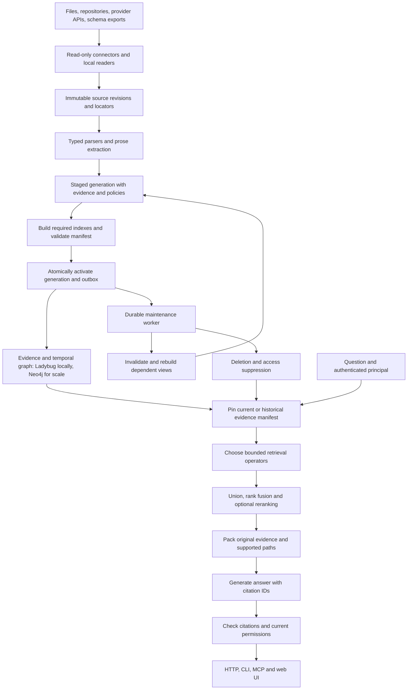

# RAG it all: an implementation plan for connected engineering knowledge

**Prepared:** 2026-09-11. **Repository inspected:** `3ac02f30054fff3827ec25aa799147be99967692`.

**Implementation branch:** `rag-it-all-tibs`, created directly from `code-graph` at the inspected commit. Execution evidence lives in `ai_docs/checkpoints/` and task ledgers under `ai_docs/gates/rag-it-all/`. Unchecked gates remain unimplemented or unverified; the plan text is not a completion claim.

**Goal:** Extend Hippo so an engineer can ask one question across database schemas, source code, requirements, tickets, pull/merge requests, service manifests, and Backstage, and receive an answer supported by precise, authorized, versioned evidence.

**Status:** Research-backed proposed design and implementation plan. The proposed modules, settings, endpoints, commands, fixtures, and acceptance gates below are work to implement, not capabilities already delivered. Repository findings come from source inspection; no application performance or test-suite baseline was measured. A temporary LadybugDB 0.15.3 probe verified transaction rollback, adding a timestamp column, and committed data surviving reopen; it does not validate the proposed full migration or search extensions.

**Recommended architecture:** Keep Python, FastAPI, Ollama and the existing code/HippoRAG implementation. Prioritize LadybugDB locally, with a shared single-owner HTTP service as an optional intermediate deployment, and Neo4j as the planned scale/availability backend. PostgreSQL is a benchmarkable alternative if operational simplicity and measured workload favor it, not an additional mandatory store. Build a heterogeneous evidence graph with immutable source revisions, supported relationship nodes, temporal assertions, and automatically maintained retrieval views. Route DDL, code, prose and catalogs through different retrieval operators, then combine their original evidence with a shared packer and answer service for HTTP, CLI, MCP and the UI. A durable maintenance worker handles ingestion, publication, invalidation, reconciliation and deletion; query-time models never edit authoritative facts.

**Planning constraint:** Choose implementation order and architecture from capabilities, dependencies, correctness, evidence quality and operational fit. Do not use delivery-duration estimates, schedules or timing-based prioritization. Runtime timeouts, source chronology, temporal relevance, retention and freshness semantics remain functional system requirements; runtime measurements are diagnostic.

**Reading order for a junior engineer:** Read sections 1–5 first, then the extractor section for your task. Implement the task sequence in section 13. Every task names files, dependencies, behavior, and checks. Section 14 defines what passing each gate means. Work sequentially where tasks edit the same existing modules.

## 1. Scope, assumptions, and the result we want

### 1.1 Working assumptions

These are design defaults, not facts discovered about the organization's infrastructure:

- Confirmed deployment preference: local first with LadybugDB, then Neo4j when measured concurrency, graph workload or availability needs justify it. A small shared deployment may retain one Ladybug-owning server. Assess PostgreSQL only if it offers a demonstrated implementation/operational advantage for the actual workload; section 10.5 defines that decision.
- Prioritize PostgreSQL and SQL Server schema exports. Make database dialect explicit so other engines can follow without changing the internal contract.
- Start with exported files and recorded provider responses. Add read-only connectors for GitHub, GitLab, Jira, Tuleap, and Backstage after identity, revisions, and authorization work.
- First pilot sizing target: approximately 10 repositories, 20,000 documents/tickets/reviews, and 2,000 tables. These are test scenarios, not validated capacity claims. Existing per-source limits still apply until measured changes are justified.
- Treat organization/workspace as an identity and authorization boundary. One workspace can contain many repositories, databases, projects, services, and teams.
- Preserve source text and structured facts. Generated summaries and inferred links carry a different evidence classification.
- Support schema explanation, code understanding, requirement traceability, and change-impact analysis. Executing generated SQL against production, changing code, posting ticket comments, and changing service ownership are outside this delivery.
- Read actual database rows only in a separately approved future feature. A DDL answers structural questions; it cannot establish current row counts, customer states, or actual revenue.

### 1.2 Representative questions and required evidence

| Question | Necessary evidence | Expected behavior |
| --- | --- | --- |
| “Which code writes `billing.public.invoice.status`?” | Qualified schema column, write expressions or explicit ORM mapping, enclosing symbols | Distinguish proven column writes from table-level writes with unknown columns. |
| “How do invoices join to customers?” | Tables, ordered FK column pairs, referenced keys, bridge tables | Return verified join paths, with alternatives or an explicit missing-relationship result. |
| “Why does `POST /refunds` require an idempotency key?” | API contract, implementing code, accepted requirement, ticket and review discussion | Cite the requirement and decision discussion; describe implementation separately. |
| “What could break if we drop `orders.legacy_id`?” | Column readers/writers, views, code callers, exposed endpoints, consumers, tests | Report observed dependents and static-analysis limits; avoid claiming complete runtime impact. |
| “Who owns the failing checkout API?” | Endpoint-to-service and service-to-owner declarations | Return ownership for the selected environment/revision with its source. |
| “Did PR 418 implement TULEAP 812?” | Explicit issue link, PR state, commit/diff, requirement criteria, tests | Separate “linked,” “merged,” and “acceptance criteria verified.” |
| “What changed between release A and release B?” | Two recorded snapshot manifests, revisions, schema/API/code differences | Compare those versions; never silently substitute current HEAD. |
| “Which services have unresolved data-retention requirements?” | Service membership, accepted requirements, current issue states, coverage inventory | Use scoped inventory and grouped synthesis, not just top-five similar passages. |

### 1.3 End-to-end acceptance example

Create a fictional `commerce` workspace containing a billing repository, a separately uploaded schema, a PRD, a Jira ticket, a Tuleap artifact, a GitLab MR, a GitHub PR, an OpenAPI document, a Hippo service manifest, and Backstage catalog entities.

The question “Why is the refund idempotency key stored, where is it enforced, and who owns the endpoint?” must retrieve:

1. The accepted PRD criterion and the ticket decision explaining retries.
2. The exact endpoint and implementation symbol.
3. The unique constraint on the idempotency column and its schema revision.
4. The merged review and relevant test, if present.
5. The catalog ownership declaration.

The answer must cite every material claim, identify conflicting evidence, and state when deployment status is unknown. A user who cannot read the ticket must not learn its title, decision, snippets, or graph connection through another visible source.

## 2. What the project already does

Paths and line numbers in this section refer to the inspected commit. Line numbers will move as implementation proceeds.

| Area | Observed behavior | Where to start |
| --- | --- | --- |
| Runtime | Python 3.11+, FastAPI/Jinja UI, MCP, CLI, Ollama; embedded LadybugDB and optional Neo4j | [pyproject.toml](../pyproject.toml), [context.py](../src/hippo/context.py), [store/__init__.py](../src/hippo/store/__init__.py); `context.py:32`, `store/__init__.py:64` |
| Ingestion | Text, file, ZIP, repository, and sample inputs share read → extract → chunk → index jobs | [pipeline.py](../src/hippo/ingest/pipeline.py); lines 75–156, 248–300, 382–402 |
| Documents | Readers support Markdown/text, PDF, DOCX, EPUB, HTML, code and config formats. `Document` has title, text, path, and `is_code`; no revision or rich locator contract | [readers.py](../src/hippo/ingest/readers.py); lines 57–97 |
| Code graph | Tree-sitter parses Python, TS/JS, Go, C#, Rust; source-scoped symbols and typed edges carry confidence and rule provenance | [extract.py](../src/hippo/codegraph/extract.py), [model.py](../src/hippo/codegraph/model.py); `extract.py:47–100`, `model.py:41–110` |
| Code chunks | Symbol-aware passages, statement boundaries for large bodies; parsed bodies and DDL bypass OpenIE, documented symbols can contribute prose facts | [chunker.py](../src/hippo/ingest/chunker.py); lines 23–34, 150–180, 395–408 |
| SQL | `.sql` documents, including standalone uploads, reach SQL extraction. Table/column names and containment exist; SQL literals supply table READS/WRITES | [data_access.py](../src/hippo/codegraph/data_access.py), [resolve.py](../src/hippo/codegraph/resolve.py); `data_access.py:180–276`, `resolve.py:743–765` |
| Git history | Commit nodes, touched symbols, PRECEDES/MODIFIES edges, and commit-message passages | [pipeline.py](../src/hippo/ingest/pipeline.py), [chunker.py](../src/hippo/ingest/chunker.py); `pipeline.py:327–365`, `chunker.py:89–120` |
| HippoRAG | Dense passage/fact scoring, LLM fact filtering, entity/code seeds, weighted undirected Personalized PageRank, dense fallback | [retriever.py](../src/hippo/hipporag/retriever.py); lines 282–460, 508–644 |
| Directed queries | Calls, exception paths, history and blast radius use separate directed adjacency; PPR itself is undirected | [paths.py](../src/hippo/hipporag/paths.py); lines 32, 174–201, 321 |
| Access | Source visible by rank or ownership; graph is scoped before retrieval | [access.py](../src/hippo/access.py), [graph_index.py](../src/hippo/hipporag/graph_index.py); `access.py:113–158`, `graph_index.py:543–667` |
| Answer surfaces | Shared `ask` service feeds HTTP/MCP/CLI; answer records supplied passage IDs | [ask.py](../src/hippo/ask.py), [answerer.py](../src/hippo/hipporag/answerer.py); `ask.py:25–87`, `answerer.py:22–52` |
| Evals | EM/F1, retrieval recall, stored traces, generated code/commit questions, code-disabled baseline comparison | [runner.py](../src/hippo/evals/runner.py), [metrics.py](../src/hippo/evals/metrics.py); `runner.py:105–190,241`, `metrics.py:34–89` |
| Backend contracts | Same store fixtures run against LadybugDB, FakeStore, and Neo4j | [conftest.py](../tests/conftest.py), [ci.yml](../.github/workflows/ci.yml); `conftest.py:179–211` |

### 2.1 Gaps that determine the implementation order

1. **SQL semantics are incomplete.** SQL extraction uses `table.name`, which loses schema/catalog qualification, and splits statements at semicolons. The data model has no datatype, nullability, PK/FK, constraint, default, authoritative-definition status, or schema revision. `DataObject` “definitions” can be mere mentions. Extend existing SQL parsing rather than introducing an unrelated SQL subsystem. Evidence: `data_access.py:205–276`, `model.py:326–354`.
2. **Source identity is too coarse for enterprise sync.** Existing readers do not expose provider IDs, revisions, structured field locations, per-item ACLs, or deletion events. Git URL ingestion is not a GitHub/GitLab issue/review connector.
3. **Reindex clears before rebuilding.** `pipeline.py:408–477` deletes existing passages before restarting; failures clear partial results. This cannot serve a reliable last-known-good enterprise catalog during a failed refresh.
4. **Retrieval lacks a lexical channel.** `retriever.py:304–309` scores full dense matrices. Exact identifiers need lexical lookup even when no useful embedding or fact exists.
5. **New links need evidence-level authorization.** Current scoping retains structural/synonym/tuned edge values when their endpoints survive (`graph_index.py:633–667`). A private ticket connecting two public services must not create a public traversable edge.
6. **A graph version is not a pinned evidence snapshot.** `context.py:62–102` can serve an older graph during reload; search and answering separately acquire graphs in `ask.py:31,48`. Cross-source answers need one consistent revision manifest.
7. **Historical outputs need access rules.** Existing eval execution uses caller access, but persisted eval set/run/result reads are capability-gated rather than evidence-scoped (`web/routes/evals.py:237–328`, `store/evals.py:233–255`). Code blocks can render stored trace paths directly (`paths.py:530–534`). Extend authorization to these outputs before indexing private enterprise data.
8. **Storage migrations must be real.** LadybugDB declares node columns and relation endpoints explicitly (`store/ladybug.py:89–154`). Its current schema creation/migration code does not generically add missing node columns (`:343–368`). Changing a declaration is not an upgrade procedure.
9. **The current backend is an in-memory retrieval projection over a persistent graph.** All embeddings and graph vertices load into memory (`graph_index.py:227–342`). Keeping Neo4j does not by itself solve retrieval memory growth.

The historical design explicitly deferred cross-source edges, incremental indexing, ticket/PRD nodes, and external schema integration: [design/README.md](design/README.md). Its “external DDL” statement is narrower than the current actual `.sql` dispatch described above. Treat source inspection as authoritative for present behavior.

## 3. Research and the decisions it supports

### 3.1 HippoRAG and “LARGER”

HippoRAG combines an extracted graph with Personalized PageRank to retrieve connected evidence for multi-hop questions. HippoRAG 2 adds passage integration, query-to-triple matching and LLM recognition filtering, with dense retrieval when no triples survive. That supports retaining Hippo's existing associative retrieval as one useful route. These papers do not establish correctness for SQL joins, software dependencies, permission propagation, or changing enterprise records. Those need explicit data contracts and domain tests. [HippoRAG](https://arxiv.org/abs/2405.14831), [HippoRAG 2](https://arxiv.org/abs/2502.14802).

**Unresolved reference: LARGER.** Searches for the exact name with RAG, retrieval, schemas, graphs, arXiv, and GitHub did not identify a unique relevant publication. A title, author, or URL is needed to attribute it correctly. This plan does not silently equate LARGER with LightRAG, RASL, or another method. Resolve it before finalizing the experimental comparison list; the implementation below does not depend on an unidentified algorithm.

### 3.2 Paper-to-design matrix

The “application” column is our engineering proposal, not a claim that the paper implements this entire system. Publication results are task/model/corpus dependent; no reported benchmark percentage is used as our release guarantee.

| Paper and first arXiv year | Relevant contribution | Application here | Boundary / adoption decision |
| --- | --- | --- | --- |
| [HippoRAG, 2405.14831](https://arxiv.org/abs/2405.14831), 2024 | Graph-based associative retrieval using PPR | Keep the established prose multi-hop route | Preserve as a regression baseline; PPR relevance is not evidence of causality. |
| [From RAG to Memory / HippoRAG 2, 2502.14802](https://arxiv.org/abs/2502.14802), 2025 | Passage nodes and query-conditioned triple filtering improve integration | Retain passage/fact candidates and recognition memory | Parser facts should not compete for the same five OpenIE fact slots. |
| [From Local to Global / GraphRAG, 2404.16130](https://arxiv.org/abs/2404.16130), 2024 | Community summaries support corpus-wide synthesis | Optional service/domain summaries for broad questions | Build only after scoped evidence exists; summaries cannot replace original citations. |
| [LightRAG, 2410.05779](https://arxiv.org/abs/2410.05779), 2024 | Low/high-level graph retrieval and incremental updates | Compare local lookup and broader relationship routes | Borrow design ideas; do not replace the project with its framework. |
| [RAPTOR, 2401.18059](https://arxiv.org/abs/2401.18059), 2024 | Retrieval at multiple levels of summarized document structure | Optional section/document summaries for lengthy PRDs | Begin with real headings and parent expansion; evaluate generated hierarchy later. |
| [G-Retriever, 2402.07630](https://arxiv.org/abs/2402.07630), 2024 | Retrieves relevant connected textual subgraphs using a budgeted optimization | Pack small connected evidence paths | Adopt the objective, initially use bounded deterministic traversal; no GNN training requirement. |
| [CRUSH4SQL, 2311.01173](https://arxiv.org/abs/2311.01173), 2023 | Schema retrieval should cover a useful set of elements; hypothetical schemas can guide retrieval | Retrieve sets of tables/columns, preserve joins and bridge tables | Hypothetical schema terms are search hints only; never authoritative schema nodes. |
| [CHESS, 2405.16755](https://arxiv.org/abs/2405.16755), 2024 | Separates context retrieval, schema selection and SQL generation | Separate schema discovery, pruning, and evidence rendering | Its value retrieval and SQL execution workflow exceed DDL-only scope. |
| [RASL, 2507.23104](https://arxiv.org/abs/2507.23104), 2025 | Indexes schema/metadata components and combines column evidence for table selection | Table, column, description, and constraint retrieval views | Strong candidate for large-schema retrieval; validate with our dialects and metadata quality. |
| [CRED-SQL, 2508.12769](https://arxiv.org/abs/2508.12769), 2025 | Clusters similar column attributes and weights column relevance inversely by cluster size; also proposes an execution-description intermediate | Later compare discriminative attribute weighting for tables sharing common column names | This is not chiefly database/domain routing. Protect required join keys; defer EDL-to-SQL. |
| [Spider 2.0, 2411.07763](https://arxiv.org/abs/2411.07763), 2024 | Enterprise text-to-SQL benchmark with broader workflow context | Include large schemas, dialect differences and documentation in evals | SQL workflow accuracy is a different metric from evidence retrieval quality. |
| [RepoCoder, 2303.12570](https://arxiv.org/abs/2303.12570), 2023 | Iterative retrieval and code generation exploit repository context | One bounded follow-up retrieval for unresolved symbols/dependencies | Generated code is not indexed as observed evidence. |
| [GraphCoder, 2406.07003](https://arxiv.org/abs/2406.07003), 2024 | Uses statement-level control/data dependence and coarse-to-fine retrieval | Preserve syntax boundaries; evaluate slices for very large functions later | Existing symbol graph is not a statement-level CCG. Do not label it a reproduction. |
| [CodeRAG, 2504.10046v1](https://arxiv.org/html/2504.10046v1), 2025; [GraphCodeAgent, v2](https://arxiv.org/html/2504.10046v2), renamed November 2025 | Connects functional descriptions with code structural/semantic graphs and agentic retrieval | Link observed requirements to implementation evidence; keep generated descriptions separate | Generated and researcher-reviewed descriptions are not approved PRDs. Pin the version when comparing methods or results. |
| [CodeRAG-Bench, 2406.14497](https://arxiv.org/abs/2406.14497), 2024 | Studies useful context from multiple sources for code generation | Test natural-language-to-code queries and distracting context | Better retrieval does not ensure the generator uses evidence correctly. |
| [Re2G, 2207.06300](https://arxiv.org/abs/2207.06300), 2022 | Combines retrieval, reranking and generation, including heterogeneous candidate scores | Add reranking after lexical/dense/graph candidate union | Use an inference-time adapter; end-to-end retriever training is unnecessary initially. |
| [IRCoT, 2212.10509](https://arxiv.org/abs/2212.10509), 2022 | Alternates retrieval with intermediate reasoning | Explicitly retrieve missing evidence for a bounded subquestion | Keep a short decision log; no unbounded autonomous tool loop. |
| [Late Chunking, 2409.04701](https://arxiv.org/abs/2409.04701), 2024 | Pools chunk vectors after contextual token encoding | Possible later experiment for long PRDs | Requires token-level embedding support; ordinary Ollama pooled vectors cannot implement it. |
| [Beyond Chunk-Then-Embed, 2602.16974](https://arxiv.org/abs/2602.16974), 2026 | Compares chunking strategies across retrieval settings and finds task dependence | Measure chunking on our document and corpus queries separately | Recent preprint; supports experimentation, not a universal chunk-size rule. |
| [RAGChecker, 2408.08067](https://arxiv.org/abs/2408.08067), 2024 | Diagnoses retrieval and generation with separate fine-grained metrics | Score evidence retrieval, claim support and answer completeness separately | LLM judgments need human calibration and deterministic structural checks. |
| [BRIGHT, 2407.12883](https://arxiv.org/abs/2407.12883), 2024 | Tests reasoning-intensive retrieval beyond surface similarity | Add indirect “why/impact” questions and hard negatives | Public benchmark results are not a replacement for an enterprise gold set. |

### 3.3 Additional papers: verified versions and adoption boundaries

The repeated references in the request are deduplicated here. Findings were checked against primary methods, experiments and limitations, not inferred from titles. Numerical gains across papers are not comparable because corpora, models, budgets and judges differ. The implementation choices in later sections are our adaptations unless explicitly described as a reproduction.

| Paper / reviewed version | What the paper supports | Decision for this app |
| --- | --- | --- |
| [NodeRAG: Structuring Graph-based RAG with Heterogeneous Nodes, 2504.11544v1](https://arxiv.org/html/2504.11544v1), 2025 | Seven functional node types distinguish entities, relationships, semantic units, attributes, high-level elements, overviews and original text. Semantic units are LLM-generated event summaries; exact/dense entry and shallow PPR select different content roles, with HNSW proximity connections. | Adopt heterogeneous identities, relationship nodes and distinct search views as a central design influence. Keep parser-derived facts authoritative and summaries derived with original-span backfill. Its experiments do not establish update/delete or temporal correctness. |
| [VDGR-RAG, 2608.07994v2](https://arxiv.org/html/2608.07994v2), 2026 | Combines vector, document-directory and entity graph routes with backtracking/reflection. Internal telecom evaluation supports hierarchy retrieval, with LLM-judged outcomes and uneven benefits from deeper backtracking. | Add real heading/breadcrumb search and bounded parent/child expansion for long PRDs. Do not copy global name-only deduplication or discard low-level engineering identifiers. |
| [PAR²-RAG: Planned Active Retrieval and Reasoning, 2603.29085v1](https://arxiv.org/html/2603.29085v1), 2026 | Collects complementary evidence before sufficiency-controlled refinement. More search depth is not consistently better. Main text and appendix disagree on candidate counts, reranker/judge choices; its appendix any-gold-hit formula is not full evidence recall. | Adopt a bounded evidence-needs ledger and compare coverage-only against follow-up. Specify our own budgets and metric definitions. No autonomous five-agent framework is required. |
| [Do We Still Need GraphRAG? / RAGSearch, 2604.09666v1](https://arxiv.org/html/2604.09666v1), 2026 | Separately varies retrieval backend and agent controller. Results depend on both; graph retrieval is competitive for multi-hop QA while simpler retrieval remains competitive elsewhere. | Require backend × controller ablations under matched budgets. Its general QA benchmarks do not validate schema joins, permissions or enterprise history. Defer RL training. |
| [CatRAG: Breaking the Static Graph, 2602.01965v1](https://arxiv.org/html/2602.01965v1), 2026 | Adds weak entity seeds and query-dependent edge/passage weighting to HippoRAG 2. Passage enhancement hurts one structured QA dataset in ablation; model edge judgments incur overhead. | Experiment with request-local prose PPR weights. Preserve static HippoRAG as a baseline. Never rewrite stored facts or let model relevance judgments prune required DDL/code relationships. |
| [LivingRAG: Augmenting Graph RAG with Experience, 2608.25960v1](https://arxiv.org/html/2608.25960v1), 2026 | Reuses validated query experiences as sparse retrieval priors and generation scaffolds. Main evaluation uses fixed corpora; an appendix PPR adapter is preliminary. Experiences are not updated/deleted and facts do not expire. | Optional retrieval-prior memory only after temporal invalidation works. The name does not imply a solved synchronization lifecycle. Historical generated answers are excluded from the initial memory feature. |
| [Relink, 2601.07192v1](https://arxiv.org/html/2601.07192v1), 2026 | Learns ranking over explicit relations and sentence-supported co-occurrence candidates; query-time extraction repairs selected missing links. Learned encoders/ranking materially affect results. | Later try source-supported, query-local prose link repair. An inference-only heuristic is an adaptation. Co-occurrence cannot establish ownership, foreign keys, implementation or causality. |
| [Think Parallax / ParallaxRAG, 2510.15552v4](https://arxiv.org/html/2510.15552v4), first 2025, reviewed April 2026 revision | Learned multi-view triple representations, directional encodings and query-conditioned gating use path supervision. Experiments concern largely static knowledge graphs; timing excludes graph I/O. | Defer trained retrieval until held-out enterprise labels exist. Ordinary multiple Ollama pooled embeddings cannot reproduce its internal learned heads. |
| [Cross-Granularity Hypergraph RAG / HGRAG, 2508.11247v1](https://arxiv.org/html/2508.11247v1), 2025 | Represents passages as entity-containing hyperedges, with passage-weighted diffusion and dense residual retrieval. Improvements vary by dataset and final evidence count. | Optional passage/entity incidence route for prose; retain disconnected dense hits. Ladybug nodes and membership edges suffice, with sparse application-side math. Compare equal evidence-token budgets. |
| [HiGraAgent, EACL Findings 2026](https://aclanthology.org/2026.findings-eacl.62/) | Entity/passage hierarchy, local PPR and RRF feed a Seeker/Librarian workflow. Its full controller adds substantial token/latency overhead; the hierarchy is not generated document summaries. | Borrow bounded planning and preservation of independent passage hits. Do not import unsupported model-created engineering links. Official publication verified; no arXiv ID was verified. |
| [SAG: SQL-Retrieval Augmented Generation with Query-Time Dynamic Hyperedges, 2606.15971v2](https://arxiv.org/html/2606.15971v2), 2026 | Extracts chunk events/entities and retrieves through event–entity incidence, reranking and direct passage backfill. SQL implements retrieval over unstructured events; the paper reports no clear end-to-end cost advantage at benchmark scale. | Optional event route for tickets/review decisions, implemented with Ladybug adjacency. This is not DDL retrieval and does not require importing its SQL/search infrastructure. |
| [Agentic RAG with Knowledge Graphs / INRAExplorer, 2507.16507v1](https://arxiv.org/html/2507.16507v1), 2025 | Uses curated metadata and specialized semantic/graph tools for publication/expert questions. Evidence is primarily illustrative scenarios, not a controlled retrieval benchmark. | Provide bounded typed tools for schema joins, requirement traces and complete service inventories. Use parameterized templates, current permissions and explicit completeness. |
| [Triple-Robustness Analysis for Multi-Hop Requirements Traceability, 2608.00705v1](https://arxiv.org/html/2608.00705v1), 2026 | Varies retrieval pipelines, corpora, embedders and judges. Its graph route is a local typed walk; the requirements corpus is synthetic. Candidate precision, packed evidence and answer citations can diverge. | Evaluate those three stages separately, stratified by artifact family and hop count. Add real reviewed enterprise traces; do not claim certification or universal graph superiority. |

### 3.4 Temporal research and what remains our responsibility

| Primary source | Relevant evidence | Adoption boundary |
| --- | --- | --- |
| [Zep: A Temporal Knowledge Graph Architecture for Agent Memory, 2501.13956v1](https://arxiv.org/html/2501.13956v1), 2025 | Separates fact validity from system creation/expiration, links facts to source episodes, and incrementally maintains a graph. Conversational memory experiments support the approach, with variation across models and knowledge-update slices. | Adopt two time axes and evidence dependencies in LadybugDB. Reject its general preference for newly ingested conflicting information: delayed imports and lower-authority comments must not overwrite current engineering declarations. Its experiments do not prove deletion/ACL correctness. |
| [TG-RAG: RAG Meets Temporal Graphs, 2510.13590v1](https://arxiv.org/html/2510.13590v1), 2025 | Uses timestamped facts and time-scoped summaries, refreshing affected temporal ancestors. Tests historical questions before/after adding a new year of earnings calls, plus new questions. | Adopt temporal eligibility and affected-summary rebuilding. Its corpus-growth evaluation does not cover deletions, retroactive corrections or what the system knew at a past moment. |
| [TimeR⁴: Time-aware Retrieval-Augmented LLMs for Temporal KG QA, EMNLP 2024](https://aclanthology.org/2024.emnlp-main.394.pdf) | Resolves implicit temporal conditions using background retrieval, then retrieves/reranks with time constraints. Trains temporal representations using wrong-time and wrong-content negatives. | Adapt evidence-grounded time resolution and adversarial evaluation; defer training. Private release dates must come from source evidence, not model background knowledge. |

No reviewed paper supplies the complete maintenance contract required here. Sections 5.5, 7.5–7.9 and 8.10 define our implementation: bitemporal versions, durable events, atomic publication, support-aware retraction, dependency invalidation and recoverable purge. Temporal correctness is a production prerequisite; learned memory and graph-weighting experiments are optional.

### 3.5 One graph, specialized retrieval views

The main upgrade is a shared evidence model, not a replacement framework. NodeRAG motivates giving information different graph roles; our domain schema extends those roles with versioned constraints, symbols, declarations and permissions. Represent relationships as supported records because a single relationship needs its own provenance, validity interval, and independent supporting sources. Search representations point back to these records and original spans.

| Data / question | First production route | Next controlled experiment | Never substitute |
| --- | --- | --- | --- |
| DDL, catalog descriptions, joins | Qualified exact lookup + metadata views + lexical/dense table selection + complete declared FK bundles | RASL view weighting; CRUSH4SQL search hints; CRED-SQL attribute discrimination | Prose co-occurrence for declared constraints; generation date for deployment date |
| Code, stack traces, dependencies | Symbol/path search + AST boundaries + directed import/call/data-use expansion | One unresolved-symbol follow-up; later statement slices | Tree-sitter symbol graph for full data/control dependence or runtime execution |
| Long PRDs, manuals, runbooks | Block-aware hybrid + real heading hierarchy + existing HippoRAG prose route | VDGR hierarchy ablation; section summaries; optional HGRAG incidence | Generated summary for an original requirement or its approval state |
| Jira/Tuleap, PR/MR discussions | Field/thread/changeset structure + hybrid + explicit work-item/review links | SAG event incidence; bounded source-supported Relink-style repair | Mention for implementation; merged review for deployment or acceptance |
| Service manifests, Backstage, OpenAPI | Exact field/entity references + typed traversal + paginated inventory | Descriptive semantic routing and linked explanation retrieval | Code-author frequency for ownership; top-k results for a complete list |
| Mixed “why/impact” | Up to three evidence needs, typed and prose providers, complete supported paths | PAR² coverage/follow-up; query-local CatRAG weighting for prose only | PPR score or a generated path for causal proof |
| Broad synthesis | Scoped typed inventory + original sections + contributor-tracked group summaries | GraphRAG/NodeRAG high-level views after invalidation tests | Corpus-wide summaries across private or obsolete sources |
| Historical/current/recent questions | Temporal eligibility, source authority and exact snapshot selection before relevance | Tuned recency signal for genuinely time-sensitive prose | “Newest ingested wins” or age decay for an unchanged valid constraint |

### 3.6 Architectural alternatives

| Option | Advantage | Cost / weakness | Decision |
| --- | --- | --- | --- |
| Uniform chunks + vector search | Small initial implementation | Loses exact schema semantics, relationships and change context | Keep as a measured baseline. |
| Convert everything to LLM triples and one PPR graph | Closest to the original prose pipeline | Expensive extraction; weak identifiers; inferred joins/ownership become misleading | Do not use for structured truth. |
| Typed extraction + shared evidence + multiple retrieval channels | Reuses current strengths and supports exact and associative queries | Requires explicit identity, visibility, versioning and fusion contracts | Recommended. |

The central design decision is **one connected evidence system with several retrieval operators**. “One system” does not require one chunk representation, one embedding model, or one ranking algorithm.

## 4. Target architecture and invariants

### 4.1 Data flow



### 4.2 Non-negotiable invariants

| ID | Invariant | Reason |
| --- | --- | --- |
| I1 | Every returned factual claim points to authorized source evidence at a recorded revision | Users must be able to verify answers. |
| I2 | Names are scoped by workspace, provider instance and domain namespace | `orders`, `#42`, and `checkout` are not globally unique. |
| I3 | Parser observations, declarations, discussion claims, and model inferences remain distinguishable | A proposed requirement or inferred dependency is not deployed behavior. |
| I4 | Retrieval never traverses an edge whose supporting evidence is forbidden | Public endpoints do not make a private relationship public. |
| I5 | Ordinary failed refreshes leave the last successful generation queryable; current deletion/access/purge suppressions still apply | Content availability cannot bypass known revocation or removal. |
| I6 | Current answers use one pinned source-generation manifest and recheck present-day ACLs before return | Avoid mixed revisions and stale authorization. |
| I7 | Structured-only indexing does not require OpenIE; extraction failures remain visible | Schema correctness must not depend on an LLM inventing structure. |
| I8 | Every connector processes duplicate deliveries and interrupted pagination idempotently | Reliable incremental sync requires at-least-once processing. |
| I9 | Dropped constraints, deleted comments, revoked access and renamed objects propagate to all derived indexes | Stale embeddings and links are still stale evidence. |
| I10 | Existing behavior has a legacy retrieval mode and backend contract tests | New rankings must be measurable, reversible changes. |
| I11 | Missing context produces a partial or insufficient-evidence result | Unsupported certainty is worse than an explicit gap. |
| I12 | Effective time, source modification, observation and publication are distinct | Late imports must not rewrite chronology or create false recency. |
| I13 | Every derived view has versioned dependencies and a tested invalidation/purge path | A correct source update is insufficient if stale summaries or vectors still answer. |
| I14 | Only validated, manifest-complete generations publish; expired workers cannot publish | Autonomous processing must recover safely after crashes and races. |

## 5. Data model, identity, and provenance

### 5.1 Keep existing nodes; add an evidence layer

Retain `Source`, `Passage`, `Entity`, `Fact`, `Symbol`, `DataObject`, and `Commit`. Do not turn services, tables, or tickets into untyped OpenIE `Entity` rows: existing orphan cleanup and name merging have different semantics.

Add the following records. Fields used for filtering, joins, or ordering are typed columns. Extensible provider payloads may be JSON, but identities/ACLs/revisions must not live only in opaque JSON.

| Record | Required fields | Purpose |
| --- | --- | --- |
| `Workspace` | `id`, `name` | Isolation namespace; existing sources migrate to `default`. |
| `WorkspaceMembership` / `GroupMembership` | Workspace, stable local principal/group IDs, enabled state, source of reviewed mapping and policy epoch | Explicit membership authority; existing rank/owner access alone does not establish workspace or provider-group membership. |
| `Connector` | `id`, `workspace_id`, `kind`, `instance_url`, `config_json`, `credential_ref`, `enabled`, `capabilities_json` | A configured ingestion integration, separate from its output sources. |
| `Artifact` | `id`, `workspace_id`, `source_id`, `connector_id?`, `kind`, `external_id`, `canonical_uri`, `policy_id`, `deleted_at?` | Stable identity of one file, ticket, review, schema snapshot, or catalog entity. |
| `ArtifactRevision` | `id`, `artifact_id`, `provider_revision?`, `content_hash`, `raw_uri`, `source_updated_at?`, `observed_at`, `lifecycle`, `metadata_json` | Immutable content observation. Distinguish source time from ingestion time. |
| `Generation` | `id`, `source_id`, `parent_id?`, `status`, `parser_version`, `linker_version`, `embedding_profile`, `created_at`, `published_at?`, `manifest_hash`, `coverage_json` | Complete queryable index generation for a logical Source. |
| `GenerationMember` | `generation_id`, `artifact_revision_id` | Explicit list of revisions included in a generation. |
| `EvidenceSpan` | `id`, `revision_id`, `locator_kind`, `locator_json`, `text_hash`, `text`, `policy_id` | Exact original evidence: source lines, document section, field, comment, page, or diff hunk. |
| `KnowledgeObject` | `id`, `workspace_id`, `kind`, `canonical_key` | Stable typed identity: service, endpoint, requirement, table, column, symbol identity, etc. No global mutable description here. |
| `ObjectObservation` | `id`, `object_id`, `revision_id`, `span_id`, `attributes_json`, `evidence_class` | Source-specific observed properties, including conflicting descriptions/owners. |
| `Assertion` | `id`, `workspace_id`, `subject_id`, `predicate`, `object_id`, `scope_key` | Stable typed relationship identity, not an OpenIE `Fact` embedding or mutable truth record. |
| `AssertionVersion` | `id`, `assertion_id`, `evidence_class`, `rule_version`, `confidence`, `status`, `valid_from?`, `valid_to?`, `validity_kind`, `recorded_from`, `recorded_to?`, `temporal_basis`, `temporal_precision` | Versioned relationship interpretation. Section 5.5 defines interval and correction semantics. |
| `AssertionSupport` | `assertion_version_id`, `span_id`, `derivation_group` | Provenance with AND within one derivation group, OR across independently sufficient groups. |
| `NativeBinding` | `generation_id`, `object_id`, `native_kind`, `native_id`, `span_id` | Maps stable objects to existing `Symbol`/`DataObject`/`Commit` nodes. |
| `AccessPolicy` | `id`, `workspace_id`, `mode`, `allow_users`, `allow_groups`, `deny_users`, `deny_groups`, `verified_at`, `expires_at?` | Source/provider visibility. Unknown policy is deny. |
| `SyncState` | `connector_id`, `partition_key`, `cursor_json`, `watermark`, `last_success_at`, `last_reconciled_at`, `error_code?` | Durable pagination and reconciliation progress. |
| `IndexEvent` | `id`, `generation_id`, `kind`, `payload_json`, `state` | Durable publication/invalidation work that can be replayed after a crash. |

Add `workspace_id` and `active_generation_id` to `Source`. Add `generation_id`, `artifact_revision_id`, `span_id`, `parent_passage_id?`, `content_kind`, and `embedding_profile` to managed `Passage` rows. An evidence span may have several retrieval representations; each representation points back to the same original evidence.

Every record stored as a Ladybug node needs an `id` primary key. For join records in this table, derive that ID from canonical tuples: GenerationMember `(generation, revision)`, AssertionSupport `(assertion_version, span, derivation_group)`, NativeBinding `(generation, object, native_kind, native_id, span)`, and SyncState `(connector, partition)`. Add corresponding Neo4j uniqueness constraints. A span's workspace/source are obtained through revision → artifact; store validation checks this chain rather than trusting a client-supplied source field.

`KnowledgeObject` carries identity only. Return names, owners, descriptions and other attributes from authorized `ObjectObservation`s. Otherwise a visible object could accidentally expose an attribute learned from a private source.

### 5.2 Stable identity rules

Create one identity helper using SHA-256 of canonical JSON arrays, encoded as UTF-8 with fixed separators. Use readable prefixes for debugging. Do not concatenate unescaped strings with delimiters. Store the canonical key alongside the hash to diagnose collisions and migrations.

| Object | Canonical identity input |
| --- | --- |
| Artifact | `[workspace, connector_instance, artifact_kind, provider_immutable_id]`; local files use source plus normalized relative path |
| Git repository | Workspace + provider host + provider repository ID; URLs are aliases |
| Ticket | Workspace + provider host + immutable issue/artifact ID; Jira key is a changeable alias |
| PR/MR | Workspace + provider host + repository/project ID + provider review ID |
| Service | Workspace + catalog instance + normalized catalog entity reference |
| Endpoint | Service identity + protocol + API identity/version + HTTP method + exact contract path template |
| Database object | Workspace + database instance ID + environment + catalog + schema + dialect-aware identifier parts + object kind |
| Symbol identity | Repository identity + language + file path + qualified name + overload/signature discriminator when supported |
| Revision | Artifact ID + provider revision when reliable + normalized content hash |
| Span | Revision ID + canonical locator + exact text hash |

Treat branch, commit and generation as versions, not equivalent identities. Explicit renames create alias/lineage records; absent provider rename evidence, report a delete/add rather than guessing equivalence. Do not merge overloaded methods or same-named modules without a discriminator.

Database case handling is dialect- and deployment-sensitive. Preserve original identifier spelling and quoting. Store normalized lookup components separately. PostgreSQL quoted identifiers and SQL Server collation rules must not be approximated by the prose `clean_phrase()` function.

Backstage references use `kind:namespace/name`, with documented defaults resolved before storage. Prefix the reference with catalog instance and workspace so multiple catalogs do not collide. [Backstage entity references](https://backstage.io/docs/features/software-catalog/references/).

### 5.3 Relation vocabulary and truth classes

Use a validated predicate registry declaring allowed endpoint kinds, direction, support requirements and whether traversal is permitted. Initial predicates:

| Family | Predicates | Interpretation |
| --- | --- | --- |
| Catalog | `PART_OF`, `OWNED_BY`, `PROVIDES_API`, `CONSUMES_API`, `DEPENDS_ON`, `EXPOSES_ENDPOINT` | Catalog/manifest declarations; deployment observation is a different evidence class. |
| Implementation | `IMPLEMENTED_BY`, `READS_TABLE`, `WRITES_TABLE`, `READS_COLUMN`, `WRITES_COLUMN`, `REFERENCES_OBJECT` | Parser or explicit mapping evidence. Unknown column-level use stays table-level. |
| Schema | `HAS_COLUMN`, `HAS_CONSTRAINT`, `FK_REFERENCES`, `VIEW_READS`, `DERIVES_FROM`, `RENAMED_TO` | Preserve constraint objects and ordered column mappings. |
| Work tracking | `HAS_CRITERION`, `TRACKS`, `BLOCKS`, `DUPLICATE_OF`, `MENTIONS`, `ADDRESSES`, `CHANGES`, `MERGED_AS` | `ADDRESSES` means an explicit relationship, not proof of completion. |
| Decisions | `SUPERSEDES`, `CONTRADICTS`, `SUPPORTS`, `DECIDED_IN` | Explicit or reviewed relationships, with evidence and lifecycle. |
| Identity | `ALIAS_OF`, `BOUND_TO` | Explicit namespace mapping or reviewed identity resolution. |

Existing code relations remain in `CODE_EDGE`. New cross-source assertions live in their own records; do not append all enterprise relationships to `Fact` or rely on the existing pairwise max-weight aggregation to preserve their semantics.

Evidence classes: `syntax_observed`, `catalog_observed`, `declared`, `discussion_claim`, `model_inferred`, `human_verified`. Confidence is a rule-quality indicator, not a calibrated probability of business truth. A parser can be certain that a manifest declares an owner while the manifest itself is stale.

For inference requiring a code span and a manifest mapping, both spans belong to one support group. For two independent declarations of the same relationship, use separate support groups. An assertion is traversable only if at least one complete support group is visible and applicable to the snapshot. This avoids both over-restricting independently public facts and leaking private multi-source derivations.

### 5.4 Illustrative evidence object

```json
{
  "evidence_id": "span-refund-constraint-r7",
  "artifact_id": "artifact-billing-schema",
  "revision_id": "revision-billing-schema-r7",
  "source_id": "source-billing-ddl",
  "generation_id": "generation-ddl-7",
  "content_kind": "schema_constraint",
  "evidence_class": "syntax_observed",
  "locator": {"kind": "file_lines", "path": "billing.sql", "start": 21, "end": 24},
  "text": "CONSTRAINT uq_refund_key UNIQUE (tenant_id, idempotency_key)",
  "source_updated_at": null,
  "observed_at": "2026-09-11T12:00:00Z"
}
```

These IDs are illustrative readable labels. Production IDs come from the canonical identity function. An upload with no trusted source timestamp keeps `source_updated_at=null`; ingestion time must not be presented as the date the schema changed.

### 5.5 Temporal versions and query semantics

Use UTC instants and half-open intervals `[start, end)`. Preserve the provider's original timestamp, timezone and precision. Store these clocks separately:

| Clock / field | Meaning | Must not be interpreted as |
| --- | --- | --- |
| `source_updated_at` / provider sequence | Provider's modification claim or documented version ordering | Deployment time or a universal cross-provider order |
| `observed_at` | When Hippo received immutable source bytes | When their claims became true |
| `published_at`, `recorded_from/to` | When a version became query-visible and when its recorded interpretation was replaced | Business-effective time |
| `valid_from/to` | Source-supported interval during which an assertion applies | An interval inferred merely from ingestion time |
| `last_verified_at`, policy expiry | Last successful canonical content/policy verification | A new content version or a new fact |

`validity_kind` is `explicit_interval`, `observed_snapshot`, `atemporal`, or `unknown`. For explicit intervals, an absent upper bound means open-ended; an unknown lower bound does not mean negative infinity. Preserve uncertain day/month boundaries as bounds with precision metadata; do not silently claim an exact instant. Observation at commit C or catalog snapshot S is a valid version claim, even when no deployment-effective interval is known.

`AssertionVersion` holds status and timing; `Assertion` holds only stable relationship identity. `ObjectObservation` also receives effective-time metadata for time-dependent attributes. Assertion support refers to the version, never a mutable global assertion status. Different scopes or validity intervals cannot share a version merely because the subject/predicate/object match. Different independently sufficient supports can share a version only when they support the same scoped temporal claim.

When a new state closes a previously open interval, append the corrected historical segment as well as the new state. For example, recording Bob's ownership effective May 1 closes the recorded interpretation “Alice since April 1, no known end” and records “Alice April 1–May 1” plus “Bob from May 1.” Retaining only Bob would destroy current reconstruction of April. Provider snapshot replacement without a known effective boundary records a new observation, not an invented effective interval.

Extend `QueryRequest` with a discriminated `TemporalSelector`:

```json
{
  "mode": "as_of",
  "valid_at": "2026-05-05T12:00:00Z",
  "known_at": "2026-05-06T12:00:00Z",
  "snapshot_id": null,
  "valid_during": null,
  "changes_since": null,
  "timezone": "America/Phoenix"
}
```

Supported modes are `current`, `as_of`, `during`, `changes`, `compare`, and `atemporal`. `as_of` uses `valid_at`; `during` uses `[start,end)` plus an explicit `overlaps` or `throughout` predicate; `changes` uses `changes_since`, `changes_until` and `change_clock=published|source_modified|effective`; `compare` supplies two selectors. `known_at` is optional in all historical modes and defaults to the latest published knowledge. `snapshot_id` pins exact source/link manifests; reject contradictory selectors rather than silently overriding them. Normalize relative expressions using the request clock/timezone and record the resolved interval in the response. Default “newly learned changes” to `published`; ask only when the intended clock cannot be reasonably inferred and would materially alter the answer.

“Who owned service A on May 5?” reconstructs May 5 from knowledge available now. Adding “according to what we knew on May 6” selects versions published by May 6. An ownership change effective May 1 but received May 10 can change the first answer without rewriting the second. A requested `known_at` before initial ingestion yields `history_unavailable` unless historical publication records genuinely exist.

For explicit validity, the basic eligibility predicates are:

```text
recorded_from <= known_at AND (recorded_to IS NULL OR known_at < recorded_to)
valid_from <= valid_at AND (valid_to IS NULL OR valid_at < valid_to)
AND complete_applicable_support_group_exists
AND current_authorization_allows_all_required_support
AND no_suppression_applies_to(principal, query_mode, evidence)
```

These predicates do not make `unknown` time exact. Unknown-time evidence may appear in a separately labeled contextual group, excluded from time-proven claims. Active DDL/code observations answer questions about their selected snapshot even if deployment time is unknown. A current request defaults to the latest published observations and applicable explicit intervals, with freshness/coverage disclosed.

A historical query builds a `HistoryManifest` listing the retained revisions, assertion versions and link sets eligible at its knowledge cutoff and effective selector. It is not restricted to the current generation's artifact membership: a previously valid ownership declaration may need an older source span. Pin that manifest for all providers and citation replay, still applying current access and purge rules. The history index inventories all retained eligible revisions without making them candidates for ordinary current queries. Return incomplete/history-unavailable when retention removed necessary history.

A backdated correction closes the old interpretation's recorded interval in the publication transaction and appends corrected version(s). Never overwrite its source bytes or prior effective interpretation. The store's only permitted historical closure mutation is a monotonic `recorded_to`; snapshots pin their knowledge cutoff. Conflicting independent sources remain separate, with a `ConflictSet` listing supported alternatives. Deterministic same-source revision replacement is automatic. Cross-source model judgments may label a possible conflict; they cannot delete evidence or assert supersession without a configured authoritative rule.

### 5.6 Maintenance and retrieval-view records

Add these typed records alongside the core evidence tables. Implement the lifecycle records before live connector rollout; optional research records arrive only with their feature.

| Record | Minimum contract |
| --- | --- |
| `SyncRun` / `MaintenanceJob` | Source/scope, phase, expected parent, durable cursor, lease owner/expiry, increasing fencing token, attempt count, retry time, input fingerprint, sanitized error |
| `SourceEvent` | Immutable artifact/provider identity, delivery ID, revision/sequence when available, operation, received time, payload hash, acceptance state; unique dedupe key |
| `IndexManifest` | Generation, profile/config fingerprint, required retrieval representations, checksums, readiness; missing optional representations explicitly listed |
| `LinkGeneration` | Immutable cross-source input manifest hash, linker version, assertion-version membership and coverage; pinned by query snapshots |
| `HistoryManifest` | Explicit retained revision/assertion/link membership selected for a temporal query, knowledge cutoff, coverage and retention gaps |
| `DerivedRecord` / `DerivedDependency` | View kind, rule/model version, exact input revisions/bindings, dependency fingerprint, dirty/ready/retired state; reverse dependency lookup |
| `Suppression` | Target/scope, principal applicability, view applicability (`current_only` or `all_history`), reason (`access_loss`, `tombstone`, `purge`), monotonic epoch, creation time, authoritative restoration barrier |
| `PurgeJob` | Scope, phase, removal manifest, raw/derived/saved-output statuses, backup disposition, minimal audit; no purged text in the job |
| `IndexEvent` / `ConsumerAck` | Aggregate/sequence, dedupe key, per-consumer state, attempts, lease and retry time; inserted atomically with publication/invalidation |
| `RetrievalView` | Canonical object/span IDs, view kind, text/vector profile, source revision, derivation version, dependency fingerprint |
| `Section` / `SectionMember` | Original heading, ordered parent/child membership, breadcrumb, original spans and source revision |
| Optional `EvidenceEvent`, `Mention` | Source-supported semantic unit and participant occurrences/roles; generated fields carry their evidence class |
| Optional `RetrievalExperience` | Query fingerprint, route/profile version, sparse priors, allowed supporting IDs, input revisions, policy fingerprint, expiry and support-check status |

`ConflictSet` is an index over versions that disagree within the same scope/time, with a resolution status and supporting evidence. It does not merge entities or grant permissions. Alias records likewise retain namespace, authority and support; uncertain semantic aliases remain candidates rather than destructive identity merges.

## 6. Extraction strategies by source

### 6.1 Database DDL and catalogs

Extend `codegraph/data_access.py` for code-use extraction and add `schema/` for authoritative schema modeling. Both call shared dialect/identifier helpers; they must not independently normalize database names.

**Input contract:** a schema source specifies `database_instance`, `environment`, `dialect`, optional default catalog/schema, and whether the input is a `snapshot` or `migration_series`. Never infer a production database identity solely from a repository folder name.

**Parsing sequence:**

1. Retain original bytes/text and offset maps. Detect supported encoding; report undecodable files.
2. Parse the configured dialect with SQLGlot. Replace raw `;` splitting with SQL-aware statement boundaries. Add tested SQL Server batch handling for standalone `GO` lines outside strings/comments; add PostgreSQL dollar-quote fixtures. SQLGlot supports dialect selection, but its capability for each construct must be tested against the project's pinned version. [SQLGlot documentation](https://sqlglot.com/sqlglot.html).
3. Emit schema/table/view/column/constraint/index observations. Keep type, precision/scale, nullability, defaults, identity/generated expressions, comments, PK/unique/check constraints, FK update/delete actions, and declaration spans.
4. Represent composite constraints as their own objects. An FK stores ordered source/target column pairs; do not reduce it to unrelated column edges.
5. Parse view definitions and resolvable column lineage. Expand `SELECT *` only against a complete known schema at that revision; otherwise mark lineage incomplete.
6. Preserve unsupported statements as searchable original text with structured warnings. Do not claim their semantics were parsed. Stored routines, triggers, vendor extensions and dynamic SQL need an explicit support matrix.
7. For migration series, require an explicit ordered migration manifest and starting snapshot. Apply only supported operations to an in-memory schema model; never execute uploaded migrations. If a statement may affect schema state but is unsupported, mark the resulting snapshot incomplete and do not assert that it represents current complete schema.
8. Keep current and historical schema views separate. A set of CREATE and DROP statements found in a repo is a history, not automatically the current database.

**Retrieval units:**

- Table card: qualified name, purpose/comment, compact column inventory, key summary, schema revision.
- Column card: qualified table/column, type and constraints, description and applicable business glossary references.
- Constraint card: complete constraint and all ordered members.
- View/routine card: signature, dependency inventory, original definition evidence, completeness flag.
- Schema/database card: namespace and inventory summary used for routing, not as a substitute for exact DDL.

Embed the cards for discovery; retain exact DDL separately for answers. Table cards should be deterministic renderings, not LLM paraphrases. Long column inventories can split into child cards with a shared table parent.

**Code-to-schema binding:** code parsing produces a source-local reference such as `orders`. Resolve it using an explicit manifest database binding, language/ORM context and configured default schema. Bind to a canonical table only when the scoped candidate is unique. Otherwise return unresolved candidates. Matching names across two unrelated databases never creates an automatic cross-source edge.

First support column access for explicit SQL projections and explicit INSERT/UPDATE columns with resolvable aliases. `COUNT(*)`, dynamic SQL, unknown aliases and ORM conventions do not prove reads/writes of every column. Add ORM adapters one at a time with real fixture coverage; preserve table-level behavior for unsupported frameworks.

**Optional later input:** read-only catalog export adapters for PostgreSQL and SQL Server. Reuse the same schema contract; acquire database/schema/version metadata and comments, not data rows. Driver-specific credentials and least-privilege metadata queries need separate integration tests. Begin with user-supplied exports so the initial feature has no live database dependency.

### 6.2 Code and repository context

Retain the five current language parsers, resolver confidence/provenance and symbol-aware chunking. Add revision, file locator, parser version and object bindings to their output.

Create three searchable views of a code symbol: exact names/signatures, original implementation passage, and available doc-comment/purpose text. Keep views separately scored and deduplicate by original evidence when packing. Generated functional descriptions are optional derived views with `model_inferred` status and the model/prompt version recorded.

For code questions, expand an identified symbol into a bounded neighborhood: relevant imports/types, direct callers/callees, tests, exceptions, data objects and API bindings. Include signatures before whole neighboring bodies. A declaration in a README does not prove a call edge. The original directed relation and evidence accompany every displayed path.

Add endpoint extractors for narrowly supported frameworks, starting with FastAPI in this repository and one user-priority framework. For FastAPI, test router prefixes, mounted routers, decorators and constant paths. Computed registration, reflection and runtime dependency injection remain unresolved unless configuration or runtime evidence is imported. Framework support is separate from language support.

Git history needs the parent/base and target commit for each diff. Map hunks to symbols at the corresponding revision, not current line numbers. Keep file renames, deleted symbols and truncated/shallow history visible. Do not infer deployment solely from a merged commit.

### 6.3 PRDs and unstructured documents

Introduce a parsed-document representation containing blocks, hierarchy and locators. Preserve headings, paragraph/list boundaries, table headers, code fences, links, document status and section ancestry. PDF extraction keeps page numbers and text offsets; DOCX locators use heading/paragraph/table coordinates rather than invented stable page numbers. Scanned pages produce an OCR-needed warning unless an OCR adapter is configured.

Start with 300–600 token child passages and up to 1,200 token parent sections, as tunable defaults. Use the relevant model tokenizer when available. Do not cut a requirement criterion, short table, or code fence in half. For oversized tables, repeat column headings in retrieval renderings and preserve original row/cell locators. Contextual prefixes contain the title and heading path, separated from verbatim source text.

For PRDs, identify requirement IDs, acceptance criteria, scope, assumptions, non-goals, dependencies, decisions and status. Explicit IDs and heading structure are deterministic; inferred requirement extraction must cite a verbatim span and remain a proposal until reviewed. Preserve draft/accepted/rejected/superseded states.

Retain OpenIE for prose relationships. Do not collapse similarly spelled engineering objects globally: a prose mention first resolves within workspace/source scope, then through explicit aliases. Keep unresolved mentions as text. Summary nodes reference all contributing spans and inherit their combined authorization requirements.

### 6.4 Jira and Tuleap

Create one parent artifact per ticket and independently versioned child artifacts for comments and attachments. Ticket headers, current fields, descriptions, acceptance criteria, comments and history events become distinct evidence units. Index the current state and retain a separate event history; an old comment saying “done” does not override the current workflow state.

Jira Cloud descriptions/comments can use Atlassian Document Format. Walk the structured content, preserving lists, tables, code blocks, links and mentions; do not stringify the JSON as the retrieval text. Keep immutable issue IDs in identity and human-readable keys as aliases. Select custom fields explicitly from a configured field map. [Atlassian Document Format](https://developer.atlassian.com/cloud/jira/platform/apis/document/structure/).

For Jira Cloud, implement the documented enhanced JQL search flow and pagination supported by the selected deployment; do not copy a deprecated `/search` example. Use a separate adapter/config profile for Jira Data Center. Explicitly capture issue visibility/security and comment restrictions. [Jira issue search API](https://developer.atlassian.com/cloud/jira/platform/rest/v3/api-group-issue-search/).

For Tuleap, discover tracker field definitions and map configurable field IDs/shortnames to title, description, state and acceptance criteria. Preserve typed artifact links and changeset IDs; support rich-text format metadata. Query tracker artifacts, then fetch details and changesets using the instance's API schema. Personal access keys use `X-Auth-AccessKey`; the instance's `/api/explorer/` documents installed endpoints. [Tuleap artifact queries](https://docs.tuleap.com/user-guide/integration/rest/quick-start/query.html), [authentication](https://docs.tuleap.com/user-guide/integration/rest/quick-start/auth.html), [API reference discovery](https://docs.tuleap.com/user-guide/integration/rest.html).

Provider ACL metadata is not necessarily available to a service-account token. When visibility cannot be reproduced, restrict ingestion to an explicitly approved audience or verify access on demand with delegated credentials. Never map every record seen by an administrator credential to “Everyone.”

### 6.5 GitHub PRs and GitLab MRs

Index title/body, lifecycle, base/head commit IDs, merge metadata, issue links, changed files, diff hunks, ordinary comments, review comments/discussions, review state and check metadata. Keep user-authored rationale distinct from code diffs and generated bot output.

GitHub PRs use both pull-request and issue APIs: ordinary discussion comments are issue comments, while code review comments/reviews are separate resources. Implement all required pagination; do not treat the PR body response as complete review context. [GitHub pull-request API](https://docs.github.com/en/rest/pulls/pulls).

GitLab uses project-scoped merge requests, notes/discussions and versioned diffs. Capture diff refs and provider truncation indicators; when a complete diff is unavailable, label coverage partial and fetch a configured repository diff only when authorized. Respect the deployed GitLab version rather than assuming every cloud endpoint exists. [GitLab merge-request API](https://docs.gitlab.com/api/merge_requests/).

Link reviews to tickets through explicit provider relations or parsed full URLs/qualified IDs. A bare `#42` resolves only within its repository/provider context. Link review hunks to symbols using the base/head revision and side of the comment; outdated comments remain historical evidence.

Use `ADDRESSES` for an explicit ticket relationship. Derive `MERGED_AS` only from provider merge metadata. Completion of an acceptance criterion requires additional test/decision evidence and should be returned as a qualified assessment.

### 6.6 Service manifests, Backstage, and API contracts

Define an optional `hippo-service.yaml` adapter for organizations without a complete catalog. This is a proposed project format, not a Backstage standard:

```yaml
apiVersion: hippo.dev/v1alpha1
kind: Service
metadata:
  name: billing
  namespace: commerce
spec:
  owner: group:default/payments
  repository: github.example.com/commerce/billing
  sourceRoot: services/billing
  environment: production
  apis:
    - ref: api:commerce/refunds-v1
      definition: ./openapi.yaml
  databaseBindings:
    - alias: primary
      instance: commerce-postgres
      catalog: billing
      schema: public
  dependencies:
    - component:commerce/customer
  endpointBindings:
    - api: api:commerce/refunds-v1
      method: POST
      path: /refunds
      symbol: billing.api.create_refund
```

Validate this format with a checked-in JSON Schema. The repository reference must resolve through configured repository identities; it is not a credential-bearing clone URL. The `environment` is a declaration scope, not proof that HEAD is deployed there. Real deployment claims require an imported release/deployment mapping to a commit.

For Backstage, consume both repository descriptors and catalog API entities. Supported initial kinds are Component, API, Resource, System, Domain, Group and User. Normalize declared relationships into the registry; preserve unsupported kinds as generic catalog documents. Use entity-specific observations rather than overwriting one global record when the descriptor and processed catalog disagree. Backstage uses a common `apiVersion/kind/metadata/spec` envelope for YAML and JSON. [Descriptor format](https://backstage.io/docs/features/software-catalog/descriptor-format/).

| Backstage relation | Hippo relation |
| --- | --- |
| `ownedBy` | `OWNED_BY` |
| `partOf` | `PART_OF` |
| `providesApi` | `PROVIDES_API` |
| `consumesApi` | `CONSUMES_API` |
| `dependsOn` | `DEPENDS_ON` |

Normalize inverse forms to one stored direction. Prefer processed catalog relations when answering what the catalog currently declares, while retaining the descriptor as its own evidence. Catalog ownership expresses responsibility; it must not grant Hippo read permission. [Backstage relations](https://backstage.io/docs/features/software-catalog/well-known-relations/), [catalog API](https://backstage.io/docs/features/software-catalog/software-catalog-api/).

Backstage API entities identify an API contract, not necessarily individual endpoints. Parse referenced OpenAPI 3.0/3.1 documents into method/path operations, parameters, request/response schemas, security declarations and operation IDs. Preserve JSON Pointer locators and schema references. Endpoint bindings come from explicit manifest entries or supported framework parsers. Do not equate a service dependency with a proven call to every endpoint. [OpenAPI specification](https://spec.openapis.org/oas/v3.1.1.html).

Use safe YAML loading with alias/depth/size limits. Resolve local references within the source root. External `$ref` and Backstage substitutions go through an explicitly configured allowlist with size, redirect and timeout limits; unresolved references remain visible as warnings. GraphQL, AsyncAPI and gRPC descriptors can follow through separate adapters using the same API/operation identity contract.

## 7. Ingestion, synchronization, and publication

### 7.1 Connector interface

Create `src/hippo/connectors/base.py` with a small typed contract. This is illustrative interface code; concrete row types live in `knowledge/model.py`.

```python
class Connector(Protocol):
    def capabilities(self) -> ConnectorCapabilities: ...
    def list_changes(self, cursor: SyncCursor | None) -> ChangePage: ...
    def fetch(self, ref: ExternalRef) -> RawArtifact: ...
    def fetch_policy(self, ref: ExternalRef) -> PolicyObservation: ...
```

`ChangePage` contains ordered change records, an opaque continuation cursor, a completed-scan marker and provider coverage warnings. Each change has stable external identity, observed provider revision if available, and `upsert/delete/policy_change`. Unsupported delete feeds require inventory reconciliation. All connector methods are read-only to the provider.

Use `httpx` and recorded `MockTransport` responses for adapter tests. Keep retry/pagination/credential handling in `connectors/http.py`; keep provider field mapping in the provider adapter. Distinguish errors: authentication, forbidden, not found, throttled, transient server/network failure and malformed payload.

### 7.2 Durable sync sequence

1. Acquire a per-source sync lease. On the embedded backend, all writes remain in the one owning process.
2. Load the last durable cursor/watermark. Fetch a page with bounded timeout/response size and provider-specific pagination.
3. Store normalized raw observations and policy observations durably. Content hashes exclude volatile fetch metadata; provider content/status/permission changes still create applicable updates.
4. Checkpoint the page cursor only after its raw observations are durable. A restart may replay a page; uniqueness keys prevent duplicate artifacts/revisions.
5. Build a staged generation using the prior manifest plus accepted changes. Do not delete the active generation.
6. Validate required records, references, vector dimensions, original spans, access policies and extraction coverage. Build and checksum all mandatory retrieval artifacts before declaring the index manifest ready. Optional OpenIE failures preserve searchable text; mandatory extractor or embedding failures prevent publication unless an explicit degraded mode is used.
7. Publish with a transaction that compares the expected parent generation, fencing token and suppression epoch; changes active generation/index-manifest pointers; increments index version; and records invalidation events. A concurrent publication fails the compare and must rebuild/rebase. Outbox work must not be the only mechanism making mandatory retrieval indexes available after publication.
8. Mark indexing progress independently from fetch progress. “Fetched” must not mean “searchable.”
9. Clean abandoned staging data after a retention period; never collect data pinned by a live query or retained snapshot.

Use exponential backoff with jitter and honor `Retry-After`; cap attempts and total job duration. For update-time polling, use an overlap window and stable provider ID as a tie-breaker. Comments/permissions may change without reliably advancing a parent's timestamp, so poll child resources where supported and run periodic complete inventory/policy reconciliation. Deletions are inferred only from a successfully completed authoritative inventory, never from a failed page.

Webhook support comes after polling. Validate provider signatures, deduplicate delivery IDs and refetch the canonical resource. Store the durable job before acknowledging delivery. Webhooks accelerate convergence; periodic reconciliation remains required.

### 7.3 Generations and current code IDs

Existing symbol/data IDs are source-scoped and would overwrite old rows if two generations were stored together. Solve this explicitly:

- Add an optional `node_namespace` to code extraction/identity construction, separate from logical `source_id`. Managed sources use the canonical-array hash of `[source_id, generation_id]` as the namespace. Legacy extraction defaults preserve current IDs.
- Persist logical `source_id` plus `generation_id` on managed code nodes. `NativeBinding` maps their generation-specific IDs to stable `KnowledgeObject` identities.
- Propagate the namespace through all five language walkers, resolver-generated data, SQL objects, Git Commit IDs, edge endpoints and `Chunk.defines`. Commit IDs currently use source plus SHA too; updating only Symbol IDs would still overwrite old generations.
- Recompute whole-repository name resolution for a new repository generation initially. Cache syntax-only file facts and text/embedding results where inputs are unchanged. Existing walker `FileFacts` already contain source-scoped IDs, so cached outputs must rematerialize native IDs and every reference for the new namespace. Reusing old resolved edges after another file changes is not automatically safe.
- Give managed passages IDs based on generation, artifact revision, structural locator and text hash. Reuse vector values through a content/profile cache even when a new passage row needs a new ID.
- Current-query loaders include only generation members selected by the request snapshot. Historical loaders use the explicit `HistoryManifest` from section 5.5, with version-compatible code bindings and link sets; they may include retained earlier revisions. Legacy rows are handled by the legacy loader until migrated; do not serve duplicate copies of the same evidence.

This buys atomic source refresh before optimizing graph patches. Dependency-aware invalidation is required in Task 9A; finer-grained write/resolution optimization follows only after full-rebuild equivalence tests.

**Required changes to existing side effects:** add `index_source(..., publication="staged")` or a separate staged writer. The current indexer unconditionally updates global embedding metadata and bumps graph version (`hipporag/indexer.py:306–309`); staged writes must do neither. Only `publish_generation()` activates content. Initially enforce one configured embedding profile for managed writes; make profile-partitioned metadata/loaders explicit before adding another.

Add `discard_generation()` and `collect_generation()` on both stores and FakeStore. Managed failure paths must not call `_clear_passages(source_id)`, `delete_passages_for_source()` or `delete_code_nodes_for_source()`: those currently remove all rows for the logical source (`pipeline.py:227–242,473–477`, `store/memory.py:126–141`, `store/code.py:673–693`). Keep active-serving status separate from build/sync status. Startup recovery must recover leases and mark abandoned builds without turning an otherwise queryable active source into a wholly failed source.

Global prose Entity/Fact identity can remain shared, but graph contributions from MENTIONS/STATES/DEFINED_IN/REFERS_TO must be recomputed only from selected, authorized passage generations. Synonym candidates and derived weights need the same filtering; staged/retired/private code must not enter a published synonym projection. Store synonym support per generation/evidence where needed instead of blindly reusing an aggregate global pair score.

### 7.4 Cross-source refresh and temporal meaning

A query snapshot is a manifest such as `{repo: g12, schema: g7, tickets: g31, catalog: g8}`, plus index/profile versions, a `LinkGeneration`, the knowledge cutoff, temporal selector and policy fingerprint. It is a consistent view of indexed knowledge, not proof that independent providers described the same deployment instant. Current permissions and suppressions are rechecked even when replaying that snapshot.

Store source timestamps and explicit release/environment bindings. Default answers say “indexed as of …” where appropriate. Apply the distinct valid-time and known-time selectors in section 5.5; if necessary history was never imported, return `history_unavailable` rather than backdating current data. Missing valid-time information remains unknown.

Cross-source assertions are derived against versioned observations. Re-resolve their dependencies when any support or endpoint changes. An edge with retired support is absent from the active graph even if its stable object endpoints still exist. Keep retired evidence for authorized historical queries according to retention policy.

### 7.5 Autonomous maintenance state machine

This is required application behavior, not an optional agent experiment. Extend `jobs.py` with a durable worker service: its existing daemon-thread registry is not the source of truth. Start/stop the scheduler from the application lifespan; CLI and MCP submit jobs through the owning server. A process restart resumes durable jobs. Network fetches, parsing and model calls occur outside database transactions and write locks.

```text
QUEUED -> FETCHING -> BUILDING -> VALIDATING -> READY -> PUBLISHED
                    |              |
                    +-> RETRY_WAIT-+  (resume recorded unfinished phase)
prepublication -> QUARANTINED | CANCELLED | SUPERSEDED
former active generation -> RETIRED -> GC_PENDING -> COLLECTED
```

`SyncRun` tracks work, while `Generation.status` tracks stored output; they are separate records. Cancellation affects staging only. Retiring a previous active generation happens only after a replacement commits or a confirmed deletion suppresses it.

Implement the following algorithm in `knowledge/maintenance.py`, `knowledge/lifecycle.py` and `store/generations.py`:

1. **Claim:** transactionally lease the job and increment its fencing token. Each write batch checks that token. Expired workers may finish a model call, but cannot persist or publish after takeover.
2. **Receive:** write fetched blobs to a temporary file, verify checksum, atomically rename, then commit immutable inbox references and the fetch cursor. Blob orphans from a crash are collectable; committed references must never point to an incomplete file.
3. **Order:** apply connector-specific revision rules from section 7.6. Refetch canonical state when ordering is unknown. Record no-op/replayed observations without treating them as fresh content.
4. **Diff:** compare stable extraction units against the parent manifest. Reuse immutable spans/embeddings when content and parser/profile/scope fingerprints match. Re-resolve the whole repository initially; incremental name resolution requires clean-rebuild equivalence before activation.
5. **Build:** write staging records and a complete source manifest. Derive affected local relationships. Build every representation listed in that pipeline version's mandatory capabilities. The Task 5 pipeline initially requires its existing dense/legacy-compatible inventory; Task 13 adds exact/lexical/hierarchy builders and publishes a new capability version before hybrid mode becomes available. A supported no-vector fallback is explicit in the manifest, never inferred from missing files.
6. **Validate:** check schema contracts, provenance closure, temporal interval validity, endpoint bindings, permissions, extractor coverage and index checksums. `READY` means all mandatory artifacts can be loaded for this manifest. A dirty optional summary is excluded, not silently reused.
7. **Publish:** in one short transaction compare parent, lease token, suppression epoch and input dependencies; activate generation/index manifest; close applicable recorded intervals; advance publication watermark; bump graph version; and insert outbox events. Duplicate publication of the same generation is idempotent. A competing generation winning the parent comparison makes the loser `SUPERSEDED` and schedules a rebase.
8. **Converge:** consumers invalidate/rebuild optional views and cross-source links from durable outbox records. Until a compatible new `LinkGeneration` is ready, exclude invalid old links synchronously and report incomplete linking coverage. Do not mutate a link set pinned by a saved answer.
9. **Recover:** reclaim expired leases at startup, verify ready manifests, retry unfinished phases, and collect abandoned staging according to retention. An ordinary refresh failure leaves the last good generation usable with a stale indicator. Confirmed deletion, purge or access loss immediately suppresses affected evidence despite that fallback.

Initial operating defaults, configurable per connector: poll content every 5 minutes with a 10-minute overlap; refresh policies every 5 minutes and expire unverified policy observations after 10 minutes; reconcile authoritative inventory daily; evaluate dirty jobs every second; scan for abandoned work/GC hourly. Use a 60-second lease with heartbeats every 15 seconds, five transient retries with jittered backoff capped at 5 minutes, then quarantine. These are starting operational choices, not promises about provider or model throughput. Stable scoped credentials and policy semantics must be verified for each live adapter.

Routine polling, parser updates, deterministic supersession, dependency invalidation, retries, permitted retention GC and scoped rebuilds run automatically after connector configuration. Models cannot change source authority, broaden scope, resolve ambiguous identity destructively, or trigger hard deletion. Semantic conflicts remain visible without stopping unrelated ingestion. Operators can inspect sanitized jobs, retry quarantined work, or change configuration; routine source updates do not need a per-event approval workflow.

### 7.6 Out-of-order events, deletions and reconciliation

An event is an observation or refresh hint, not an instruction to overwrite whatever arrived earlier. Each adapter documents whether it supplies ordered revisions, equality-only revision tokens, deletion events, consistent inventories, independent child updates and reliable policy observations.

| Input condition | Required action |
| --- | --- |
| Duplicate provider delivery/revision/hash | Acknowledge idempotently; do not create duplicate support, embeddings or source versions. |
| Documented monotonic revision B followed by A | Keep A as an observation if useful for permitted history; do not replace current B. |
| ETag or Git SHA | Compare for equality only. Neither is a sortable clock; follow the configured branch/ref and canonical provider state. |
| Equal update timestamp, different bytes; unknown ordering | Retain observations, refetch canonical state, record ambiguity. Do not invent a total order from arrival time. |
| Delete followed by delayed upsert | Enforce the tombstone/version barrier. Only a newer authoritative canonical observation or explicit confirmed restoration can restore current visibility. |
| Timeout, throttling, malformed page, partial inventory | Retry and mark coverage stale. Never infer deletion. |
| 403 or permission-masked 404 | Mark access unknown/lost and apply policy/suppression rules; this does not establish that the object was deleted. |
| Successful complete authoritative inventory omits an object | Confirm scan scope/credentials remained stable. Refetch missing candidates; exclude candidates modified after scan start. Only then infer retirement. |
| Child comment/field/policy changed without parent timestamp | Use independent child cursors or scheduled child reconciliation; parent polling alone is insufficient. |

Persist separate receipt/fetch, publication and policy watermarks. Advance the fetch cursor only after durable receipt; never advance the publication watermark just because a page was downloaded. Webhooks are persisted before acknowledgment and followed by canonical refetch; polling/reconciliation repairs missed webhooks.

For branch rewrites, renamed files and corrected schema exports, derive the selected source state from the configured canonical ref/snapshot and record lineage. A removed `FOREIGN_KEY` in a newer selected DDL snapshot retires that declaration there; it does not prove when the production database changed. Changing a comment or importing an old PRD cannot retire a schema relation.

### 7.7 Dependency-driven invalidation and rebuilding

Every derived record stores exact dependencies, including input revisions, support groups, object bindings, extraction/profile versions and relevant scope. Keep reverse dependency relationships in LadybugDB. Model-generated artifacts additionally identify model/prompt version. Projections whose scores depend on the corpus require a corpus-membership fingerprint, even if their selected answer uses only two spans.

Publication/invalidation and outbox insertion share one transaction. Each consumer leases events and records acknowledgment after idempotent processing. A crash after work but before acknowledgment causes safe replay. Deduplicate by `(consumer, event_id)` and guard installations with the target generation/dependency fingerprint: a slow build for A cannot replace B. Quarantine poison events with a retry control; never silently discard them.

Invalidation walks reverse dependencies with a visited set and bounded batches. Immediate eligibility checks against source/suppression epochs make outdated derivatives unavailable before this asynchronous walk completes. Rebuild bottom-up where dependency order matters. Cycles in identity/call graphs are normal; cycles in the derivation dependency DAG are rejected or collapsed into an explicitly rebuilt projection unit.

| Changed input | Dirty or retired outputs | Rebuild scope |
| --- | --- | --- |
| Prose block/comment | Its views, extracted mentions/events/facts, supporting assertions, parent summaries | Changed block and dependent section/record; text-only retrieval remains possible |
| Symbol/file/import | Symbol views, native bindings, resolved calls/data use, cross-source links | File parse plus repository resolution initially |
| Table/column/constraint | Schema cards, join adjacency, code-to-schema bindings, schema summaries | Affected database snapshot and linked code neighborhood |
| Catalog owner/API/dependency | Versioned declarations, endpoint bindings, service summaries | Catalog entity and supported dependents |
| Backdated correction | Old effective interval interpretation, affected historical time buckets and ancestor summaries | Corrected versions and both old/new bucket dependencies |
| Permission change/delete/purge | All affected search projections, summary inputs, saved-result caches and experiences | Scoped suppression first; safe rebuild or removal afterward |
| Parser/model/profile upgrade | Records produced by that version and downstream dependencies | Staged scoped rebuild; no in-place mixing of incompatible embeddings |

For support removal, invalidate the whole AND derivation group containing the removed span. Preserve an assertion version if another complete applicable OR group survives, and cite only surviving visible support. Recompute visible graph contributions from those groups; a removed private contributor must not keep influencing public scores. Canonical identities with surviving observations are retained.

Optional summaries use the full contributor set, including records added to a group. Therefore maintain a group-membership fingerprint as well as explicit input dependencies: a new relevant ticket must invalidate a “all open requirements” summary even though it was absent from the old summary's input list. Time-bucket summaries likewise refresh old buckets on correction/deletion, not only on new dates.

### 7.8 Retirement, access suppression, purge and collection

| Operation | Immediate behavior | Retained behavior |
| --- | --- | --- |
| Content update | Atomically select the new validated generation; retire replaced current support | Permitted prior versions remain addressable by historical selectors |
| Confirmed upstream delete | Install tombstone/current-query suppression, fence stale builders, invalidate dependent evidence | History remains only if retention and current authorization allow it |
| Principal/group revocation | Advance policy epoch; block affected spans, bridges and derivatives before model/response dispatch | Other authorized principals can still use permitted evidence |
| Credential loss / unknown policy | Fail closed for unverified/expired scope; pause or retry sync | No fabricated deletion; preserve permitted data for recovery |
| Connector disconnect | Default to paused sync with the source suppressed; explicit `freeze_snapshot` option retains a visibly stale snapshot subject to policy expiry | This action is distinct from erasure |
| Full purge under configured policy | Scope-wide suppression and write fencing immediately; cancel dependent builders and invalidate saved outputs | Remove retained content and derivatives; leave minimal non-content barrier/audit records |

Suppression applicability is explicit: an ordinary upstream tombstone blocks `current_only` views; retained historical evidence can still be read under current permissions. Access-loss/purge suppressions apply to `all_history` for the affected principal/scope. A deletion timestamp is when source content disappeared, not necessarily when its business claim became false; do not assign it as an effective interval end without supporting evidence.

`PurgeJob` phases are `SUPPRESSING -> ENUMERATING -> REMOVING -> VERIFYING -> COMPLETE`, with durable retry/quarantine. Enumerate raw blobs, spans, observation attributes, facts, generated events/descriptions, lexical postings, vectors, graph projections, summaries, experiences, saved answer/trace text and managed exports. Derived outputs depending on purged input are removed even if they contain no verbatim quote. Shared facts may be re-derived exclusively from independent surviving support; they cannot retain content derived from the purged source.

Historical snapshots do not bypass purge. Their removed evidence resolves to `evidence_purged`, not another revision. A minimal deletion barrier prevents replayed events or backup restoration from resurrecting content. Do not promise instantaneous byte erasure from immutable/offline backups: record the configured expiry/destruction procedure separately. Restore must apply the current purge ledger and suppress pending removals before serving traffic; a purge cannot be declared fully verified while required managed copies remain unaccounted for.

GC roots are active generation/index manifests, live query pins, retained snapshots, active builds, pending outbox work and configured retention holds. Purge overrides content-retention pins and leaves unavailable markers. Under a writer transaction, recheck roots and claim a bounded collection batch so a new pin cannot race collection. Remove dependencies before unreferenced content/identity, and recompute reachability from authoritative memberships during repair rather than trusting cached counts. Never call legacy source-wide cleanup for a managed staging failure.

Default pilot retention: active generation plus 30 days of retired history, abandoned staging for 24 hours, completed non-content job metadata for 30 days. Explicit workspace retention/purge policy overrides these defaults. Time decay, low retrieval frequency and TTL expiry never by themselves authorize content deletion.

### 7.9 Convergence guarantees and operational checks

The maintenance guarantee is: accepted authoritative source changes converge to a validated published view through at-least-once processing, while suppression prevents known-forbidden/deleted current evidence from being served during convergence. It is not a claim of instant knowledge of upstream changes. Report receipt lag, publication lag, policy-verification age and cross-source linking lag separately.

Initial measured service objectives for the pilot: accepted deletion/revocation becomes ineligible for new dispatch within 5 seconds; no response dispatched after the suppression transaction may include affected evidence; small accepted edits target publication within 10 minutes; full reconciliation completes within 24 hours where provider quotas permit. Queue overload or mandatory extraction failures produce a stale/partial/unavailable status, not an unqualified freshness claim. Streaming responses must recheck before each dispatch and terminate on revocation; already delivered bytes cannot be recalled.

Build a repair command that validates references, index manifests, support closure, temporal intervals and dependency fingerprints, then schedules the smallest safe rebuild. Automatic repair may rebuild a view/source from retained originals; it may not fabricate missing originals or silently delete an unexplained conflict. Compare every optimized delta implementation against a clean scoped rebuild on canonical observations, active support groups and retrieved evidence IDs. Only promote incremental optimization after this equivalence gate passes.

## 8. Retrieval design

### 8.1 Shared request contract

Add a `QueryRequest` with `question`, `mode`, optional source/kind/repo/service/database/environment filters, the section 5.5 temporal selector, optional snapshot selector, and `budget`. User filters narrow the authorized corpus. They never widen it.

Initial modes: `legacy`, `hybrid`, `schema`, `code`, `traceability`, `overview`, and `auto`. `legacy` preserves the current ranking path. `auto` uses rules first, with an optional constrained classifier when rules are ambiguous. Classifier output is an enum plus proposed subquestions, not SQL/Cypher or arbitrary tool calls. Low confidence uses hybrid retrieval.

Legacy means preserving the ranking algorithm, not bypassing new visibility or version rules. Managed sources require a snapshot/evidence-filtered projection before dense scoring, fact filtering, code seeding and PPR. Current `ctx.graph_for(access)` is insufficient for per-comment/span policies. Implement `legacy_projection(snapshot, principal)` and use it for both the legacy mode and hybrid's HippoRAG channel; filtering only the returned passages is not acceptable.

Hard constraints come only from explicit user filters or resolved explicit identifiers. A guessed service/database is a soft preference; otherwise routing can discard the correct source before retrieval.

### 8.2 Candidate channels

All channels operate inside the same authorized snapshot. A forbidden object cannot become a candidate, seed, reranker input, traversal bridge or summary input.

| Channel | Candidates | Initial budget |
| --- | --- | --- |
| Exact | Qualified symbols, ticket IDs, catalog refs, method/path, table/column names | Up to 20 matched identities; ambiguity returned explicitly |
| Lexical | BM25 over title/path/identifier tokens and original text | Top 60 evidence units |
| Dense | Embedding search over source-appropriate cards/passages | Top 60 evidence units |
| HippoRAG | Existing fact recognition and PPR route | Top 60 passages for fusion |
| Typed graph | Bounded, directed expansion from resolved candidates | Up to 100 objects/200 edges, normally 2 hops |
| Hierarchy | Actual section headings/breadcrumbs followed by original children/parents | Top 20 sections, at most 3 levels and 40 child spans within the shared budget |

Budgets are tuning defaults to measure, not paper-derived optimal values. Never compare cosine, BM25 and PPR scores directly. Fuse ranked lists with weighted reciprocal rank fusion:

```text
rrf(evidence) = sum(channel_weight / (60 + rank_in_channel))
```

Ranks start at 1; absence contributes zero. Deduplicate within each channel before fusion. Start equal weights for lexical/dense/HippoRAG; give exact matches a separately reserved slot rather than a huge arbitrary numeric score. Typed graph expansions are grouped into evidence bundles so related constraints/path edges survive deduplication.

Inside hybrid's HippoRAG adapter, pass `select_fn=None` so the current code keep/drop/expand LLM stage does not run before the shared reranker/packer. Keep it in legacy mode or a named ablation. This avoids two independent selection passes and conflicting treatment of the existing `via_expand` flag.

Implement an in-memory inverted lexical index with cached token counts and postings, matching the existing in-process architecture. Start BM25 `k1=1.2`, `b=0.75`, preserving full identifier tokens alongside snake/camel components. Compute scoring statistics on the authorized view, or use a demonstrably non-sensitive fixed-statistics policy; a global private corpus must not change visible graph weights or document-frequency explanations. Test the former strict behavior initially.

Documents without embeddings remain eligible for exact/lexical retrieval. A missing vector is a modality limitation, not disappearance from memory. The hybrid coordinator uses evidence inventory independently of the legacy graph loader, which currently excludes passages without usable vectors.

For multiple embedding profiles, embed the query separately with each profile's model and task prefixes, search only that profile's vectors, and contribute separately ranked lists. Equal dimensions do not imply compatible embeddings. Do not use the current majority-dimension filtering as a model-compatibility check.

### 8.3 Typed traversal and PPR

Keep existing PPR unchanged behind the legacy route. For the new route, initially use a separate directed assertion adjacency filtered by support, snapshot, relation type and confidence class. Do not immediately add every enterprise relation to the shared undirected PPR graph.

Examples:

- Ownership: endpoint → API/service → owner.
- Change rationale: symbol ← change/PR → ticket → requirement/decision.
- Data impact: column ← writer/reader symbol ← caller → exposed endpoint ← API consumer.
- Schema discovery: candidate columns → parent tables → FK constraints → bridge tables.

Each traversal returns the original direction, supporting span IDs and truncation status. A reversed lookup of `WRITES_TABLE` is valid for finding writers; it must still render as “symbol writes table.” Never use the existing undirected fallback to claim a directed call path.

Downweight or exclude navigation-only hubs such as a whole organization's owner group from expansion. Preserve per-relation budgets so a popular service or generic word does not flood the candidate set. Optional typed-edge PPR is a later ablation; it must outperform bounded traversal without privacy or exact-query regressions.

### 8.4 Schema route: retrieve a usable sub-schema

1. Resolve database/environment/schema scope. If the same table name is plausible in several databases, return choices or clearly separated results.
2. Retrieve separate `RetrievalView`s for observed table/column names, aliases, descriptions and constraint metadata. Use the full question plus at most three extracted keyword groups, with one aggregate candidate budget rather than multiplying top-k by every view. Fuse ranks with equal view weights initially; cap contribution per table so a wide table does not win solely by column count. Start with at most 12 candidate tables. Learned/calibrated RASL-style weights use training labels only; generated descriptions remain optional derived views.
3. Map matched columns to their parent tables. Include exact identifiers regardless of the semantic rank.
4. Retrieve relevant declared FK edges between candidates using bounded BFS. Add bridge tables needed for a candidate join path; preserve complete ordered composite keys. Initial bound: 3 FK hops and 20 total tables.
5. Retain selected/filter/aggregation columns, PK/unique keys needed to understand cardinality, FK members, and relevant checks/defaults/comments. Never prune one member of a composite relationship independently.
6. Pack schema evidence under budget. If required connected evidence does not fit, return the incomplete-context flag and offer a narrower scope; do not silently omit a join predicate.
7. Explain declared relations and alternatives. Similar names alone do not create a foreign key. A missing declared FK can be supplemented by a separately labeled reviewed logical relation or observed join expression, never disguised as a constraint.

This is schema retrieval, not a promise that generated SQL will execute correctly. If a future optional SQL-drafting mode is added, validate identifiers/dialect and show the chosen schema; production execution remains a separate service and authorization boundary.

### 8.5 Code and traceability routes

For a named symbol/stack frame, reserve its defining passage and retrieve direct supporting signatures/tests before semantic neighbors. For natural-language code questions, hybrid retrieval finds candidate implementations; requirement and API mappings add candidates even with weak textual overlap.

For “why,” request at least one rationale source and one implementation source when available. For “who,” prefer a valid ownership declaration. For “impact,” walk only configured dependency/read/write/call/API relations and distinguish declared dependencies from observed calls. Mark the result incomplete when parser coverage, dynamic behavior or source coverage is incomplete.

For a mixed question, declare at most three evidence needs before retrieval, such as `owner_declaration`, `implementation/schema`, and `rationale/history`. Search independent needs concurrently when identities are known; mark unresolved dependencies rather than inventing identifiers. If evidence is missing, allow one follow-up round with at most three explicit subqueries, sharing the original budget. Stop on no new evidence, repeated normalized query, deadline, or token limit. Retrieved text may suggest search terms but cannot authorize new external sources or change policies.

### 8.6 Reranking and context packing

Rerank at most 40 fused evidence units using a pluggable local cross-encoder or constrained LLM reranker. Evaluate model choice on code, schema and prose slices. The initial implementation can run without a reranker; LLM mode returns candidate IDs only, rejects unknown IDs and falls back to fused order on failure.

The evidence packer:

1. Reserves explicitly named evidence and required schema/path bundles.
2. Deduplicates overlapping spans and multiple retrieval views of the same text.
3. Expands children into their source parent where this adds needed context.
4. Enforces diversity appropriate to the query, rather than forcing every source type into every answer.
5. Packs complete constraints and complete supported path statements.
6. Preserves version, lifecycle, locator and evidence class in the citation header.
7. Stops at a model-aware input budget.

With the current 8,192-token context, start with a 4,500-token evidence target, 1,500-token answer reserve, and a 500-token margin. Compute actual room as `context - system_prompt - question - answer_reserve - margin`; use the smaller of that and the target. Count headers/path text too. If the tokenizer is unavailable, use a conservative estimator, mark it approximate and retry overflow with a reduced pack. Character counts alone are insufficient for code, SQL and non-English text.

Read the real context limit from `ctx.config.num_ctx`. Pass the same answer-output limit through to the model call: the current answerer hard-codes 1,024 output tokens, so reserving 1,500 without changing the call would be inconsistent. Preserve the 1,024 limit in legacy mode if needed for parity.

### 8.7 Answers and citations

Return `answer`, `status` (`supported`, `partial`, `insufficient_evidence`), `citations`, `snapshot_id`, `coverage`, `warnings` and a sanitized retrieval trace. Maintain existing fields through an explicit compatibility adapter; `passage_ids` continues to mean supplied context, not verified claim support.

Give evidence short response-local IDs such as `E1`. Ask the model to cite material claims with these IDs. A validator checks that every cited ID was supplied, currently authorized, and has an existing locator; invalid citations trigger one constrained repair or a partial result. Citation validity alone does not prove entailment: evaluate claim support separately and describe it as model-checked where used.

Build citation URLs deterministically. Git citations pin commit+path+lines; ticket/review citations use provider comment/change IDs where possible and state the captured revision; uploads cite Hippo's authorized evidence endpoint. Never claim an external live page is an immutable snapshot when the provider can edit it.

For conflicting sources, present both authorized claims with timestamps and lifecycle. Use question-specific authority: live catalog observation for “what does Backstage show,” schema snapshot for declared constraints, accepted decision for intended rationale, parser evidence for code at a commit. Do not choose one global “latest source wins” rule.

### 8.8 Overview questions

Exact counts and lists come from scoped typed queries, with coverage and pagination. “How many services have no owner?” is not a top-k retrieval problem.

For broad synthesis, first group authorized evidence by service/domain/status. Produce bounded per-group summaries with source IDs, then aggregate. Cache a summary only with its full input revision set and policy fingerprint; invalidate it when any input changes. Whole-corpus community summaries are a later optimization after this simpler grouped route proves useful.

### 8.9 Shared providers, bounded controller and complete-set tools

Keep retrieval representation separate from planning. A provider accepts `RetrievalRequest(snapshot, principal, temporal_selector, need, limits)` and returns a `CandidateBundle`. Each bundle contains original `evidence_ids`, object IDs, supported directed paths, per-channel score/rank provenance, dependency fingerprints, unresolved references, coverage/truncation and measured budget usage. Do not return unrestricted graph fragments that downstream code must guess how to authorize.

The initial provider registry contains `exact`, `lexical`, `dense`, `legacy_hippo`, `typed_graph`, `schema`, and `hierarchy`. `QueryPlan` is an acyclic set of at most three needs. `EvidenceLedger` maps each need to `satisfied|partial|missing|conflicting`, returned evidence IDs and an unresolved reference. Model judgments may suggest a need or sufficiency status; deterministic validation requires the referenced evidence to exist. The action log records searches, IDs, errors and stop reason, not private model reasoning.

Define a *retrieval invocation* as one coordinator search for one need; it can use several channels. Allow at most six such invocations across coverage plus the single follow-up round. Track individual channel/model calls separately so this definition cannot hide unlimited fanout. Start with request-wide caps of 600 scored unique candidates, 200 traversed edges, 3,000 tokens of planning/rerank model output and a 30-second retrieval deadline; the existing context budget is a separate final-pack cap. Share counters atomically across parallel needs. These are pilot defaults to tune on actual hardware. Exact/simple questions bypass the planner and its extra model calls.

Add typed read-only tools `find_schema_joins`, `trace_requirement`, `list_service_endpoints`, `list_dependents` and `get_evidence`. They execute parameterized Ladybug queries from a fixed registry with validated IDs, relation types and row limits. Graph pagination uses stable IDs and the same snapshot. “All endpoints” returns an inventory page, total only when computed over the full authorized scope, continuation and `complete`/`truncated` status; it is not reduced to a semantic top-k answer. If the planner needs another page, that consumes the same tool/row/deadline budget.

### 8.10 Temporal eligibility, relevance and recency

Temporal validity and recency are different. An old, unchanged primary key is current structural evidence. A recent comment may be less authoritative than an older accepted requirement. A fresh crawl of an old page increases verification confidence but must not boost the page as newly written.

Use this order in every provider, including PPR and summary lookup:

1. Resolve explicit identity, environment, release/commit and time constraints. “At release R” requires an actual release/deployment record or an explicit version mapping. If unavailable, return the missing premise rather than obtaining a private date from model memory.
2. Apply current authorization/suppression, selected source/link manifests and the requested recorded/effective-time predicates before candidate generation and traversal. Use separate historical inventory/index views where necessary. A fixed global top-k followed by time filtering can miss all historical evidence; use a compatible prefiltered projection or bounded adaptive search that reports incomplete coverage.
3. Retrieve and rank relevant evidence. Prefer authority/lifecycle appropriate to the question and preserve conflicting claims. Source age alone cannot retire a fact.
4. Apply optional recency only within comparable source-authority and relevance bands, after exact/required evidence reservations. For ordinary structural, historical and atemporal questions its weight is zero.

For the optional `recent_activity` policy, normalize fused relevance within the current candidate list to `[0,1]`, group candidates into configurable 0.1 relevance bands within the same authority/lifecycle tier, and sort within a band by `relevance + alpha * freshness`. Start `alpha=0.05`; `freshness = exp(-ln(2) * age_days / half_life_days)`. Suggested experimental half-lives are 14 days for ticket/review activity and 30 days for operational prose. These are engineering hypotheses to calibrate, not values established by a cited paper. Unknown/future timestamps receive no bonus and a diagnostic; never substitute ingestion time. Preserve stable-ID tie breaking.

“Changes since T” first retrieves the complete permitted event/version delta within its scope and `[changes_since, changes_until)`, sorted by `change_clock`, then applies semantic ranking if the question narrows the topic. Publication-clock enumeration uses the committed event/version ledger. Effective/source-modified enumeration reports unknown-time exclusions; a newly received backdated correction is a current publication change whose effective date can be old. Expose that distinction and the selected clock. Recency ranking cannot replace interval selection. Report source verification age separately; an expired freshness objective schedules synchronization or qualifies the answer without asserting that the fact became false.

Point-in-time paths require every assertion/support to be applicable at the selected time; retain the interval intersection with the path. Historical event sequences instead enforce their requested order and can span disjoint intervals. Do not require events in a change history to be simultaneous, or combine mutually incompatible versions into one current dependency path.

### 8.11 Research experiments behind explicit feature flags

Implement experiments only after core retrieval, temporal and maintenance gates pass. Every derived artifact uses section 7's invalidation contract. Register each experiment independently, preserve the baseline, and disable it on timeout/invalid output. Promotion is per source type, not a global framework switch.

| Experiment | Concrete implementation | Evaluation / default |
| --- | --- | --- |
| `prose_incidence` | Materialize authorized passage–entity membership in Ladybug; compute sparse incidence diffusion in memory with query–passage weights and protected exact/dense residual candidates. No specialized hypergraph database. | HGRAG-inspired adaptation; test missing entities, disconnected useful passages, hubs, zero degree and finite nonnegative weights. Off initially. |
| `event_incidence` | Extract source-supported event views with participant roles for decision threads, then bounded event→entity→event expansion and original-span backfill. | SAG-inspired adaptation; one expansion round initially; compare extraction/update cost and evidence-set recall against prose HippoRAG. Off. |
| `query_weighted_ppr` | Create request-local weights on the authorized prose projection. Bound seed/neighbor judgments, validate returned edge IDs, and fall back to static PPR. Persistent edge weights never change. | CatRAG-inspired; ablate seeding, relation weighting and passage boosts separately. Keep boosts off schema/code/catalog routes. Off. |
| `query_link_repair` | During the one follow-up round, extract a proposed missing prose relation from supplied original sentences. Return `CandidateLink` with source spans, existing endpoint IDs and validation state; discard after the request. | Relink-inspired inference-only adaptation, not its trained ranker. False co-occurrence and invented causal/implementation links must not enter authoritative paths. Off. |
| `section_summary` / `group_summary` | Generate compact derived summaries for real sections/service groups; keep every contributor and membership fingerprint. Search summary, then load original evidence. | VDGR/RAPTOR/GraphRAG/NodeRAG design influences; invalidate on edits, additions, deletions, policy changes and changed group membership. Off beyond basic deterministic grouping. |
| `experience_prior` | Persist only validated sparse retrieval priors with query/profile/route versions, exact supporting revisions, scope/policy fingerprint, expiry and a bounded store. Recheck all support on reuse; never seed inaccessible IDs. | LivingRAG-inspired; start with 7-day expiry and 10,000 records/workspace, deterministic least-recently-used eviction. No past generated answers in the initial prompt. Off until chronological replay gates pass. |
| `schema_hint` / `attribute_discrimination` | Use hypothetical names as ephemeral search strings; optionally penalize common/redundant column attributes when ranking tables while protecting join keys. | CRUSH4SQL/CRED-SQL adaptations; compare complete table/column-set recall and clean-update equivalence. Off. |

Parallax learned heads, statement-level GraphCoder analysis, trained temporal encoders, RL controllers and token-level late chunking remain separate research tasks. Existing Ollama pooled embeddings and tree-sitter symbols do not implement those algorithms. A new model/framework dependency needs a measured advantage on its target slice, resource/version pinning and an explicit rollback; paper popularity is not a promotion gate.

## 9. Authorization and evidence handling

### 9.1 Extend the existing access model explicitly

Preserve the rank/owner rule for existing local sources. Managed connector sources add workspace membership and upstream item policy as additional requirements:

```text
can_read_span(principal, span) =
    workspace_membership(principal, span.workspace)
    AND existing_source_access(principal, span.source)
    AND upstream_item_policy(principal, span.policy)
    AND NOT current_revocation(span, principal)
```

The current owner shortcut must not bypass an upstream denial. Explicit deny wins. Connector credentials identify the ingestion service, not the answer's reader. Keep provider group IDs namespaced and map them to authenticated Hippo principals through reviewed configuration initially; add identity-provider synchronization later if needed.

For local curated imports without upstream ACLs, explicitly select `policy_mode=local_curated` and an allowed audience. For connector imports, unknown/expired policy observations fail closed. Do not enable private connectors in Hippo's pre-user open mode. Configure a policy freshness deadline for shared deployment; expired grants become unavailable until verified. A target such as five minutes is a pilot configuration, not a guarantee of instantaneous upstream revocation.

For an assertion, require authorized endpoint observations and at least one fully authorized support group. Recompute edge weights and traversal eligibility from visible support. A public mention of a service must not reveal a privately observed owner or dependency. Reuse canonical object identities internally, while materializing user-visible attributes only from allowed observations.

### 9.2 Cache and replay rules

Cache keys include workspace, snapshot manifest hash, effective allowed-policy fingerprint, authorization epoch, retrieval settings and embedding profile. Shared caches are allowed only when those inputs match. Never key solely on user rank or visible source IDs when item/comment policies differ.

Authorization changes increment a separate epoch and invalidate scoped graphs, lexical statistics, candidate caches, evidence packs and summaries. Immediately block known revoked spans through an access overlay even if a background graph reload is still using an older content snapshot. Before calling a model and before returning a response, recheck the authorization epoch. On change, recompute/revalidate the pack; do not return the stale answer.

Apply these rules to source pages, graph exploration, search traces, code paths, exports, saved analyses, changesets containing source text, and persisted eval questions/results. An old trace is untrusted saved data: reconstruct visible evidence from IDs and discard unauthorized text/paths. Users may view a saved result only if its ownership policy and current evidence policy permit it. An administrator capability alone should not silently grant provider document access.

Recompute display labels and community descriptions from authorized observations too. Current scoped graphs reuse global community labels; a hidden symbol name must not become visible through a community label or overview heading.

For HTTP MCP, require the request's own identity; do not fall back to the process's `HIPPO_TOKEN`. Preserve explicit environment-token use for local stdio/CLI. This is a concrete current transport distinction to implement, based on `mcp_server.py:99–118`.

### 9.3 Raw content, secrets, and untrusted documents

Store raw revisions under the configured data directory with opaque content paths. Serve them only through an authorization-checked endpoint. Do not expose connector tokens, raw authorization headers, credentials embedded in URLs, or filesystem paths through source metadata and traces. Connector config stores credential references; resolve the secret at runtime from environment variables or a configured secret-file provider.

Use secret scanning/redaction before searchable extraction; quarantine likely credentials rather than embedding them. Preserve a redaction map so citations refer accurately to the accessible sanitized view. Decide separately whether original sensitive uploads are retained; default to not retaining detected secrets in general-purpose searchable storage.

Treat ticket text, comments, PRDs and code comments as source data. They cannot alter system instructions, authorize tools, select a new network host, or grant access. The answering model gets evidence in delimited blocks and has no connector write tools. Include prompt-injection fixtures that instruct the model to reveal hidden tickets or ignore supplied evidence.

Validate connector origins, enforce TLS, support a configured enterprise CA bundle and authenticated proxy when required, and avoid forwarding credentials across redirect origins. Imported references use an explicit host/path policy. Resource limits from the existing readers remain enforced; connector attachments also need aggregate byte, archive, recursion and time limits.

## 10. Storage, migrations, and wiring

### 10.1 Physical persistence strategy

Keep graph/evidence records in the chosen existing backend and raw blobs in `data_dir`. Avoid adding a second authoritative database for the pilot. Lexical indexes and embedding caches are rebuildable derived data, with the source generation recorded in their headers.

Use `KnowledgeObject` as one typed table with a validated `kind` rather than dozens of new backend node labels. First kinds include service, API, endpoint, team, person, repository, database, schema, table, column, constraint, view, symbol, requirement, criterion, ticket and review. Kind-specific attributes live in versioned observations. Use typed columns for frequently filtered observation fields such as lifecycle/environment if profiling requires them; do not expose arbitrary JSON predicates as user-authored graph queries.

Create KnowledgeObjects for ticket/review/requirement identities as well as their raw Artifact records; an Artifact owns source bytes and revisions, while a KnowledgeObject participates in relationships. ObjectObservation ties the two together. This distinction prevents a reviewer from having to guess whether a predicate endpoint is an artifact ID or an object ID.

Persist assertions as nodes with scalar subject/object IDs and explicit support relations defined identically on both backends. Choose this layout: `Assertion -SUBJECT_OBJECT-> KnowledgeObject`, `Assertion -TARGET_OBJECT-> KnowledgeObject`, `AssertionVersion -VERSION_OF-> Assertion`, and `AssertionSupport` linking an AssertionVersion to an EvidenceSpan with `derivation_group`. Add primary keys/uniqueness constraints and backend-supported lookup structures for workspace, artifact, revision, generation, predicate, time and endpoint identity. Do not assume a Neo4j secondary-index declaration works in LadybugDB. Validate references in the store write contract because backend enforcement differs.

Store generation membership for all query-visible managed records, either directly on generation-specific rows or through membership relations. Immutable revisions/spans/observations can be reused across generations; their inclusion is determined by the current-generation or historical manifest. Assertions with multi-source support are selected only when their support revisions and compatible endpoint bindings are present in that query's manifest. Historical membership is explicit, not an unrestricted scan of all retired rows.

`QuerySnapshot` records contain source-generation/history membership, link-generation identity, knowledge cutoff, temporal selector, profile/settings fingerprints and creation time. Persist them when saving answers/evals; use a request-local equivalent for ephemeral searches. They are not globally public inventory endpoints. Retained snapshots must participate in garbage-collection reference checks.

### 10.2 LadybugDB deployment and search capability gate

The repository pins `real_ladybug>=0.15.3,<0.16`; the inspected environment has 0.15.3 and the application imports `real_ladybug`, not the import spelling in every current documentation example. Prefer this tested binding initially. A temporary database probe on 2026-09-11 produced rollback row count `0` and reopen committed row count `1`, and accepted `ALTER TABLE ... ADD ... TIMESTAMP`. Full concurrent publication, migration and crash tests remain mandatory.

Ladybug documents explicit begin/commit/rollback and a single writer transaction. Its concurrency model permits multiple connections sharing one database object, while a writable database has a single owning instance; separate read-only database instances cannot be used alongside that writer against the same file. Keep Hippo's file ownership lock and one server process. Any reader-connection pool shares that database object and needs contention tests; do not run multiple independent Uvicorn workers against the embedded file. [Transactions](https://docs.ladybugdb.com/cypher/transaction/), [connections and concurrency](https://docs.ladybugdb.com/concurrency/).

The current documentation describes native FTS using BM25 over node string properties and native HNSW vector search, including filtered graph projections. These are promising storage adapters, not assumed capabilities of every pinned binding/extension combination. FTS output requires explicit ordering; identifier views should test stemming disabled. Vector projection support does not imply the same projection is available to every graph algorithm. [FTS extension](https://docs.ladybugdb.com/extensions/full-text-search/), [vector extension](https://docs.ladybugdb.com/extensions/vector/).

Task 3 adds a disposable `scripts/rag_store_capabilities.py` and records engine/extension versions. Probe create/load/query, fixed vector dimensions, reopen, insertion, edit, deletion, index rebuild, transaction restrictions and cleanup. For filtered search, prove authorization + generation + temporal restrictions apply before top-k and that hidden records do not influence exposed scoring statistics. Also verify permission changes during a query and extension-unavailable startup. Do not install/download extensions silently at application startup; packaging pins the approved version.

Use native FTS/vector only after correctness, isolation, lifecycle and target-slice recall checks pass; record runtime measurements as diagnostics. Otherwise keep authorized-view in-memory BM25 and exact NumPy dense scoring with manifest-addressed caches. This still favors LadybugDB as the sole authoritative graph/evidence store. Derived search indexes may be rebuilt outside the publication transaction, but must be ready under the new manifest before activation. Preserve the binding's existing bytes/decode parameter workaround for free text beginning with `[` or `{`; add regression fixtures rather than bypassing parameterization.

### 10.3 Backend implementation seams

| Interface / behavior | Implementation | Registration / callers |
| --- | --- | --- |
| New record validation and row shaping | New `store/knowledge.py` helpers | Both real stores and `tests/fakes/fake_store.py` |
| Neo4j evidence methods | `KnowledgeQueries` in `store/knowledge.py`; lifecycle methods in `store/generations.py` | Add mixins to `Store` in `store/__init__.py` |
| Ladybug evidence methods and schema | Explicit tables/relations and methods in `store/ladybug.py` | Existing `open_store()` stays the selector |
| Migration runner | New `store/migrations.py` | Run before schema-dependent startup/indexing, from each backend's first-connection path |
| Connector lookup | New `connectors/registry.py` | Explicit registry created from validated configuration in `AppContext` |
| Parser selection | New `knowledge/extract.py` dispatch | Called by managed ingestion before passage indexing |
| Snapshot acquisition | New `knowledge/snapshots.py` | `AppContext.snapshot_for(principal, filters)` |
| Temporal eligibility/conflicts | New `knowledge/temporal.py`, `knowledge/conflicts.py` | Every evidence loader/provider and historical replay; predicates compiled in store package |
| Durable work/invalidation | New `knowledge/maintenance.py`, `knowledge/dependencies.py`, `knowledge/outbox.py` | Application lifespan starts one scheduler; `jobs.py` executes claimed work |
| Suppression/purge/collection | New `knowledge/purge.py`, lifecycle/store methods | Source-management service and configured retention jobs; checked on all reads/writes |
| Authorized evidence reads | New `knowledge/access.py` plus store predicates | Graph, lexical, dense, citations, evals and raw-evidence endpoints |
| Retrieval orchestration | New `retrieval/coordinator.py` | Shared `ask.py` routes mode selection here |
| Existing HippoRAG adapter | New `retrieval/legacy.py` | Calls existing `Retriever` on the pinned authorized legacy-compatible projection |
| Evidence packing/answer checks | New `retrieval/evidence.py`, `retrieval/citations.py` | Shared `ask.py` and existing answerer/prompt module |
| New HTTP routes | New `web/routes/knowledge.py`, `web/routes/connectors.py` | Add routers to `web/app.py`; enforce capabilities and item access |
| CLI / remote / MCP | Extend `cli.py`, `remote.py`, `mcp_server.py` | Call the same service and serialize the same evidence contract |

Keep parsers pure: they return typed extraction results and never write to the store or call the LLM. Orchestration handles extraction, embedding and persistence. Keep Cypher in the store package. New registry entries require an extractor, serializer, visibility rule, loader, deletion behavior and contract test.

Implement `publish_generation(expected_parent, new_generation, event)` as a backend-level atomic operation. Ladybug's current `run()` commits each query separately (`store/ladybug.py:312–321`); a sequence of existing setters cannot provide the required transaction. Add explicit begin/commit/rollback handling and failpoint tests for pointer, graph-version and event writes. Serialize publication per source; test actual conflict semantics on Neo4j as well as the single-process embedded backend.

### 10.4 Upgrade and rollback procedure

1. Record schema version `1` for existing installations after verifying the current shape. Add a migration history record with checksums and completion state.
2. Build and test an additive v2 migration on a populated copy, including explicit Ladybug column additions supported by the pinned 0.15.x binding. Where an alteration is unsupported, copy into a new table/database and atomically switch only after validation. Do not assume a generic ALTER works on both engines.
3. Back up the embedded database with Hippo stopped, including raw files and a manifest; use backend-appropriate Neo4j backup. Verify restore to an isolated location.
4. Assign legacy sources to the default workspace and preserve their current permissions. Preserve old IDs and stored traces in legacy mode. Backfill artifact/span metadata only when it can be derived; mark missing original locators/revisions as `legacy_unknown`.
5. Reindex selected sources into managed generations. Retain an explicit old-to-new mapping where known; old saved passage IDs are not silently rewritten to a different document.
6. Enable hybrid mode for the selected pilot sources after equivalence and authorization gates. Do not rewrite existing graph tuning into a new identity without a validated mapping.
7. Roll back content by publishing a new generation that reuses retained compatible artifacts and records its rollback lineage, rather than rewriting old publication history. Set retrieval mode to legacy where supported. Reapply current policies, suppressions and purge barriers before activation. Old application binaries must refuse unknown schema versions; restoring the pre-upgrade backup is the rollback for an incompatible binary downgrade, followed by current deletion-ledger enforcement.

Garbage collection removes only unreachable staged/retired records after retention and snapshot checks. Source deletion tombstones identity immediately, suppresses current results, retires dependent assertions, invalidates all projections, and then deletes raw/derived data according to retention policy. Independently supported facts and unrelated sources survive. Historical retention never bypasses current access restrictions.

### 10.5 Confirmed deployment path and PostgreSQL alternative

**Decision:** local-first LadybugDB, Neo4j as the default scale/availability path. This recommendation rests on the graph-oriented workload, the existing store contracts and the required lifecycle/authorization behavior. It is an engineering judgment about this project, not a measured claim that Neo4j is universally faster than PostgreSQL. Keep one authoritative store per installation; do not introduce a PostgreSQL-plus-Neo4j dual-write system into the pilot.

| Choice | Fit for this application | Additional work / decision boundary |
| --- | --- | --- |
| LadybugDB | Local installation, development, offline use and a modest shared server | One owning process; evaluate resource capacity, required deployment topology, concurrency semantics and availability capabilities |
| Neo4j | Existing graph adapter, typed path queries, separately hosted graph service and eventual read scaling/HA | Finish transactional/versioned adapter parity and operational tests; clustering has edition/deployment requirements |
| PostgreSQL + pgvector | Attractive if the operating team already standardizes on PostgreSQL and most work is filtered documents, temporal records, job queues and bounded relational joins | Requires SQL equivalents of graph operations, index/ACL validation and full lifecycle parity; adoption depends on demonstrated capability and operational fit |

PostgreSQL offers built-in full-text search, row-level security, range types useful for temporal intervals, and recursive SQL for graph-shaped traversals. Those features make the evidence/maintenance model feasible there; they do not automatically implement this app's supported paths or PPR. A team already operating PostgreSQL could reasonably find it easier to run, and a PostgreSQL adapter would need to satisfy the same graph, provenance and lifecycle contracts. PostgreSQL full-text ranking is also not automatically equivalent to the plan's BM25 baseline. [Text search](https://www.postgresql.org/docs/current/textsearch.html), [row security](https://www.postgresql.org/docs/current/ddl-rowsecurity.html), [range types](https://www.postgresql.org/docs/current/rangetypes.html), [recursive queries](https://www.postgresql.org/docs/current/queries-with.html).

pgvector provides vector search, but approximate-index filtering can return too few matches; iterative scans can search farther within configured limits. Shared approximate indexes can also couple tenant recall. Any PostgreSQL prototype must demonstrate authorized temporal recall and isolation using appropriate exact search, partitions or other tested index organization. Row-level security alone does not prove retrieval-quality equivalence or the absence of cross-tenant ranking effects. [pgvector documentation](https://github.com/pgvector/pgvector).

Neo4j's standard cluster architecture provides fault tolerance and read scaling, with one elected writer per database and asynchronously replicated secondaries. Adding replicas is therefore not a promise of linear write scaling. Clustering is documented as an Enterprise feature; verify the selected self-hosted or managed offering before budgeting deployment. Publication and immediate suppression reads need appropriate routing/consistency so a lagging replica cannot serve revoked evidence. [Neo4j clustering architecture](https://neo4j.com/docs/operations-manual/current/clustering/introduction/).

**Migration triggers:** evaluate the shared backend when required resource capacity or concurrent-access semantics exceed the local architecture, when independent application instances are required, or when the service requires database replication/failover. A larger corpus alone is insufficient evidence to choose a different engine. The current whole-graph/vector in-memory loading must also change: switching persistence to Neo4j or PostgreSQL does not remove that application bottleneck.

**Scale validation work, before production cutover:** extend Task 16's benchmark to replay the same dataset on Ladybug and Neo4j with 1, 10 and 50 concurrent clients, plus continuous 1% content changes and explicit revocations. These are test points, not expected supported user counts. Record p95 latency, peak application/database RAM, publication/suppression lag, read/write throughput, rebuild time and deployment cost. Include deep/high-degree typed paths and selective temporal/permission filters, not only vector similarity. Test failure recovery with the chosen actual deployment topology.

If PostgreSQL remains operationally attractive at that checkpoint, run a bounded prototype using the same fixture: map evidence, assertion versions and supports to relational tables; implement transactional publication/outbox, temporal filtering, exact/lexical/vector candidates and the required bounded path queries. Reuse the application PPR projection initially. Require G4/G5/G18/G19 semantics and equivalent evidence-set recall before comparing operational fit, resource consumption and operating cost. A prototype passing only vector retrieval is not a substitute for the combined backend. A production PostgreSQL adapter requires its own contract-complete implementation and acceptance gates; no duration estimate determines that choice.

**Cutover procedure:** add a fixture-backed migration command that exports a pinned source/history/link manifest and imports it into the target adapter with canonical IDs, support groups, policies, job state and temporal intervals preserved. Validate counts/checksums and query results; replay accepted updates to a recorded watermark; briefly fence publication for the final delta; then switch the configured store. Keep the former store read-only for rollback and never run two independent authoritative writers. Rollback after accepting writes on the new store requires a verified reverse-delta replay or restore-and-replay procedure, not merely changing the connection URL. Reapply the current suppression/purge ledger before either store serves traffic.

PostgreSQL and SQL Server remain the initial **schema-source dialects** to ingest regardless of which database hosts Hippo. Those are separate decisions.

## 11. Models, capacity, and operations

### 11.1 Model profiles

Keep current `qwen3:8b` and `nomic-embed-text` as baseline configurations, not assumed best choices. Add an `EmbeddingProfile` recording provider, immutable model identity/digest when available, dimension, preprocessing version, tokenizer, normalization and query/document prefixes.

Initial delivery uses one profile across evidence views to simplify operations. Later compare code-oriented and prose/schema-oriented profiles. Different embedding spaces are separate indexes; never mix their vectors in one dot product or synonym computation. Candidate lists from different spaces can still combine by rank fusion.

If the profile changes, build a shadow index and switch only after coverage/dimension checks. Cache embeddings by workspace/security boundary, normalized input hash and complete profile. Cache OpenIE by text, model/prompt/schema version and extraction settings. ACL-only updates must not require re-embedding unchanged content.

### 11.2 Credential and runtime dependency inventory

The following names are proposed connector configuration conventions. They do not exist in today's `Config`. Configured credential references are resolved by Task 9; provider tokens are never stored in graph metadata.

| Dependency | Runtime source | Verification / failure behavior |
| --- | --- | --- |
| Existing Ollama | `OLLAMA_URL`, `HIPPO_LLM_MODEL`, `HIPPO_EMBED_MODEL`, `HIPPO_NUM_CTX` | Model readiness and matching profile; retrieval-only fallback where possible. |
| Existing Ladybug | `HIPPO_DATA_DIR`, `HIPPO_DB_PATH` | Writable isolated path and single owning process; startup refuses incompatible schema. |
| Existing Neo4j | `NEO4J_URI`, `NEO4J_USER`, `NEO4J_PASSWORD` | Dedicated test instance for CI; no secrets in status output. |
| Existing Hippo caller | Browser session or `HIPPO_TOKEN` for CLI/stdio; per-request bearer token for HTTP | Verify caller identity and policy on each request. |
| GitHub | `credential_ref` to a read-only installation/user token provider; env option `HIPPO_GITHUB_TOKEN` for pilot | Record host and API capabilities; token expiry/rotation does not change artifact identity. |
| GitLab | `credential_ref`, env option `HIPPO_GITLAB_TOKEN` | Validate read scope against configured projects; preserve self-hosted base URL. |
| Jira | OAuth token provider or configured email/API-token pair for a supported Cloud profile | Distinct Cloud/Data Center auth configuration; field/ACL capability probe required. |
| Tuleap | `credential_ref`, env option `HIPPO_TULEAP_ACCESS_KEY` | Send only to configured instance; discover tracker/API capabilities. |
| Backstage | Configured service token or deployment-specific auth adapter | Verify catalog visibility semantics; catalog ownership is not access policy. |
| Enterprise networking | Configured CA bundle/proxy; credentials through secret reference | TLS verification remains enabled; origin-scoped auth; sanitized failures. |

No live provider credentials or network topology were inspected for this plan. Every live integration task must record a successful non-production read and its permission limitations before promotion. Offline fixtures can be implemented without those credentials.

### 11.3 Capacity checkpoints

The current graph and vector matrices live in memory. Approximate float32 vector storage is `number_of_vectors * dimensions * 4` bytes before Python objects and graph overhead. At one million 768-dimensional vectors, one matrix alone is about 3.1 GB; multiple view/fact/name matrices and per-policy copies add more.

Measure corpus size at 10k, 100k and then 1m evidence units using synthetic data with realistic identifier lengths and graph degree. Record cold load, warm retrieval, scoped graph construction, index size and peak resident memory. Do not raise all input limits simultaneously.

Initial performance targets on a recorded pilot machine:

- Record warm exact/lexical/dense/typed retrieval behavior at 100k evidence units, separating model work. Latency is diagnostic, not an architecture or feature-selection gate.
- No unbounded graph walk; every response records limits and truncation.
- Refreshing 1% of content reuses at least 95% of unchanged embedding/extraction inputs, even if whole-repository resolution is rerun.
- Warm request peaks fit an agreed memory limit, initially 8 GB for the retrieval process excluding Ollama on a 32 GB pilot machine.

These targets are provisional acceptance budgets to benchmark, not measured product performance. Track model filtering/reranking/generation latency separately; CPU Ollama answer times should not be conflated with index retrieval latency.

If required corpus capacity exceeds the memory budget, evaluate a backend-neutral search-index interface backed by an ANN engine and a persistent lexical index. Benchmark candidate recall against exact search and enforce permission filtering before ranking/return. Never introduce an ANN backend that only supports post-filtering if it causes authorized-recall collapse. Keep graph traversal as bounded neighborhood queries or source-local projections before attempting a whole-enterprise igraph replica.

### 11.4 Observability and failure behavior

Track per source/connector: fetch lag, last successful publication, policy verification age, pages fetched, retry counts, tombstones, raw bytes, parsing coverage, unsupported constructs, unresolved identities, indexed passages, extraction/model calls and embedding cache hit rate.

Track per query: snapshot, policy epoch, selected route, candidate counts by channel, duplicate count, fusion/rerank time, graph expansion counts, evidence tokens, source diversity, citation validation outcome, incomplete coverage, model time and total time. Log identifiers safely; do not log full private prompts or raw secrets by default.

| Failure | Required behavior |
| --- | --- |
| Provider unavailable / rate limited | Back off; expose stale-source warning; retain last published content subject to policy freshness. |
| Credential revoked / permission unavailable | Stop importing; deny content whose policy can no longer be verified according to configured freshness rule. |
| One attachment fails | Record attachment coverage; do not erase successfully fetched parent history. |
| Required schema parse fails | Preserve searchable raw evidence and diagnostics; do not advertise a complete authoritative schema. |
| OpenIE fails | Keep lexical/dense evidence with extraction warning. |
| Embedding service unavailable | Serve exact/lexical/typed retrieval; publish new lexical-only generations only under explicit degraded mode and flag coverage. |
| Reranker fails | Return fused candidate order. |
| Answer model fails | Return authorized evidence and a generation error; do not invent an answer. |
| Refresh crashes | Resume or discard staging; active generation remains usable. |
| ACL changes during answer | Revalidate/rebuild before returning, or fail with an access-change result. |

## 12. Evaluation that measures the combined system

### 12.1 Build the gold set before tuning retrieval

Create `tests/fixtures/rag_all/` with small, human-readable artifacts and deliberately conflicting names. Keep gold labels outside the indexed corpus. Include:

- A `commerce` repo with two services and explicit route registrations.
- An independently uploaded PostgreSQL schema and SQL Server variant, composite tenant-aware keys, views and a migration adding then dropping a column.
- A second database with another `orders` table and an unrelated team called `Payments`.
- A PRD with draft/accepted/superseded criteria; a decision table crossing a chunk boundary.
- Jira and Tuleap recorded payloads with custom fields, comments, edits, deletions and a restricted comment.
- GitHub and GitLab recorded review payloads with old/new diff sides, a rename, an outdated comment and a truncated diff.
- A Hippo service manifest, Backstage descriptors/API responses, OpenAPI refs, catalog drift and an unknown reference.
- Two permission audiences with overlapping public sources; a hidden ticket is the only evidence linking two visible services.
- Two snapshots with conflicting schema/owner observations and an explicit release-to-commit mapping for only one service.

Create 120 reviewed questions across six slices, 20 per slice: exact lookup, schema/join, code/dependency, requirements/rationale, cross-source impact, and temporal/conflict/insufficient evidence. Add a separate deterministic adversarial permission suite; privacy must not be averaged into a quality score.

Split related questions by underlying artifact/service/repository into development and held-out sets. Do not merely random-split paraphrases. Keep a separate hand-authored cross-source holdout whose gold relations are not generated by the same parser being evaluated. Generated commit questions are useful auxiliary tests, but cannot independently prove parser or link correctness.

Gold records contain question ID, principal/policy fixture, snapshot, query mode, required object IDs, acceptable alternative evidence sets, required relation paths, required answer facts, forbidden claims and expected insufficiency. Use alternative groups for equivalent evidence rather than requiring one arbitrary chunk ID.

### 12.2 Metrics and baselines

| Layer | Metrics |
| --- | --- |
| Extraction | Exact identity match; typed relation precision/recall; qualified-name fidelity; constraint and composite-key fidelity; unsupported-statement reporting |
| Synchronization | Idempotence; update/delete/revoke convergence; staging recovery; full rebuild vs refresh equivalence |
| Retrieval | Evidence Recall@5/10/20, MRR, nDCG@10, all-required-evidence success, source-family coverage |
| Schema | Required table recall, required column recall, complete valid join-path coverage, wrong-database rate, false-FK rate |
| Graph | Correct directed path and complete support-group coverage; unresolved-link rate |
| Generation | Claim support precision, required-fact coverage, valid citation rate, contradiction handling, abstention precision/recall |
| Privacy | Zero forbidden text, metadata, nodes, paths, citations and inferred-only links in any observable output |
| Operations | p50/p95 latency by stage, peak RAM, disk, model calls/tokens, changed-content work, time to publication |

Do not reuse the existing metric name `path_fidelity` to mean directed path correctness: today it measures modified-symbol passage recall for commit questions (`evals/runner.py:131–190`). Add a clearly named new metric.

Run equal-budget comparisons:

1. Exact + BM25 only.
2. Dense only.
3. Existing HippoRAG/code behavior (`legacy`).
4. Hybrid lexical+dense with no graph expansion.
5. Hybrid + typed graph expansion.
6. Hybrid + typed graph + HippoRAG.
7. The winning retrieval setup + reranker.
8. Optional summaries/follow-up retrieval as separate ablations.

Freeze corpus, principal, snapshot, models and evidence-token budget. Report per-slice results and paired bootstrap uncertainty where sample sizes permit. Do not claim a small apparent gain is established if intervals overlap materially. Set baseline-relative release targets after Task 1 captures the baseline; initial proposed target is +10 percentage points all-required-evidence success on cross-source questions versus the strongest baseline, with no more than 2 points regression on exact/schema slices. All deterministic correctness and privacy gates must pass regardless of averages.

Select weights, chunk sizes and the winning ablation on the development split; inspect the held-out set only for release evaluation. Today's `compare_with_baseline()` turns off code features while leaving prose HippoRAG active, so it cannot stand in for the new dense-only baseline.

LLM judgments use a pinned prompt/model and a human-reviewed sample including both correct and incorrect answers. Keep retrieval-only tests separate from live-model answer evaluation. No provider network or model downloads should be required for ordinary unit tests.

### 12.3 Controller, temporal and maintenance evaluation

Retain the 120-question corpus and add a deterministic chronological replay suite; do not replace it with one headline answer score. Each replay step defines source state, delivered events, effective/publication times, current principal, expected active evidence and allowed historical alternatives. Use an injected clock and recorded provider responses so tests never sleep for a real TTL.

Run these retrieval configurations with `one_pass`, `coverage_only`, and `coverage_then_followup` controllers: lexical+dense; legacy HippoRAG; hybrid typed; hybrid typed+hierarchy. Experiments add one provider at a time. Hold source/link manifests, permissions, embedding/generator/reranker profiles, returned evidence tokens and aggregate candidate/call budgets fixed. Log actual use. A controller improvement must not be attributed to the graph if the baseline received fewer searches. This factorial design follows the evaluation concern in [RAGSearch](https://arxiv.org/html/2604.09666v1).

Record the candidate pool, packed context and final citations separately. Define `any_hit@k`, fraction of required evidence retrieved, and `all_required_set_success` as distinct metrics; alternative sufficient sets are explicit in gold labels. Stratify by DDL/code/prose/catalog, 1/2/3+ supported hops, ambiguity, unknown history and recency intent. Freeze model/judge/prompt/date and calibrate judge disagreement against a human-reviewed subset. [Requirements traceability robustness study](https://arxiv.org/html/2608.00705v1).

Temporal comparisons are semantic-only, naive newest-first, temporal eligibility without decay, and eligibility plus bounded recency. Include wrong-time/right-content, right-time/wrong-content and both-wrong negatives, following the temporal discrimination problem studied in [TimeR⁴](https://aclanthology.org/2024.emnlp-main.394.pdf). Measure temporal evidence recall, time-valid complete-path success, stale evidence rate, historical contamination and unknown-time abstention. Use chronological/service/repository splits; labels for future changes must not enter tuning or memory before their replay event.

| Required replay / fault | Deterministic expectation |
| --- | --- |
| Add new-year/new-release data | Old unaffected historical answers remain supported; newly answerable questions gain evidence |
| Effective May 1, received May 10; correction received May 12 | `valid_at` reconstruction differs correctly from `known_at`; no prior publication history is rewritten |
| Old document imported last; recent irrelevant comment | Neither defeats the authoritative active structural declaration merely through recency |
| Same identity text in staging/production; two nonoverlapping relation intervals | No cross-environment or impossible same-time dependency path |
| Multiple allowed owners versus conflicting single-valued declaration | Cardinality-aware behavior; no false automatic supersession |
| B then A, duplicate event, equal timestamps/different bytes, delete then stale upsert | Canonical state does not regress or resurrect; genuine authoritative restoration remains possible |
| Partial inventory, credential loss, permission-masked 404 | No false deletion; policy expiry fails closed and coverage reports the outage |
| Remove one AND support; preserve independent OR support | Affected derivation disappears; independently supported relationship survives with valid citations |
| Edit/delete/purge during embedding, relinking or summary work | Fencing/fingerprint checks reject late stale writes; dirty derivatives never answer as current |
| Revoke during model call/replay; slow old graph reload | Suppression/policy checks prevent later dispatch of forbidden evidence |
| Crash around blob reference, cursor, READY, publication writes, outbox ack or GC batch | Actual Ladybug reopen preserves atomicity and resumes idempotently |
| Two leased builders; takeover during slow model call | One competing publication wins; expired worker cannot write afterward |
| GC racing a query pin; purge against a retained snapshot | Normal collection respects roots; purge yields unavailable markers and removes saved text |
| Incremental edit/delete vs fresh scoped rebuild | Same canonical active observations/support groups/evidence IDs; approximate scores compared within declared tolerances |
| Restore a backup predating deletion; rollback after correction/purge | Current purge/suppression ledger is applied before serving; rollback creates a new recorded publication and cannot revive purged evidence |

Add measurements for event receipt→ineligible, receipt→publication, dirty backlog age, link-generation lag, false retirement, purge component completeness, changed-unit embedding reuse, and recomputation cost. Experiments with experience memory must include cold start, reordered streams, source changes, permission changes, topic drift and expiration; score retrieval before/after memory reuse at each chronological step.

Release requires zero deterministic forbidden/stale derivative dispatch, false FK/identity merges, false retirements in the fixture suite, and unaccounted purge components. Core temporal/lifecycle gates cannot be waived by average quality gains. Optional research features promote only when their held-out target slice improves within the agreed context and resource limits without breaking exact/structural/history regressions; otherwise they stay disabled.

## 13. Implementation sequence

Implementation order follows technical dependencies, correctness and acceptance gates. Do not estimate delivery duration or choose features/backends based on implementation time. A junior engineer should work with a reviewer on identity, migrations and authorization. Each task should land as a tested increment. Shared files such as `context.py`, `ask.py` and backend stores are intentionally edited sequentially; do not dispatch these tasks concurrently without first separating file ownership.

### Task 0 — Isolated local development and baseline smoke test

**Depends on:** none. **Gates:** G0.

**Read:** `pyproject.toml`, `src/hippo/config.py`, `tests/conftest.py`, `.github/workflows/ci.yml`.

**Create:** `scripts/rag_local_smoke.py`. It accepts `--base-url`, reads `HIPPO_TOKEN` without printing it, checks `/api/status` and authorized `/api/settings`, and exits nonzero on failed HTTP/schema checks. It must distinguish “web server responds” from “graph and models ready.”

**Steps:**

1. Install into a development virtual environment and run existing local tests before implementation:

   ```bash
   python3 -m venv .venv
   .venv/bin/python -m pip install -e '.[dev]'
   HIPPO_TEST_STORE=fake .venv/bin/python -m pytest tests/unit -q
   HIPPO_TEST_STORE=ladybug .venv/bin/python -m pytest tests/unit -q
   .venv/bin/python -m ruff check .
   .venv/bin/python -m ruff format --check .
   ```

2. Start an isolated instance, preserving the same settings in every terminal:

   ```bash
   export HIPPO_DATA_DIR="$PWD/.rag-dev-data"
   export HIPPO_DB_PATH="$HIPPO_DATA_DIR/hippo.lbug"
   export HIPPO_STORE=ladybug
   export HIPPO_PORT=8011
   export OLLAMA_URL=http://localhost:11434
   .venv/bin/hippo serve --host 127.0.0.1 --port 8011
   ```

3. Add `.rag-dev-data/` and local evaluation output directories to `.gitignore`. Use fake models for tests. For a live smoke, start Ollama and pull the configured models using `hippo pull-models` with the same environment.
4. On the isolated instance, create the first user through the existing UI, obtain its Account token and export `HIPPO_TOKEN` in the second terminal. Do not put a token in this document or commit it. No auth bypass is needed.
5. Run `.venv/bin/python scripts/rag_local_smoke.py --base-url http://127.0.0.1:8011`; also verify the same protected endpoint refuses an unauthenticated request after user creation.
6. Record Python/dependency versions, machine specs and test results in the implementation PR. Task 0 must pass before Task 1.

Only run Neo4j fixture tests against a disposable test instance: the existing fixture clears its database. The CI service configuration is the reference setup; never point `HIPPO_TEST_STORE=neo4j` at a shared graph.

### Task 1 — Cross-source fixture and retrieval baseline

**Depends on:** Task 0. **Gates:** G1.

**Create:** `tests/fixtures/rag_all/`, `tests/unit/test_rag_eval.py`, `src/hippo/evals/rag_all.py`, `scripts/rag_eval.py`.

**Modify:** `src/hippo/evals/metrics.py`, `tests/conftest.py`.

**Steps:**

1. Write the fixture described in section 12 with stable IDs and a documented gold-label schema. Start with 24 questions, four per slice; grow to 120 before release.
2. Implement loader validation for missing evidence IDs, invalid alternative groups, duplicate questions and accidental inclusion of gold answers in the input corpus.
3. Add MRR/nDCG and required-evidence-set metrics using known small rankings, including empty gold sets and alternative valid evidence.
4. Implement the evaluation CLI: `--mode legacy|bm25|dense|hybrid|all`, `--fixture`, `--split dev|holdout`, `--retrieval-only`, `--output`, `--check-targets`. Until a mode exists, fail with “mode not implemented”; never produce empty success results.
5. Capture the current legacy baseline with fake models for deterministic behavior and a separate optional live-model baseline. Mark unsupported source families as coverage gaps rather than zero-quality implemented connectors.

**Check:** `.venv/bin/python -m pytest tests/unit/test_rag_eval.py -q`. Known rankings must produce the hand-calculated metrics.

### Task 2 — Evidence identities and typed contracts

**Depends on:** Task 1. **Gates:** G2.

**Create:** `src/hippo/knowledge/{__init__,model,identity,predicates}.py`, `tests/unit/test_knowledge_identity.py`, `tests/unit/test_knowledge_contracts.py`.

**Steps:**

1. Implement immutable typed models for section 5, including support groups and source locators. Reject unknown predicates and invalid endpoint kinds.
2. Implement canonical hash helpers, provider instance normalization and source-root-safe paths. Preserve dialect-specific identifier semantics.
3. Add contract fixtures proving that same-named tables in two databases, same ticket numbers on two hosts, and different Backstage namespaces remain distinct.
4. Specify serialization version `1` for evidence/query payloads and deterministic round trips. Empty optional values have the same shape across stores.

**Check:** `.venv/bin/python -m pytest tests/unit/test_knowledge_identity.py tests/unit/test_knowledge_contracts.py -q`.

### Task 3 — Persistence and tested schema migration

**Depends on:** Task 2. **Gates:** G3.

**Create:** `src/hippo/store/{knowledge,generations,migrations}.py`, `tests/unit/test_store_knowledge.py`, `tests/unit/test_store_migrations.py`, `scripts/rag_store_capabilities.py`.

**Modify:** `src/hippo/store/{base,ladybug,__init__}.py`, `tests/fakes/fake_store.py`.

**Steps:**

1. Write a populated v1 database fixture through current store methods, containing prose, code, source roles, a trace and an eval result.
2. Implement migrations with version/checksum records. Add primary keys/constraints, explicit endpoint relations and typed columns on both backends.
3. Implement create/read methods for artifacts, revisions, spans, observations, assertion versions, support groups, generation/index/link manifests and section 5.6 durable records; include workspace and access inputs in read contracts from the beginning.
4. Add transaction/CAS publication methods and durable invalidation records. Keep external I/O outside database transactions.
   Implement explicit backend transactions; add failure injection between pointer/version/event writes to prove they roll back together.
5. Prove migration idempotence, failed-migration recovery and v1 record preservation. Create/reopen a Ladybug file as part of the test.
6. Run the store suite on FakeStore, LadybugDB and the CI Neo4j instance. A passing fake alone does not finish this task.
7. Run the isolated capability probe from section 10.2. Record native search extensions as passed, unavailable or failed; select the documented fallback when they cannot meet filtering/lifecycle guarantees.

**Check:** `HIPPO_TEST_STORE=ladybug .venv/bin/python -m pytest tests/unit/test_store_knowledge.py tests/unit/test_store_migrations.py -q`, repeated with `fake` and dedicated `neo4j`.

### Task 4 — Managed evidence authorization and transport separation

**Depends on:** Task 3. **Gates:** G4.

**Create:** `src/hippo/knowledge/access.py`, `tests/unit/test_evidence_access.py`, `tests/unit/test_rag_replay_access.py`.

**Modify:** `src/hippo/access.py`, `context.py`, `status.py`, `mcp_server.py`, `store/{knowledge,evals,ladybug}.py`, `web/routes/{api,evals,analyze,graph}.py`, relevant store fakes.

**Steps:**

1. Implement explicit workspace/principal/group membership records and upstream policy intersection without changing legacy local-source semantics. Provider groups map through reviewed identities, never by coincident names or rank.
2. Implement per-observation visibility and AND/OR assertion-support visibility. Test a private relationship between two public endpoints.
3. Add policy epochs and expiration; invalidate scoped retrieval state immediately on known revocations.
4. Apply current evidence authorization to saved evals/analyses, graph views, path blocks and exports. Reconstruct replay data from authorized evidence IDs.
5. Separate HTTP caller credentials from stdio environment credentials in MCP. Add an actual HTTP MCP-client test with no header while the process has `HIPPO_TOKEN` set.
6. Reject private connector configuration while the installation is in open mode.
7. Scope status counts, code cards, job metadata and every aggregate by the same authorized evidence view. Adding a private-only corpus must not alter another audience's observable counts or labels.
8. Install the managed-safe legacy projection before managed generations are query-visible. Task 13 integrates that adapter into hybrid retrieval; it does not postpone access enforcement.

**Check:** `.venv/bin/python -m pytest tests/unit/test_evidence_access.py tests/unit/test_rag_replay_access.py tests/unit/test_mcp_http.py tests/unit/test_access.py -q`.

### Task 5 — Staged generations and pinned query snapshots

**Depends on:** Tasks 3–4. **Gates:** G5.

**Create:** `src/hippo/knowledge/{snapshots,lifecycle}.py`, `tests/unit/test_generations.py`, `tests/unit/test_query_snapshots.py`.

**Modify:** `src/hippo/ingest/pipeline.py`, `hipporag/{indexer,graph_index}.py`, `codegraph/{model,extract}.py`, `context.py`, `ask.py`, stores/fakes.

**Steps:**

1. Add logical-source vs generation-node namespaces without altering default legacy IDs. Update all code ID constructors and writer validation consistently.
   Include Git Commit IDs, walker outputs, resolver-generated data, edge endpoints and chunk definition references; rematerialize cached syntax facts.
2. Stage a second source generation while retaining the first. Current-query loaders select exactly one generation per source; Task 5A adds explicit retained-history manifest selection.
3. Cache unchanged parse/embedding inputs; initially rerun source-wide resolution. Add explicit generation-aware source counts and cleanup.
   Add staged indexing that suppresses the existing indexer's global publication side effects; use generation-scoped discard/collection and managed restart recovery.
4. Publish ready generation/index manifests by expected-parent CAS with fencing/suppression checks. Test failure before publish, process restart, duplicate publish and concurrent refresh; incomplete mandatory indexes cannot become active.
5. Acquire one snapshot in `ask.py` and pass it through search, code context, evidence packing and answering. Update `web/routes/api.py` and all CLI/MCP callers that independently reload a graph for `code_block`; a second `ctx.graph_for()` must not replace the pinned view. Recheck ACL epoch independently of content version.
6. Define garbage-collection references for active queries and retained snapshots.

**Check:** `.venv/bin/python -m pytest tests/unit/test_generations.py tests/unit/test_query_snapshots.py tests/unit/test_ingest_concurrency.py tests/unit/test_core_context.py -q`.

### Task 5A — Bitemporal evidence and deterministic conflict handling

**Depends on:** Tasks 2–5. **Gates:** G18.

**Create:** `src/hippo/knowledge/{temporal,conflicts}.py`, `tests/unit/test_temporal_evidence.py`, `tests/unit/test_temporal_conflicts.py`, `tests/fixtures/rag_all/temporal_events.jsonl`.

**Modify:** `knowledge/{model,snapshots,access,lifecycle}.py`, `store/{knowledge,generations,ladybug}.py`, store fakes and fixture loader.

**Steps:**

1. Implement section 5.5 selectors, UTC/precision handling, explicit unknown/open-ended states and interval overlap/throughout validation.
2. Add recorded-time version closure and append-only corrected interpretations in the publication transaction. Reject malformed/negative intervals and scope mismatches.
3. Implement parameterized effective/recorded eligibility and snapshot history selection. Current policy/suppression remains independent of historical time.
4. Add deterministic same-source replacement using adapter ordering; retain independent conflicting sources and cardinality-aware alternatives in `ConflictSet`.
5. Build the May ownership example, backdated correction, imported-old-last, unknown-date, environment collision and purged-history fixtures.
6. Expose original/effective/observed/published times in evidence serialization; no date resolution from model memory. Keep optional model conflict suggestions read-only.

**Check:** `.venv/bin/python -m pytest tests/unit/test_temporal_evidence.py tests/unit/test_temporal_conflicts.py -q`, including Ladybug reopen and fixed historical knowledge-cutoff assertions.

### Task 6 — Structured document blocks and local import adapter

**Depends on:** Tasks 5, 5A. **Gates:** G6.

**Create:** `src/hippo/knowledge/{extract,documents}.py`, `src/hippo/connectors/{__init__,base,local}.py`, `tests/unit/test_document_evidence.py`.

**Modify:** `src/hippo/ingest/{readers,chunker,pipeline}.py`, `hipporag/indexer.py`.

**Steps:**

1. Add block/locator metadata without breaking existing `Document` callers; use defaults or a compatibility adapter.
2. Implement heading/list/table/code-fence-preserving extraction and parent-child chunking, retaining PDF pages and DOCX paragraph/table coordinates. Store `Section` membership/breadcrumbs for hierarchy retrieval; repeated titles retain distinct revision/locator identities.
3. Keep original evidence separate from rendered embedding prefixes. Verify span text hashes against the original revision.
4. Route PRD criteria/IDs into observations and keep inferred criteria separate. Preserve parser/OpenIE failures as coverage metadata.
5. Adapt local file/ZIP/repo input to managed artifacts and policies. Keep an explicit legacy option during migration.

**Check:** `.venv/bin/python -m pytest tests/unit/test_document_evidence.py tests/unit/test_ingest_readers.py tests/unit/test_ingest_chunker.py -q`.

### Task 7 — Qualified schemas, constraints and migration semantics

**Depends on:** Tasks 5–6. **Gates:** G7.

**Create:** `src/hippo/schema/{__init__,model,identifiers,parse,render,migrations}.py`, `tests/unit/test_schema_parse.py`, `tests/unit/test_schema_migrations.py`.

**Modify:** `src/hippo/codegraph/{data_access,resolve}.py`, `knowledge/extract.py`.

**Steps:**

1. Write PostgreSQL and SQL Server fixtures for quoting, qualification, semicolons inside strings, dollar quotes, `GO`, composite PK/FK, checks, defaults, comments and views.
2. Parse explicit dialects and produce exact observations/constraint member order with source spans. Preserve unsupported constructs with warnings.
3. Render deterministic table/column/constraint cards; no OpenIE calls occur for DDL.
4. Implement bounded supported migration operations against a known starting schema and explicit order; unknown schema-changing operations mark completeness false.
5. Distinguish declaration from usage evidence. Add code-to-schema unresolved references without cross-database name guessing.

**Check:** `.venv/bin/python -m pytest tests/unit/test_schema_parse.py tests/unit/test_schema_migrations.py tests/unit/test_codegraph.py -q`.

### Task 8 — Service manifests, Backstage and OpenAPI imports

**Depends on:** Tasks 6–7. **Gates:** G8.

**Create:** `src/hippo/catalog/{__init__,manifest,backstage,openapi}.py`, `schemas/hippo-service.schema.json`, `tests/unit/test_catalog_parse.py`, `tests/unit/test_openapi_parse.py`.

**Modify:** `knowledge/extract.py`, `pyproject.toml`.

**Steps:**

1. Add YAML parsing as a runtime dependency, not only the current dev dependency; select/test a schema validator and pin compatible dependency ranges.
2. Validate the proposed service manifest; map catalog refs and explicit repository/database bindings.
3. Parse Backstage descriptors and recorded catalog entity responses; normalize relation directions and preserve instance-specific metadata.
4. Parse OpenAPI operations and bounded schema refs with exact JSON Pointer evidence. Keep endpoint operation and implementation bindings distinct.
5. Test reference cycles, unknown kinds, malicious remote refs, duplicate identities and conflicting descriptor/catalog observations.

**Check:** `.venv/bin/python -m pytest tests/unit/test_catalog_parse.py tests/unit/test_openapi_parse.py -q`.

### Task 9 — Connector runtime and durable polling

**Depends on:** Tasks 4–6. **Gates:** G9.

**Create:** `src/hippo/connectors/{http,registry,sync,credentials}.py`, `tests/unit/test_connector_sync.py`, `tests/unit/test_connector_http.py`.

**Modify:** `src/hippo/config.py`, `context.py`, `jobs.py`, stores/fakes.

**Steps:**

1. Implement the typed connector interface and capability flags for changes, deletion feeds, ACLs, history and attachments.
2. Validate configured origins/partitions and resolve credential references at runtime. Add CA/proxy configuration with sanitized errors.
3. Implement bounded HTTP retry, pagination, response validation, durable raw-page checkpoints and per-source sync leases.
4. Implement complete-inventory reconciliation; test that partial/failed inventory never creates deletions.
5. Keep fetch cursor, publication cursor and policy verification state distinct. Resume after failures without losing changes.

**Check:** `.venv/bin/python -m pytest tests/unit/test_connector_sync.py tests/unit/test_connector_http.py -q`.

### Task 9A — Autonomous maintenance, dependency invalidation and purge

**Depends on:** Tasks 3–6, 5A, 9. **Gates:** G19.

**Create:** `src/hippo/knowledge/{maintenance,dependencies,outbox,purge}.py`, `tests/unit/test_maintenance_worker.py`, `tests/unit/test_dependency_invalidation.py`, `tests/unit/test_evidence_purge.py`, `scripts/rag_repair.py`.

**Modify:** `jobs.py`, `context.py`, `web/app.py` lifespan, `connectors/sync.py`, `knowledge/lifecycle.py`, stores/fakes, retention/config validation.

**Steps:**

1. Implement the state machine, leases/fencing, heartbeat, retry/quarantine and durable inbox/outbox consumers from section 7.5. Keep thread tracking as execution telemetry only.
2. Add overlapping polling, scheduled complete reconciliation and policy expiry with an injected clock. Implement tombstone/version barriers and stable-scope scan checks from section 7.6.
3. Record exact reverse dependencies and membership fingerprints. Suppress stale derivatives synchronously; process invalidation in bounded idempotent batches, rebuild by input fingerprint and reject stale completion.
4. Implement support-group retraction, immediate suppressions, distinct disconnect/freeze behavior, retention GC and the complete `PurgeJob` removal manifest. Restore applies the purge ledger before traffic.
5. Add read-only diagnostics and scoped repair scheduling. Automatic repair may rebuild from originals; missing originals or ambiguous conflicts remain explicit.
6. Inject failures before/after every durable boundary, lease takeover, concurrent publication, deletion during model work, outbox replay and collection races. Verify actual Ladybug reopen and independent-support survival.
7. Compare staged delta output to a clean scoped rebuild. Keep whole-repository resolution until a narrower optimization proves equivalent; autonomous maintenance does not depend on optimizing every rebuild.

**Check:** `.venv/bin/python -m pytest tests/unit/test_maintenance_worker.py tests/unit/test_dependency_invalidation.py tests/unit/test_evidence_purge.py -q` on both real backends. The repair script accepts `--fixture`/`--dry-run` and operates on a temporary fixture by default.

### Task 10 — GitHub and GitLab review connectors

**Depends on:** Tasks 9, 9A. **Gates:** G10.

**Create:** `src/hippo/connectors/{github,gitlab}.py`, `tests/unit/test_connector_github.py`, `tests/unit/test_connector_gitlab.py`.

**Modify:** `connectors/registry.py`, `knowledge/extract.py`.

**Steps:**

1. Implement PR/MR discovery and detail fetch with ordinary comments, reviews/discussions, versions and changed-file metadata.
2. Normalize every child resource as a versioned artifact with appropriate inherited or restricted policy.
3. Preserve old/new diff sides, file renames, merge state and immutable commit links. Record truncated/binary diffs explicitly.
4. Reconcile edited/deleted comments and permission changes without relying only on parent timestamps.
5. Pin a provider API version where supported and capture deployment capabilities. Record fixtures for cloud and intended enterprise/self-hosted versions.

**Check:** `.venv/bin/python -m pytest tests/unit/test_connector_github.py tests/unit/test_connector_gitlab.py -q`.

### Task 11 — Jira, Tuleap and live Backstage connectors

**Depends on:** Tasks 8–9, 9A. **Gates:** G11.

**Create:** `src/hippo/connectors/{jira,tuleap,backstage}.py`, `tests/unit/test_connector_jira.py`, `tests/unit/test_connector_tuleap.py`, `tests/unit/test_connector_backstage.py`.

**Modify:** `connectors/registry.py`, provider fixture files.

**Steps:**

1. Implement Jira field mapping/ADF, documented search pagination, comments and state transitions. Make Cloud/Data Center profile explicit.
2. Implement Tuleap tracker-field discovery, artifact details, typed links and changesets according to the target instance schema.
3. Implement Backstage catalog entity pagination and processed relations; retain descriptors as separate observations.
4. Exercise child ACL changes, unknown permissions, renamed ticket keys, missing fields, tracker-specific status IDs and catalog name reuse.
5. Add read-only optional live integration checks for one non-production project/catalog per provider; tests skip with a stated reason when credentials are absent, and release records must distinguish skipped from passed.

**Check:** `.venv/bin/python -m pytest tests/unit/test_connector_jira.py tests/unit/test_connector_tuleap.py tests/unit/test_connector_backstage.py -q`.

### Task 12 — Cross-source linking and code/schema/API bindings

**Depends on:** Tasks 5A, 7–8, 9A for local/recorded artifacts and lifecycle-safe linking; integrate live provider enrichment after Tasks 10–11. **Gates:** G12.

**Create:** `src/hippo/knowledge/{linking,bindings}.py`, `src/hippo/codegraph/endpoints.py`, `tests/unit/test_cross_source_links.py`, `tests/unit/test_endpoint_bindings.py`.

**Modify:** `codegraph/{extract,data_access}.py`, `knowledge/lifecycle.py`.

**Steps:**

1. Resolve explicit URLs/provider IDs/catalog refs into stable objects; store unresolved reference candidates rather than guessing.
2. Bind code data uses to configured database/schema identities; support explicit SQL column reads/writes with aliases.
3. Add supported FastAPI endpoint extraction and explicit manifest bindings; preserve unresolved dynamic registrations.
4. Resolve review hunks at base/head revisions and connect requirements/tickets/reviews/code with typed, supported assertions.
5. Add a reviewed alias/mapping record that survives generation changes. Derived links retire when support revisions disappear.
6. Test same-name collisions, source deletion, conflicting claims, no-code-match, hidden support, and explicit rename lineage.
7. Publish immutable `LinkGeneration`s with exact input fingerprints and pin them in query snapshots. A source update excludes incompatible links immediately; delayed relinking cannot alter a saved link generation.

**Check:** `.venv/bin/python -m pytest tests/unit/test_cross_source_links.py tests/unit/test_endpoint_bindings.py -q`.

### Task 13 — Exact/lexical/dense fusion and typed retrieval

**Depends on:** Tasks 5–8, 5A, 12. **Gates:** G13.

**Create:** `src/hippo/retrieval/{__init__,model,exact,lexical,dense,fusion,legacy,graph,schema,hierarchy,temporal,coordinator}.py`, `tests/unit/test_hybrid_retrieval.py`, `tests/unit/test_schema_retrieval.py`, `tests/unit/test_hierarchy_retrieval.py`, `tests/unit/test_temporal_retrieval.py`.

**Modify:** `context.py`, `ask.py`, `hipporag/graph_index.py`, `store/base.py` settings validation.

**Steps:**

1. Build exact and lexical indexes from all authorized evidence, including evidence without vectors. Test punctuation-heavy identifiers and camel/snake components.
2. Adapt dense and existing HippoRAG candidates into a common evidence-ID contract; preserve the legacy route unchanged.
   Build the authorized snapshot projection before any legacy channel work, and disable its code selection callback inside hybrid mode.
3. Implement deterministic RRF, tie-breaking by stable evidence ID, per-channel deduplication and exact-hit reservation.
4. Implement relation-filtered directed expansion and schema join-path closure with complete composite constraints and bounded search.
5. Add deterministic mode routing and soft hints. Explicit filters intersect with ACLs; guessed routing cannot become a hard exclusion.
6. Extend retrieval-only eval modes and compare against Task 1. Store stage counts and limits in a versioned trace.
7. Add heading/breadcrumb search with bounded original-child expansion and metadata-type schema views. Preserve disconnected dense/exact candidates.
8. Apply temporal eligibility before every channel, including historical index/projection selection; implement optional bounded recency separately. Test historical evidence missing from unfiltered top-k and mutually incompatible path intervals.
9. Register the new mandatory provider capabilities and rebuild selected source/history manifests before enabling hybrid mode. Older generations remain usable only through the capabilities they actually provide.

**Check:** `.venv/bin/python -m pytest tests/unit/test_hybrid_retrieval.py tests/unit/test_schema_retrieval.py tests/unit/test_hierarchy_retrieval.py tests/unit/test_temporal_retrieval.py tests/unit/test_retriever.py tests/unit/test_graph_index.py -q`.

### Task 14 — Evidence packing, citations, and bounded follow-up

**Depends on:** Task 13. **Gates:** G14.

**Create:** `src/hippo/retrieval/{rerank,evidence,citations,followup,overview,planner,tools}.py`, `tests/unit/test_evidence_packer.py`, `tests/unit/test_rag_citations.py`, `tests/unit/test_rag_followup.py`.

**Modify:** `src/hippo/ask.py`, `hipporag/answerer.py`, `prompts.py`, `ollama.py` only where profile/token counting support is required.

**Steps:**

1. Implement deterministic packing before optional reranking; test full join bundles, parent expansion, duplicate spans and token exhaustion.
2. Add optional candidate-ID reranking with a no-model fallback and recorded latency. Unknown candidate IDs never enter evidence.
3. Generate citation-bearing answers and validate source IDs/locators/current ACLs. Preserve legacy response fields through an adapter.
4. Implement the provider/controller contract, evidence-needs ledger, concurrent independent coverage searches and one bounded follow-up round. Test aggregate counters, repeated subqueries, no progress, deadlines and errors.
5. Implement scoped inventory for exact overview lists/counts and grouped synthesis with contributor-aware cache invalidation.
6. Test contradictory versions, unsupported deployment claims, empty memory and questions requiring actual database rows.
7. Implement complete-set typed tools with stable snapshot pagination; test inventory completeness independently of top-k retrieval. Resolve temporal premises only from supplied evidence.

**Check:** `.venv/bin/python -m pytest tests/unit/test_evidence_packer.py tests/unit/test_rag_citations.py tests/unit/test_rag_followup.py tests/unit/test_ask.py -q`.

### Task 15 — Product surfaces and connector operations

**Depends on:** Tasks 9A, 14; expose each live adapter as it passes Tasks 10–11. **Gates:** G15.

**Create:** `src/hippo/web/routes/{knowledge,connectors}.py`, `src/hippo/web/templates/connectors.html`, `tests/unit/test_rag_surfaces.py`.

**Modify:** `web/app.py`, `web/templates/{ask,source,analyze}.html`, relevant partials, `web/static/app.js`, `cli.py`, `remote.py`, `mcp_server.py`, `docs/{CONTRACTS,MCP,FIDELITY}.md`.

**Implement proposed contracts:**

- `POST /api/knowledge/search` and `/api/knowledge/ask`: explicit mode/filter/snapshot request; versioned evidence response.
- `GET /api/knowledge/evidence/{id}`: authorized source span and citation metadata.
- `GET /api/knowledge/objects/{id}`: authorized observations and supported relations.
- `POST /api/connectors` and `POST /api/connectors/{id}/sync`: local configuration/job actions, requiring source-management capability; they do not modify provider content.
- `GET /api/connectors/{id}/status`: coverage, last fetch/publication and sanitized error state.
- CLI `hippo search`, `hippo sync`, `hippo connector list`, and `hippo ask --mode ...`; update server-forwarding behavior in `remote.py`.
- MCP tools `search_knowledge`, `get_evidence`, `trace_requirement`, `schema_context`, `service_dependencies`; each calls the same service used by HTTP. Keep existing tool names/contracts available.

Show original evidence, source version, declared/observed/inferred status and coverage in the UI. Surface ambiguous object choices and incomplete context. Do not expose extraction internals as mandatory user workflow steps.

**Check:** `.venv/bin/python -m pytest tests/unit/test_rag_surfaces.py tests/unit/test_mcp_server.py tests/unit/test_mcp_http.py tests/unit/test_cli.py -q`.

### Task 16 — Update/delete recovery, performance and release evaluation

**Depends on:** Tasks 0–15, including 5A and 9A. **Gates:** G16, G17.

**Create:** `scripts/rag_benchmark.py`, `scripts/rag_restore_check.py`, `tests/unit/test_rag_lifecycle_e2e.py`, optional credential-gated tests under `tests/integration/`.

**Modify:** `.github/workflows/ci.yml`, `src/hippo/evals/rag_all.py`, `README.md`, `.env.example`.

**Steps:**

1. Complete the 120-question reviewed set and freeze held-out labels. Run all baselines and per-slice comparisons with identical budgets.
2. Run the full temporal/event/fault replay matrix from section 12.3, including crash recovery, reindex, delete, rename, schema drift, ACL changes during generation, late events, retroactive corrections and restore under the purge ledger.
3. Benchmark 10k/100k/1m generated evidence sizes and write JSON reports with hardware/profile/version information. Record failures instead of quietly lowering the corpus.
4. Run real backend contract matrices and live-model quality checks separately from deterministic tests.
5. Run read-only non-production provider checks; confirm exact API/field/policy behavior for each intended deployment. Document unavailable integrations as unreleased, not passed.
6. Record the release configuration, remaining unsupported constructs, rollback path and operational dashboards. Promote sources gradually as described in section 15.

**Check:** G16/G17 commands below. Do not enable all connectors simply because the UI can list them.

### Optional follow-on tasks, after the initial release gates

These do not block the complete read-only combined pilot above:

- Live database metadata exporters, with driver-specific integration tests and no row retrieval.
- Webhooks, after polling/reconciliation is proven; duplicate/out-of-order delivery tests are mandatory.
- Finer-grained repository resolution and graph-update optimizations after full-rebuild equivalence. Durable autonomous synchronization, invalidation, deletion and scoped rebuilding are already required in Tasks 5A/9A.
- More framework endpoint and ORM adapters, each with a support matrix and unsupported-case diagnostics.
- Community summaries, late chunking, statement-level code slicing, typed PPR, or trained retrievers only when an isolated ablation improves the relevant slice.
- ANN/persistent lexical backends when corpus capacity and measured memory requirements justify them.
- Resolve the LARGER reference and add a fair comparison if its actual method is relevant.

### Optional experiment implementation order

These are optional upgrades, each with its own disable switch and G20 promotion record. Their dependencies and evidence of retrieval benefit determine adoption; delivery duration is not a selection criterion.

| Task | Dependencies / proposed files | Implementation and completion check |
| --- | --- | --- |
| E1 — Incidence alternatives | Tasks 9A, 13–16; `retrieval/incidence.py`, `knowledge/events.py`, `tests/unit/test_incidence_retrieval.py` | Implement passage incidence first, event incidence second, both using canonical IDs and original spans. Compare each independently with HippoRAG under fixed tokens; edit/delete replays must remove stale membership and events. |
| E2 — Request-local graph adaptation | E1 evaluation or a documented baseline failure, Tasks 14/16; `retrieval/query_graph.py`, `tests/unit/test_query_graph.py` | Add bounded prose seed/relation weighting and source-supported candidate-link extraction as separate flags. Prove no persistent graph writes, no authoritative inferred paths, no budget escape, and deterministic fallback. |
| E3 — Derived hierarchy summaries | Tasks 6, 9A, 14/16; `knowledge/summaries.py`, `tests/unit/test_summary_lifecycle.py` | Build source-section and service/time-group summaries with complete membership/dependency fingerprints. Test additions to previously summarized groups, backdated edits, deletion and policy changes before quality comparison. |
| E4 — Reusable retrieval priors | Tasks 9A, 14/16; `retrieval/experience.py`, `tests/unit/test_experience_memory.py` | Implement section 8.11's bounded prior store, replay validation and eviction. Run chronological cold/warm/update/delete/revoke tests; unsupported or stale memories cannot seed retrieval. |
| E5 — Schema ranking refinements | Tasks 7, 13/16; `retrieval/schema_views.py`, `tests/unit/test_schema_views.py` | Compare view/attribute weights and hypothetical search hints independently. No synthetic schema nodes; protected composite joins remain complete; label-dependent calibration stays on the training split. |

All new derived record kinds must register serialization, read visibility, dependency invalidation, purge and rebuild behavior before they are indexable. Extend `scripts/rag_eval.py` with `--experiment` and `--controller`; record configuration and raw stage metrics in the promotion report. A failed experiment remains disabled and its result is documented; do not blend it into the winning configuration to hide a regression.

## 14. Acceptance gate ledger

**Evidence status for every gate: pending implementation.** Commands naming new files/scripts become runnable when their owning task lands. All commands run from repository root. `.venv/bin/python` can be replaced by the project's selected interpreter consistently.

| Gate | Owner | CHECK | EXPECT |
| --- | --- | --- | --- |
| G0 | Task 0 | Existing fake/Ladybug tests and Ruff commands; `python scripts/rag_local_smoke.py --base-url http://127.0.0.1:8011` | Baseline recorded; isolated authenticated server smoke passes; unauthenticated protected access denied. |
| G1 | Task 1 | `python -m pytest tests/unit/test_rag_eval.py -q` | Gold loader and hand-calculated metrics pass; initial baseline and coverage saved. |
| G2 | Task 2 | `python -m pytest tests/unit/test_knowledge_identity.py tests/unit/test_knowledge_contracts.py -q` | No cross-namespace collisions; deterministic IDs; invalid predicate/locator contracts rejected. |
| G3 | Task 3 | `python -m pytest tests/unit/test_store_knowledge.py tests/unit/test_store_migrations.py -q` on all three stores; `python scripts/rag_store_capabilities.py --output .rag-eval/store-capabilities.json` | Round-trip parity, populated v1 preservation, idempotent migration, actual Ladybug reopen and Neo4j transaction behavior; native search capability/fallback recorded. |
| G4 | Task 4 | `python -m pytest tests/unit/test_evidence_access.py tests/unit/test_rag_replay_access.py tests/unit/test_mcp_http.py -q` | No hidden support/text/metadata leakage; current ACLs apply to replays; HTTP cannot inherit process identity. |
| G5 | Task 5 | `python -m pytest tests/unit/test_generations.py tests/unit/test_query_snapshots.py -q` | Last good generation survives failure; no mixed-revision answer; CAS prevents lost publication; ACL revocation still takes effect. |
| G6 | Task 6 | `python -m pytest tests/unit/test_document_evidence.py -q` | Headings/tables/fences retained; locators/hash round-trip; unreadable pages reported. |
| G7 | Task 7 | `python -m pytest tests/unit/test_schema_parse.py tests/unit/test_schema_migrations.py -q` | Qualified dialect-aware identity, complete ordered PK/FK, explicit migration order and no fabricated unsupported semantics. |
| G8 | Task 8 | `python -m pytest tests/unit/test_catalog_parse.py tests/unit/test_openapi_parse.py -q` | Normalized catalog refs and endpoint locators; safe bounded refs; catalog ownership grants no permissions. |
| G9 | Task 9 | `python -m pytest tests/unit/test_connector_sync.py tests/unit/test_connector_http.py -q` | Duplicate/restart/pagination/throttle tests pass; failed inventory does not delete; secrets absent from logs. |
| G10 | Task 10 | `python -m pytest tests/unit/test_connector_github.py tests/unit/test_connector_gitlab.py -q` | Review threads, diffs, revisions, deletes and permission changes represented accurately. |
| G11 | Task 11 | `python -m pytest tests/unit/test_connector_jira.py tests/unit/test_connector_tuleap.py tests/unit/test_connector_backstage.py -q` | Custom field/pagination/policy cases pass; recorded version capabilities match supported adapters. |
| G12 | Task 12 | `python -m pytest tests/unit/test_cross_source_links.py tests/unit/test_endpoint_bindings.py -q` | Cross-source links require complete support; same-name negatives stay unlinked; stale bindings retire. |
| G13 | Task 13 | `python -m pytest tests/unit/test_hybrid_retrieval.py tests/unit/test_schema_retrieval.py tests/unit/test_hierarchy_retrieval.py tests/unit/test_temporal_retrieval.py -q` | Exact hits survive fusion; complete bridge/composite joins; no-vector and historical evidence retrievable; hierarchy preserves originals; recency cannot override time/scope/authority. |
| G14 | Task 14 | `python -m pytest tests/unit/test_evidence_packer.py tests/unit/test_rag_citations.py tests/unit/test_rag_followup.py -q` | Budget enforced; citation IDs resolve; unsupported claims yield partial/insufficient status; bounded loop stops. |
| G15 | Task 15 | `python -m pytest tests/unit/test_rag_surfaces.py tests/unit/test_mcp_http.py tests/unit/test_cli.py -q` | HTTP/CLI/MCP evidence, identity, filters and errors agree; legacy response compatibility retained. |
| G16 | Task 16 | `python -m pytest tests/unit/test_rag_lifecycle_e2e.py -q`; `python scripts/rag_restore_check.py --fixture tests/fixtures/rag_all --output .rag-eval/restore.json` | Full ingest→query→edit→revoke→delete→restore scenario passes; unrelated and independently supported evidence survives. |
| G17 | Task 16 | Eval/benchmark commands below and full CI matrix | Measured quality/capacity results, zero privacy failures, release targets met or explicit feature non-promotion. |
| G18 | Task 5A | `python -m pytest tests/unit/test_temporal_evidence.py tests/unit/test_temporal_conflicts.py -q` | Correct effective/recorded-time reconstruction including retired-only evidence, preserved historical segments, no ingestion-order supersession, unknown-time honesty, history after ordinary deletion and denial after purge/access loss. |
| G19 | Task 9A | `python -m pytest tests/unit/test_maintenance_worker.py tests/unit/test_dependency_invalidation.py tests/unit/test_evidence_purge.py -q` | Durable lease/fencing/outbox recovery; support-aware deletion; complete purge accounting; no stale completion/resurrection; delta/rebuild equivalence. |
| G20 | Each optional E task | Its named unit test plus `python scripts/rag_eval.py --fixture tests/fixtures/rag_all --experiment NAME --controller coverage_then_followup --split holdout --check-targets --output .rag-eval/experiment-NAME.json` | Target-slice gain at matched budgets, lifecycle/privacy pass, actual costs recorded; otherwise experiment stays disabled. |

Proposed release commands, implemented by Tasks 1 and 16:

```bash
.venv/bin/python scripts/rag_eval.py --fixture tests/fixtures/rag_all --mode all --split holdout --retrieval-only --check-targets --output .rag-eval/retrieval.json
.venv/bin/python scripts/rag_eval.py --fixture tests/fixtures/rag_all --mode hybrid --split holdout --check-targets --output .rag-eval/answers.json
.venv/bin/python scripts/rag_benchmark.py --sizes 10000 100000 1000000 --output .rag-eval/capacity.json
HIPPO_TEST_STORE=fake .venv/bin/python -m pytest tests/unit -q
HIPPO_TEST_STORE=ladybug .venv/bin/python -m pytest tests/unit -q
.venv/bin/python -m ruff check .
.venv/bin/python -m ruff format --check .
```

Run the equivalent store matrix against the disposable Neo4j CI service. The benchmark script must report retrieval-only and model-inclusive timings separately, plus peak memory and any aborted size. The restore script operates only on temporary fixture databases, never a configured live store.

Manual release evidence is required for the intended provider deployments and a human review of answer support: exact network configuration and intended meaning of a business decision cannot be established by mocked HTTP or string equality alone. Record reviewer, sample IDs, provider version, date and outcome. All unexecuted checks remain pending.

## 15. Rollout and decisions to confirm

### 15.1 Deliver working increments

| Increment | Tasks | User-visible result |
| --- | --- | --- |
| Foundation | 0–6 including 5A | Existing local data gains original-evidence locators, safe generations, temporal versions and authorization-aware snapshots. |
| Structured context | 7–8 | Rich external schemas, service manifests, catalog exports and API operations can be imported accurately. |
| Living connected knowledge | 9–12 including 9A | Autonomous sync, updates/deletes, support-aware invalidation and relationships connect the source families. |
| Retrieval and release | 13–16 | Combined retrieval and cited answers through every surface, with quality and lifecycle gates. |

Promote each increment when its dependencies and acceptance gates pass. Select pilot scope for representative evidence, available source access and demonstrable correctness. A pilot may use local exports and one provider while other adapters are validated; that subset is not complete coverage of every requested source. No delivery-duration estimates or schedule-based priorities apply.

The dependency graph permits Tasks 12–14 on recorded/local artifacts after the structured foundation, before completing every live provider. Validate that vertical slice independently; complete 9A before autonomous live sync and 10–11 before claiming those providers supported. The file ownership warnings still apply when work is parallelized.

Roll out to one fictional fixture, one non-production service, a small approved project group, then the broader workspace. Keep legacy and hybrid comparisons available. Default new ranking settings only after held-out results and permission gates pass. Stop promotion on any cross-audience leak, identity collision, lost active generation, or unsupported join represented as fact.

### 15.2 Decisions and unknowns

| Decision | Default in this plan | What must be confirmed before the affected live integration |
| --- | --- | --- |
| LARGER publication | Unresolved; no attributed implementation | Actual title/URL/author. |
| Database priority | PostgreSQL + SQL Server exports | Dialects, collations, migration tooling and whether catalogs or DDL represent deployed truth. |
| Corpus size | 10-repo/20k-record pilot; staged larger benchmarks | Actual repositories, artifact counts, graph degree, update rates and concurrent users. |
| Model policy | Existing local Ollama baseline | Hardware, approved model licenses, outbound inference policy and quality results. |
| Source authority | Question-specific, evidence-preserving | Owners of schema snapshots, service manifests, accepted decisions and deployment records. |
| Provider access | Read-only connectors after offline fixtures | Provider versions, project scope, custom field maps, auth method, API limits and attachment policy. |
| Principal/group mapping | Reviewed explicit mapping initially | Organizational identity source and a workable way to reproduce upstream access. |
| Retention | Active plus limited historical generations | Required history duration, deletion policy, backup retention and raw-content handling. |
| Freshness | Polling plus reconciliation and expiring policy observations | Content freshness objectives and maximum permitted ACL staleness per provider. |
| Deployment | Confirmed local-first LadybugDB; planned Neo4j scale/HA path, with PostgreSQL conditional on the section 10.5 comparison | Actual concurrency/availability targets, existing PostgreSQL operations expertise, Neo4j offering and measured workload/cost. |

These questions refine rollout and tuning; they do not prevent implementing the fixture-backed contracts and local import path.

### 15.3 Completion checklist

- [ ] Every requested source family has a tested local/recorded-data adapter and the intended live connector checks are recorded.
- [ ] Exact identity, schema semantics and original locators survive store round trips on both production backends.
- [ ] Cross-source assertions retain revision-specific support and cannot expose hidden relationships.
- [ ] Updates, deletes, ACL revocations, schema changes and crashes pass the complete lifecycle test.
- [ ] Effective time and recorded time remain distinct; late/backdated events, history retention and temporal paths pass G18.
- [ ] Autonomous durable jobs, support/dependency invalidation, deletion barriers, purge accounting and restore pass G19.
- [ ] Each optional paper-inspired feature has an independent ablation/promotion record; the baseline remains selectable.
- [ ] HTTP, CLI, MCP and UI share the same evidence/authorization/snapshot behavior.
- [ ] Held-out retrieval and answer evaluations, model costs and capacity measurements are attached to the release.
- [ ] Unsupported parser/framework/provider behavior is visible in coverage and documentation.
- [ ] Backup/restore and generation rollback are verified.
- [ ] The LARGER reference is either resolved and assessed or explicitly remains an unverified bibliography item; it is never cited as implemented.

The implementation is complete when the section 1 example works with precise citations, current permissions and recorded versions, and the same guarantees hold across the adversarial fixtures and the supported provider integrations.
