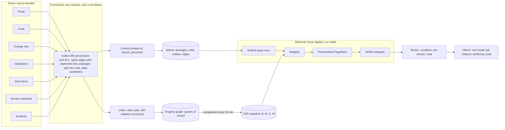
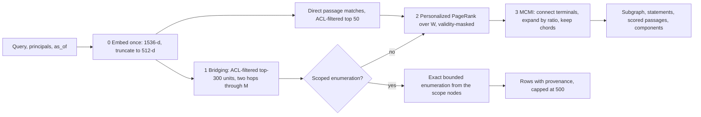
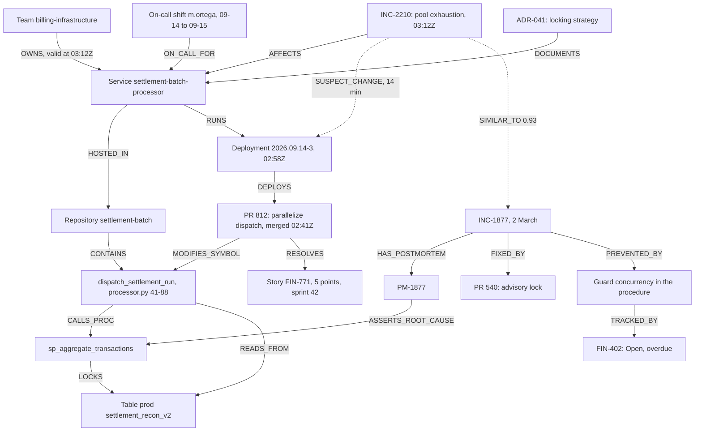

# Enterprise Graph-RAG: Unified Specification

**v1.0. One graph, one connector contract, seven kinds of engineering artifact.**

> **Provenance.** Imported on 2026-09-15 from the user's rendered specification ("Enterprise Graph-RAG:
> Unified Specification v1.0", 15 September 2026) and converted to Markdown by the orchestrator. The three
> diagrams keep their Mermaid source. Formulas are transcribed as plain text. Pseudo-code and record
> contracts are fenced as `text` so the Markdown Ruff job leaves them alone. Section 16, "Outputs of
> v1.0", is the one addition to the imported text: it names the Connector Developer Kit, specified in
> the companion document [`connector-developer-kit.md`](connector-developer-kit.md), as a v1.0 output.
> Where this specification and the repository's earlier plan (`docs/rag_it_all.md`) disagree, the
> reconciliation is recorded in the companion document, not silently here.

This document replaces the *Final System Specification* and the *v1.0 system design*. Where they
disagreed, it decides and says why. Where both were silent, on how a Google Doc, a Mongo collection, a
Trello board or a Datadog service actually becomes nodes, units and edges, it specifies the connector.
The direction is one sentence long: every source system is read by a deterministic connector into one
three-layer graph, retrieval is linear algebra over that graph, structure is compiled by code, and a
language model writes prose exactly once, citing ids that code has already verified.

Source families:

| Family | Systems |
| --- | --- |
| Written prose | Google Docs, Word, PDF |
| Code | GitHub, GitLab |
| Change sets | PRs, MRs, commits |
| Database objects | Snowflake, Postgres, SQL Server, Oracle, MongoDB |
| Work management | Jira, Trello, boards |
| Service manifests | Backstage, code-discovered, Datadog |
| Incidents | Incident tools, channels, post-mortems |



*Every source enters through the same contract. Nothing to the right of the connectors knows or cares
which system a node came from; that is what makes an eighth source a connector-sized job rather than an
architecture change.*

## Contents

1. [The direction](#1-the-direction)
2. [Reconciling the two specifications](#2-reconciling-the-two-specifications)
3. [The connector contract](#3-the-connector-contract)
4. [Identity across systems](#4-identity-across-systems)
5. [Reading each source into the graph](#5-reading-each-source-into-the-graph)
6. [The unified ontology](#6-the-unified-ontology)
7. [The index](#7-the-index)
8. [Retrieval](#8-retrieval)
9. [From evidence to answer](#9-from-evidence-to-answer)
10. [Storage, runtime, updates, access](#10-storage-runtime-updates-access)
11. [Worked trace](#11-worked-trace)
12. [Configuration](#12-configuration)
13. [Evaluation and launch](#13-evaluation-and-launch)
14. [Not in v1.0](#14-not-in-v10)
15. [Notation](#15-notation)
16. [Outputs of v1.0](#16-outputs-of-v10)

## 1 The direction

The system answers an engineer's question that spans more than one artifact silo, and shows the
verified path it used. That is the whole job. The seven source families exist because that job cannot
be done completely without them: a root cause runs from an alert through a service, a deployment, a
change, a function, a table and a design decision, and the person who should be paged is in none of
those places.

### Five commitments

- **Render, do not generate.** Every structured fact the parsers know is written as a sentence a query
  can land on: *Story FIN-771 has 5 story points, is In Progress in sprint 42, and declares branch
  FIN-771-parallel-dispatch.* This is what lets a question phrased in prose activate a column, a shift,
  a story point or a call edge without a language model translating on either side.
- **One contract.** A connector emits nodes with provenance and access control, typed edges with a
  statement that justifies them, passages split into units, and alias candidates. The index, the
  linker, retrieval and the compilers never branch on the source system.
- **Two edge families, never confused.** Deterministic edges come from a parser, a metadata field or a
  stated rule and are walked exactly. Probabilistic edges come from similarity or co-occurrence, carry
  a weight and a method, and are walked by diffusion. A label the parser did not earn is never stored,
  because a relation that was guessed is exactly the hallucinated structure this design exists to
  avoid.
- **Time and access are attributes, not afterthoughts.** Every event carries `ts`, every relationship
  that can change (ownership, on-call, dependency, sprint membership) carries a validity window, and
  every passage carries an ACL. Root-cause questions are answered *as of* the incident; ownership
  questions are answered as of now; nobody reads a document they could not open themselves.
- **One model call, after the evidence.** Retrieval is linear algebra, structure is compiled,
  pre-checks are computed, and then one model writes prose from a rendered scaffold. Code extracts
  every citation it wrote and checks it against the evidence before the answer is shown.

### Six question shapes

Two of the shapes need a different retrieval mode from the rest. A causal or impact question wants the
cheapest connected explanation, which is a small subgraph. An inventory or status question wants every
member of a scope, which a 50-node subgraph cannot hold; for those the router resolves the scope with
the same bridging step and then runs an exact, bounded enumeration over the graph (§8.6).

| Shape | Example | Retrieval mode | Scaffolds, in order |
| --- | --- | --- | --- |
| Root cause | Why is settlement-batch-processor timing out since PR 812 shipped, and have we seen this before? | Path | Timeline, dependency graph |
| Change impact | What breaks if we drop `enterprise_invoices.vat_code`? What does MR !219 touch? | Path | Dependency graph, table |
| Ownership | Who owns the settlement processor, who is on call now, and what runs on it? | Path, or enumeration when scoped | Catalog, dependency graph |
| Delivery status | Which stories in sprint 42 have no branch or PR? How many points are left on FIN-700? | Enumeration | Table, dependency graph |
| Comparison | How does `billing.orders` differ between staging and prod? | Path | Table, chunks |
| Lookup | What does `ERR_TENANT_MISSING` mean? What did ADR-041 decide? | Path | Chunks |

### Launch criteria

1. Every citation in an answer resolves to a node or passage in the returned evidence, checked by
   code, and opening it lands on the file and line, hunk, DDL statement, document paragraph, ticket
   field, catalog entry, or incident event it names.
2. Retrieval, routing, compilation and pre-checks finish in under 200 ms at p50 and 350 ms at p99
   before generation starts.
3. Zero generative tokens are spent during ingestion, linking, retrieval or structuring.
4. When the evidence does not connect the question's terminals, the answer says so and shows the
   fragments.
5. No passage, unit or label is shown to a requester whose principals are not on its ACL, verified by a
   leak test suite that runs in CI.

The part engineers will love is not the prose. It is the path preview: the evidence subgraph appears
in well under a second, before any prose, with every node clickable to the exact place it came from and
every edge showing the statement that justifies it. The answer that follows is a reading of that graph,
and says which of its claims were computed by code and which it inferred.

What the system deliberately does not do is listed in §14, with the reason for each cut. It is
read-only, it does not chat, and it does not pretend a subgraph is a metrics warehouse.

## 2 Reconciling the two specifications

The two documents were reconciliations of the same pair of source plans, and they labelled those plans
oppositely: one called the neuro-symbolic plan "Plan A", the other called it "Plan B". This document
refers to them only as the *neuro-symbolic plan* and the *unified-architecture plan*, and to the two
reconciliations as *Spec* (Final System Specification) and *v1.0* (v1.0 system design). Everything they
agreed on is adopted without re-argument: deterministic parsers, one embedder with asymmetric input
types, the three-layer graph, a derived containment matrix, IDF-adaptive synonyms at 0.88,
L1-normalized teleport halves at γ = 0.35, damping 0.85, power iteration, max-normalized MCMI influence
with one 0.45 ratio knob, cycles kept, rules-first routing, three storage tiers, citations checked by
code, and the cuts of the recognition filter, multimodal ingestion and trained routers.

Where they disagreed, the decision below is the one that survives seven source families rather than
three. Each row says why.

| Axis | Spec | v1.0 | This document | Why |
| --- | --- | --- | --- | --- |
| Structurizer | Model emits JSON scaffold, validated, retried | Compilers in code | **Compilers** | With seven typed, timestamped domains a scaffold is a query over the subgraph. A generated scaffold is a second place to hallucinate and a second bill. |
| Scaffold set | Table (timeline folded in), graph, runbook, catalog, chunks | Timeline, graph, table, catalog, chunks | **v1.0's five; runbook content retrieved as nodes** | A timeline is compiled from `ts` and deserves its own compiler. A runbook is written by the utilizer, but the steps and remediations it should cite are real: runbook documents and post-mortem remediation sections become typed nodes (§5.1, §5.7), so procedural answers cite evidence instead of inventing it. |
| Question shapes | Three | Five | **Six** | Work management with story points and branch declarations makes delivery status a first-class question, and it needs enumeration rather than a path. |
| Edge cost | Verbalize every edge; cost is always 1 − cos | Cap typed edges at 0.5, synonym 0.2, alias ε | **Both** | The verbalization is needed anyway (it is the statement text the scaffold shows) and makes an on-topic edge cheap. The cap guarantees a true structural edge is never cut mid-path by wording. One without the other either prices facts by phrasing or makes every call chain equally cheap. |
| Cycle chords | Separate pass, cost cap τ_cyc | Joint ratio, same r_min, interleaved | **Joint ratio** | Each new domain would otherwise need its own chord threshold. One knob, one heap. |
| Bridging | Cosine against all blocks, block IDF, 3 hops | Top-300 units by ANN, entity IDF, degree normalization, 2 hops | **v1.0's form plus a boilerplate weight** | ANN candidates keep the products sparse at hundreds of millions of units. Spec's block IDF survives as a weight on unit content hashes (§7.2), which is what silences `import logging` across forty thousand files. |
| Passage score | Sum of contained entity mass | Mean | **Mean** | Passage length now ranges from a one-line ticket to a 1,500-token function body; a sum ranks by length. |
| Terminals | 6 entities, 4 passages, plus edge-verbalization matches | 5 and 5 | **5 and 5** | Edge statements are units, so a query that matches a call edge seeds its endpoints through bridging. A separate terminal source would double-count them. |
| Query-time store | Dijkstra and expansion in Neo4j | Everything in CSR; graph hydrated once | **CSR only** | Stateless replicas with a hot-swapped snapshot scale with data; an online graph traversal is the first thing that falls over at a hundred million edges. |
| Updates | "Every update is local" | Append lane plus scheduled compaction | **Append and compaction** | IDF, synonym neighbours and sampled schemas are corpus-wide. The job that recomputes them has to exist and be monitored. |
| Router fallback | One bounded model call on ties | Never; chunks always eligible | **Never** | A model in the routing path is a model in the latency budget and the failure budget, for a six-way choice a lexicon makes. |
| Provenance | Span, version, observed-at, parser | `url`, `ts`, `owner_ref` | **Spec's record plus validity windows** | Line-level citation needs the span; as-of answers need `valid_from` and `valid_to` on relationships. |
| Premise | Greenfield, Neo4j | Extends a running HippoRAG v2 index | **Connector contract** | An existing index is one connector's worth of already-emitted nodes and edges. The contract is what makes the premise irrelevant. |
| Embedder outage | BM25 over units, response labelled degraded | Not addressed | **Keep the fallback** | A complete product keeps answering, more weakly and with a label, when its one external dependency is down. |
| Notation | B, α damping | P containment, d damping | **B, d** | α was overloaded in the source plans and P collides with the stochastic matrix. §15 maps both documents onto these symbols. |
| Constants | N_max = 60, ε = 0.02, κ = 0.04 | 40, 0.05, 0.05 | **50, 0.05, 0.05** | Seven domains and two scaffolds per answer need more room than 40; the traces in both documents fit in 20. The fixture set decides where it settles. |

### What neither document specified

Both documents stopped at the seams that break first when the data gets wider. This document adds, as
first-class design: the connector contract (§3); an identity resolver with ordered alias rules and a
reconciliation queue for what the rules cannot decide (§4); validity windows and `as_of` compilation
(§3, §9); access control enforced at search and at hydration (§10.4); the scoped enumeration path for
inventory and status questions (§8.6); a template classifier that turns post-mortems, ADRs and runbooks
into typed nodes rather than generic prose (§5.1); schema inference for document databases (§5.4);
declared-versus-observed service dependencies (§5.6); and precedent retrieval, which is how an incident
finds the post-mortem that already said what would have prevented it (§5.7).

## 3 The connector contract

A connector is a pure function from a source system's bytes and API responses to five kinds of record.
It runs no language model, it never writes a relation label it did not derive from syntax, metadata or a
named rule, and it never decides what happens downstream. This is the whole extensibility story: a new
source is a new connector against this contract and a fixture set, and nothing else changes.

```text
Node {
  id           : canonical key, e.g. fn:settlement-batch/processor.py::dispatch_settlement_run
  type         : from the ontology (§6)
  domain       : prose | code | change | db | work | service | incident
  label        : display name
  attrs        : { ... }                     # typed attributes: story_points, severity, column_type, ...
  ts           : RFC 3339 | null             # the moment this node is an event of, not ingestion time
  provenance   : Provenance
  acl          : [ principal id ]            # who may read this node's text and label
}

Edge {
  src, dst     : node ids                    # read src → dst; canonical direction per §4.4
  type         : from the ontology
  family       : deterministic | probabilistic
  source       : parser | metadata | rule | similarity | cooccurrence
  rule         : name | null                 # e.g. temporal_window, doc_subject, sampled_schema
  weight       : 1.0 for deterministic; similarity or confidence otherwise
  statement    : rendered sentence that justifies the edge, plus the source statement when one exists
  unit_ref     : unit id whose vector this edge reuses, or null
  valid_from, valid_to : RFC 3339 | null     # relationships that can change carry a window
  provenance   : Provenance
}

Passage {                                    # what a reader is finally shown: ≤ 1,500 tokens
  id, node_ref, title, text, ts, provenance, acl
}

Unit {                                       # what a query lands on: one sentence, statement, row, line or rendered fact
  id, passage_id, ordinal, text, embed_text  # embed_text = innermost heading or enclosing symbol + text
  mentions     : [ entity id ]               # rows of M
  kind         : sentence | statement | row | diff_line | rendered_fact | rendered_edge
  content_hash : sha256 of text with the prefix removed (boilerplate weight, §7.2)
}

AliasCandidate {                             # exact identities the connector can assert
  a, b : node ids;  rule : name;  weight : 1.0;  provenance
}

Provenance {
  source_system : gdocs | word | pdf | github | gitlab | snowflake | postgres | mssql | oracle | mongodb
                | jira | trello | backstage | k8s | datadog | pagerduty | slack | ...
  uri           : canonical link into the source system
  path          : repository path, schema.object, document id, ticket key, service id
  span          : { line_start, line_end } | { statement_index } | { page, bbox } | { paragraph } | { event_id } | null
  version       : commit sha | migration id | revision id | snapshot ts | changelog id
  observed_at   : RFC 3339 of the version
  parser        : "tree-sitter/python@0.23" | "sqlglot/postgres@26" | "docx-ooxml@1" | "pymupdf@1.24" | ...
}
```

### Rendering rules

Rendered facts are the mechanism that makes seven very different systems searchable by one query. Each
connector owns a small set of sentence templates, one per node type and one per edge type, tested with
fixtures. The rules are:

- One fact per unit. *Table BILLING.SETTLEMENT_RECON_V2 has column RUN_ID of type NUMBER(38,0), not
  null* is one unit; the table's forty columns are forty units, so a query about one column lands on
  one row of M.
- Edge statements read *{src type} {src label} {verb phrase} {dst type} {dst label}*, followed by a
  colon and the source statement when one exists: *function dispatch_settlement_run calls stored
  procedure SP_AGGREGATE_TRANSACTIONS: cursor.callproc("SP_AGGREGATE_TRANSACTIONS", [run_id])*.
  Rule-derived edges append the rule and its evidence in parentheses: *incident INC-2210 suspects
  change PR #812 (temporal window: deployed 14 minutes before the first alert)*.
- An edge produced by a source statement reuses that statement's unit vector; the statement's unit
  text *is* the verbalized form. One vector per fact, never two.
- Attribute units name the entity by its label and canonical key so dictionary matching in other
  domains links back to it.
- Sentences from prose carry the innermost heading (at most twelve tokens) in `embed_text`; code
  statements carry the enclosing symbol. The stored `text` is unchanged, so citations quote the source
  exactly.

### What a connector must not do

It must not call a language model. It must not emit a relation label from co-occurrence or similarity;
those go into probabilistic edges with the method named. It must not assert an alias it cannot back
with a rule; it emits a candidate for the linker. It must not fill a missing timestamp with ingestion
time. It must not drop a record it cannot parse silently: parse failures are counted per language and
dialect and alert above 1% (§13.3).

## 4 Identity across systems

The same thing has a different name in every system: `settlement-batch-processor` in Backstage,
`settlement-batch` as a repository, `settlement_batch_processor` as a Datadog service tag,
`settlementbatch` as a Kubernetes deployment, "the settlement job" in a post-mortem. The graph is only
cross-artifact if those become one node or are joined by an edge of weight 1. The resolver below is
the ordered set of rules that decides, and the reconciliation queue is where it admits it cannot.

### 4.1 Canonical keys

| Type | Key | Example |
| --- | --- | --- |
| Repository, File, symbol | `repo:{host}/{org}/{name}`, `file:{repo}/{path}`, `fn:{repo}/{path}::{qualified name}` | `fn:settlement-batch/processor.py::dispatch_settlement_run` |
| Change request, commit | `pr:{repo}#{number}`, `commit:{sha}` | `pr:settlement-batch#812` |
| Database object | `{tbl|col|proc|view|coll}:{env}/{database}.{schema}.{object}[.{column}]` | `tbl:prod/billing.public.settlement_recon_v2` |
| Work item, sprint | `wi:{tracker}/{key}`, `sprint:{tracker}/{board}/{id}` | `wi:jira/FIN-771` |
| Service, team, engineer | `svc:{name}`, `team:{name}`, `eng:{email}` | `svc:settlement-batch-processor` |
| Incident, alert | `inc:{tool}/{id}`, `alert:{tool}/{id}` | `inc:pagerduty/INC-2210` |
| Document, section | `doc:{system}/{id}`, `sec:{doc}#{heading path hash}` | `doc:gdocs/1BxiMV…` |
| Term (NER-only) | `term:{casefolded surface form}` | `term:connection pool` |

### 4.2 Alias rules, in priority order

Each rule produces an alias edge of weight 1 tagged with the rule name. The first rule that fires for a
pair wins; later rules never override an explicit annotation.

1. **Explicit annotation.** Backstage `github.com/project-slug`, `backstage.io/source-location`,
   `datadoghq.com/service`, `pagerduty.com/service-id`, `jira/project-key`; Datadog service
   definition `links` and `integrations`; Jira development panel branch and PR links; Trello card
   attachments that are PR or ticket URLs.
2. **Declared in code.** `DD_SERVICE` and `app.kubernetes.io/name` in a manifest inside a repository
   bind that repository to a service; a container image name binds a deployment to a repository; an
   ORM mapping binds a class to a table or collection; an OpenAPI `info.title` in a repository binds
   the API to it.
3. **Identifier equality.** Case-folded exact match of an identifier that only one system minted:
   ticket keys, commit SHAs, PR numbers with a repository, fully qualified table names within an
   environment, error codes, and HTTP method plus path for endpoints within one service.
4. **Normalized name equality, type-compatible.** Strip separators and the suffixes `-svc`,
   `-service`, `-api`, `-app`; require the pair to be type-compatible (Service to Repository, Service
   to Datadog service, JIRA component to Service). `settlement-batch-processor` and
   `settlement_batch_processor` link here; `settlement-batch` does not, and waits for rule 1 or 2.
5. **Same object across environments.** Identical fully qualified database object names in different
   environments are joined by `SAME_OBJECT_AS`, which is what the comparison scaffold diffs.

Everything else is a synonym proposal: a nearest-neighbour search over entity vectors for each new
entity (top 20), accepted when

    cos(v_ei, v_ej) ≥ τ0 + κ (1/idf(ei) + 1/idf(ej)),    τ0 = 0.88, κ = 0.05,

stored with weight equal to the cosine, and only between type-compatible entities. Two rare identifiers
link at about 0.89; two tokens that appear in most passages need about 0.98. A NER-only `Term` never
becomes a synonym of a code symbol or a table; it links to a Service, Team or Engineer by case-folded
label match or not at all.

### 4.3 The reconciliation queue

Synonym proposals between two Service nodes, between a Service and a Repository, or between a database
object and a Resource are held in a queue rather than written, because a wrong identity between
services corrupts every ownership and impact answer that crosses it. The queue is a list a platform
team reviews weekly; an accepted pair becomes an alias with `rule=reviewed` and its `provenance` names
the reviewer. Until then the two nodes stay separate and the answer says so when a path would have
crossed the gap. Coverage (share of services with a resolved repository, Datadog service and owner) is
a dashboard number (§13.3).

### 4.4 Canonical direction of cross-domain edges

Every cross-domain relationship is stored once, in one direction, by the connector that owns the fact;
the reverse is a view. A change request `RESOLVES` a work item (the change connector owns it, because
the key is in the PR); the work connector's "fixed by" is the reverse view and it emits an alias
candidate for the PR link instead of a second edge. An incident `AFFECTS` a service; a service
`HOSTED_IN` a repository; a post-mortem `ASSERTS_ROOT_CAUSE` of a node; a deployment `DEPLOYS` a change
request. The full canon is the "across domains" column of the ontology (§6).

## 5 Reading each source into the graph

Each connector below is described the same way: where the data comes from and how changes arrive; what
becomes a passage and what becomes a unit; which entities and edges it emits and by what rule; what
links it to the other six; how a citation resolves; and what it will not do. The uniformity is the
point. An engineer who has read one connector can read the others, and can write the eighth.

### 5.1 Written prose (Google Docs, Microsoft Word, PDF)

Prose is where the *why* lives: the ADR that chose the locking strategy, the PRD that required the
batch window, the runbook that says how to roll back, the post-mortem that already named the fix. It is
also the weakest-structured source, so the connector's job is to find the structure that is there
(headings, links, tables, templates, comments, authors, revisions) and never to invent structure that
is not.

#### Sources and how changes arrive

- **Google Docs.** Drive `changes.list` with a page token, polled every minute, or `changes.watch`
  push notifications; `documents.get` returns the body as structural elements with named heading
  styles, text runs with link URLs, tables, lists and inline objects. Comments and their quoted anchor
  text come from `comments.list`; revisions and their editors from `revisions.list`; the ACL from
  `permissions.list`. Suggested edits are not indexed; the accepted view is, and a unit that carries
  pending suggestions is flagged.
- **Word.** `.docx` is read directly from the OOXML: paragraphs with their style names, hyperlinks,
  tables, tracked changes (insertions included, deletions excluded, a pending-change flag on the
  unit), comments with their range anchors, and core properties for author and modified time. Files
  live in SharePoint or OneDrive (Graph delta queries, five-minute cadence) or in Drive. Legacy `.doc`
  is converted to `.docx` with headless LibreOffice first; the conversion is recorded in `parser`.
- **PDF.** PyMuPDF extracts text blocks with font size and position; the document outline is used as
  the heading hierarchy when present, otherwise headings are detected by font-size clustering. Tables
  are extracted with pdfplumber and rendered row by row. Pages with no text layer are OCR'd with
  Tesseract; their units carry `ocr=true` and a confidence, and low-confidence units are excluded from
  synonym proposals. Folders are scanned hourly; the file's SHA-256 is its version.

All three are normalized to one intermediate form: an ordered list of blocks (heading with level,
paragraph, list item, table row, code line, caption) with links, anchors and comments, plus metadata.
Everything after this point is format-independent.

#### Passages and units

A passage is a heading-bounded section, split on paragraph boundaries at 1,500 tokens, titled with its
heading path (*Settlement v2 › Locking strategy*). A table is its own passage. Units are sentences
(rule-based segmenter), list items, table rows rendered as *Column: value; Column: value*, and
code-block lines. A unit's `embed_text` is the innermost heading plus the sentence, so *It takes an
exclusive lock* embeds as *Locking strategy: It takes an exclusive lock*.

#### Template classification

Before entity extraction, the heading signature is matched against a per-organization set of
templates. A match promotes the document from generic prose to a typed node and hands its sections to a
specialized parser:

| Template | Heading signature | Emits |
| --- | --- | --- |
| ADR | Status, Context, Decision, Consequences | `ADR` node with `status`; Decision sentences as units; `SUPERSEDES` from the status line; `DOCUMENTS` to every Service or Table named by dictionary match in Context or Decision |
| PRD or design doc | Problem, Goals, Requirements, Non-goals | `PRD`; numbered or "shall/must" sentences become `Requirement` nodes with `CONTAINS_REQUIREMENT`; `SPECIFIES` to an Epic when a key is linked |
| Runbook | Prerequisites, Steps, Verification, Rollback | `Runbook` with ordered `RunbookStep` units; `RUNBOOK_FOR` to the Service named or linked |
| Post-mortem | Summary, Impact, Timeline, Root cause, Action items | Handed to the incident connector's post-mortem parser (§5.7). The document remains a prose node; the typed incident nodes point back at its sections. |

#### Entities and edges

Entity mentions come from four extractors, in decreasing precision, and only the first three produce
entities that can carry typed edges. Identifier regexes: ticket keys, PR numbers, commit SHAs, error
codes. Dictionary matching (Aho-Corasick over the labels already in V_e): service names, tables,
columns, symbols, team names; case-sensitive for code symbols, case-folded otherwise. Hyperlink
resolution: a URL into Jira, GitHub, GitLab, Backstage, Datadog or another document becomes a mention
of that node and a `LINKS_TO` edge. Transformer NER (no generation) for people, organizations and
technical terms: matched to Engineer and Team labels where possible, otherwise stored as `Term`
entities that appear in M and in nothing else.

| Node types | Deterministic within the domain | Deterministic across domains | Rule-derived | Probabilistic |
| --- | --- | --- | --- | --- |
| DocPage, DocSection, ADR, PRD, Runbook, RunbookStep, Requirement, GlossaryTerm, Comment, Revision, Term | `PARENT_OF` (heading hierarchy), `LINKS_TO` (document to document), `SUPERSEDES`, `HAS_COMMENT`, `REVISION_OF`, `CONTAINS_REQUIREMENT`, `HAS_STEP` | `AUTHORED_BY`, `LAST_EDITED_BY`, `COMMENTED_BY` to Engineer; `LINKS_TO` to WorkItem, ChangeRequest, Service, Table, Incident; `SPECIFIES` to Epic; `RUNBOOK_FOR` to Service | `DOCUMENTS` to Service or Table (`rule=doc_subject`: the section links to the subject's repository or catalog entry, or names it at least twice) | None materialized. Passage-cosine edges between documents and code were considered and rejected: they form hubs, and PageRank already flows between a section and a function through the entities both mention. |

#### Provenance and access

Google Docs: document id, revision id, heading path, paragraph index and character range; opening the
citation scrolls to the paragraph. Word: file id, revision, paragraph index. PDF: file hash, page,
block bounding box; the viewer opens the page with the block highlighted. `observed_at` is the revision
time. The ACL is the document's permission list (users and groups) resolved to principal ids; PDFs
inherit their folder's.

**What it will not do.** It does not read images, diagrams or embedded charts; a diagram is reachable
through the section that contains it. It does not extract requirements or decisions from documents
that do not match a template. It does not turn a NER term into a typed relationship. It does not index
suggestions or deletions, and it says when a cited paragraph has pending changes.

### 5.2 Code (GitHub, GitLab; monorepos and many repositories)

Code is the densest source of deterministic edges and the one where a language model would hallucinate
most confidently. Everything here comes from a grammar, a resolver or a build file. The one signal that
is not certain, an unresolved call, is stored as a probabilistic edge and never dressed up as a fact.

#### Sources and how changes arrive

Each repository is cloned once and updated by `push` webhooks on its default branch (GitHub) or
`push_events` (GitLab); the payload lists changed paths, so only those files are re-parsed. Feature
branches are not indexed here; they enter through change sets (§5.3). Generated code
(`linguist-generated`), vendored directories and binaries are excluded by the same rules the host
uses.

#### Passages and units

A file of at most 1,500 tokens is a passage; a larger file is split per top-level symbol, and a large
class per method. Units are one per statement, signature, decorator and comment or docstring sentence.
A statement that produces a typed edge is stored in its verbalized form (*function
dispatch_settlement_run calls stored procedure SP_AGGREGATE_TRANSACTIONS: cursor.callproc(…)*); every
other statement is stored as *{enclosing symbol}: {source line}*. Comments matter more than they look:
*# fan out across workers* is often the only prose bridge between a design question and the function
that answers it.

#### Parsing and resolution

- **Symbols and structure.** Tree-sitter grammars per language emit Package, File, Class, Interface,
  Enum, Function and Method nodes with spans, and `CONTAINS`, `INHERITS`, `IMPLEMENTS`,
  `INSTANTIATES`, `DECORATED_BY`.
- **Imports and calls.** A per-language resolver turns import statements into file and symbol
  references: Python module paths; TypeScript and JavaScript module resolution with `tsconfig` paths;
  Java and Kotlin packages with Gradle or Maven modules; Go module paths; C# namespaces with project
  files; Ruby by autoload convention. A call whose target resolves through the import graph and a
  symbol table is a deterministic `CALLS` edge. A call that resolves only by name is a probabilistic
  edge with weight 0.5 and `source=cooccurrence`. Dynamic dispatch and reflection are not resolved.
- **Across repositories.** Build files name the packages a repository publishes (`package.json`,
  `pyproject.toml`, `pom.xml`, `go.mod`). An allow-list of internal package names lets an import in
  one repository resolve to a symbol in another; `DEPENDS_ON_PACKAGE` is emitted between repositories
  either way.
- **Routes.** Framework decorators and annotations (FastAPI, Flask, Spring, Express, Rails routes, Go
  mux) become `APIEndpoint` nodes (method and path) with `HANDLED_BY` to the function. The service
  connector's OpenAPI endpoints alias to these by method and path (§4.2, rule 3).
- **SQL in code.** String literals passed to known database call sites (`cursor.execute`,
  `jdbcTemplate`, `knex.raw`, `sqlx`, ORM raw-query methods) are parsed with SQLGlot in the dialect
  the repository's connection configuration declares. A parsed statement yields `EXECUTES_SQL` to the
  tables, views and procedures it names; an unparsable dynamic string yields a probabilistic edge to
  the identifiers a regex finds, weight 0.5, `source=cooccurrence`.
- **ORMs and document stores.** SQLAlchemy `__tablename__`, Django model naming, JPA `@Table`, Prisma
  models, Mongoose and Spring Data schemas produce `MAPPED_TO` Table or Collection, and Mongoose or
  Prisma field definitions produce deterministic Field nodes (§5.4). Driver calls
  (`db.collection("orders")`, model methods) produce `READS_FROM` and `WRITES_TO` on the collection.
- **Configuration.** Reads of environment variables and settings keys become `ConfigKey` entities
  with `READS_CONFIG`; the service connector binds the same keys to the values manifests declare
  (§5.6).
- **Ownership from code.** `CODEOWNERS` yields `OWNS` from Team to Package or path prefix. This is
  ownership the catalog may not know, and it is what answers "who owns this file" in a monorepo.
- **Infrastructure files.** Dockerfiles, Kubernetes manifests, Helm values, Terraform and
  `catalog-info.yaml` inside a repository are handed to the service connector (§5.6) with the
  repository and path as provenance.

#### Entities and edges

| Node types | Deterministic within the domain | Deterministic across domains | Probabilistic |
| --- | --- | --- | --- |
| Repository, Package, File, Class, Interface, Enum, Function, Method, APIEndpoint, ConfigKey | `CONTAINS`, `IMPORTS`, `CALLS`, `INHERITS`, `IMPLEMENTS`, `INSTANTIATES`, `DECORATED_BY`, `HANDLED_BY`, `DEPENDS_ON_PACKAGE`, `READS_CONFIG` | `EXECUTES_SQL` to Table, View, StoredProcedure; `MAPPED_TO` to Table or Collection; `READS_FROM`, `WRITES_TO` to Collection; `OWNS` from Team (CODEOWNERS); `HOSTED_IN` from Service (service connector); `MODIFIES_SYMBOL` from ChangeRequest (change connector) | `CALLS` by name only (weight 0.5); `EXECUTES_SQL` by regex (weight 0.5); `SIMILAR_IMPLEMENTATION` between function bodies in different repositories at cosine ≥ 0.92, top 3 |

#### Provenance and access

Repository, commit SHA of the indexed default-branch head, path, line range, grammar version. A
citation opens the file at that SHA and line range, so it stays correct after the file moves on. The
ACL is the repository's: public, or its collaborators and teams resolved to principal ids.

**What it will not do.** It does not resolve dynamic dispatch, reflection or metaprogramming. It does
not attribute individual symbols to authors from blame; authorship is a change-set fact. It does not
infer which tests cover a function; a test is a function like any other. It does not index branches
other than the default one.

### 5.3 Code change sets (GitHub pull requests, GitLab merge requests, commits, reviews, pipelines)

A change set is the hinge of every root-cause and impact answer: it is the only artifact that is
simultaneously a piece of code, a moment in time, a ticket reference, a set of people and, once
deployed, a suspect. The connector's job is to compute what a change touched at the symbol and schema
level, and to record exactly when it entered each state.

#### Sources and how changes arrive

GitHub: `pull_request`, `pull_request_review`, `pull_request_review_comment`, `issue_comment`,
`check_run` and `release` webhooks; GitLab: `merge_request`, `note`, `pipeline` and `release` events.
Backfill pages through the API. A `synchronize` or force-push re-ingests the change; a merge triggers
the final computation below.

#### Passages and units

Passages: the description, split by its template sections when the repository has one; each diff hunk
with three lines of context; each review thread; each commit message. Units: description and comment
sentences; each added or removed line, prefixed by its side and enclosing symbol (*+ in
dispatch_settlement_run: workers=30*); commit subject lines; and one rendered fact per change request:
*PR #812 "parallelize settlement dispatch" by a.kim, opened 2026-09-13, merged 2026-09-14T02:41Z into
main, 2 approvals, CI passed, resolves FIN-771, branch FIN-771-parallel-dispatch*.

#### What is computed

- **Files and symbols.** `MODIFIES_FILE` from the diff. `MODIFIES_SYMBOL` by intersecting hunk line
  ranges with AST spans of the head commit: for a merged change the head is the default branch the
  code connector indexed; for an open change the changed files are parsed at the head SHA in a scratch
  parse that is not written to the code graph. Diffs of the AST yield `ADDS_SYMBOL`,
  `REMOVES_SYMBOL`, `RENAMES_SYMBOL` and `CHANGES_SIGNATURE`, each with the before and after signature
  in the statement.
- **Schema.** A hunk in a migration or DDL file is parsed with SQLGlot; the change request gets
  `ALTERS_SCHEMA` to the Migration node the database connector creates, and through it
  `DROPS_COLUMN`, `ADDS_COLUMN`, `ALTERS_COLUMN` and `ALTERS_PROCEDURE` to the objects. "Dropped
  `vat_code`" is an edge, not a sentence the model has to notice.
- **Configuration.** A hunk in a manifest, Helm values, feature-flag or environment file yields
  `CHANGES_CONFIG` to the Service the manifest belongs to (§5.6).
- **Tickets.** `RESOLVES` to a WorkItem from keys in the title, body, branch name and commit messages,
  and from the provider's closing syntax. This is the canonical direction; the work connector never
  emits the reverse.
- **People and process.** `AUTHORED_BY`, `REVIEWED_BY` with the review state, `MERGED_BY`,
  `ON_BRANCH`, `TARGETS` base branch, `CHECKED_BY` pipeline with its result, `PART_OF_RELEASE` by tag
  reachability, `REVERTS` when a revert commit is detected by message and inverse diff.
- **Deployment.** The service connector's deployment events carry a version or SHA; `DEPLOYS` from
  Deployment to ChangeRequest is emitted there by matching the merge commit. The change request itself
  never guesses when it shipped.

`ts` is the merge time for a merged change and the open time otherwise; the state is an attribute, and
the timeline compiler renders *opened*, *merged* or *reverted* accordingly.

#### Entities and edges

| Node types | Deterministic within the domain | Deterministic across domains | Probabilistic |
| --- | --- | --- | --- |
| ChangeRequest, Commit, DiffHunk, ReviewThread, Review, Pipeline, Branch, Release | `HAS_COMMIT`, `HAS_HUNK`, `HAS_THREAD`, `ON_BRANCH`, `TARGETS`, `SUPERSEDES`, `REVERTS`, `PART_OF_RELEASE`, `CHECKED_BY` | `MODIFIES_FILE`, `MODIFIES_SYMBOL`, `ADDS_SYMBOL`, `REMOVES_SYMBOL`, `RENAMES_SYMBOL`, `CHANGES_SIGNATURE` to code; `ALTERS_SCHEMA` to Migration and through it `DROPS_COLUMN`, `ADDS_COLUMN`, `ALTERS_COLUMN`, `ALTERS_PROCEDURE`; `CHANGES_CONFIG` to Service; `RESOLVES` to WorkItem; `AUTHORED_BY`, `REVIEWED_BY`, `MERGED_BY` to Engineer | None. Everything a change set says about itself is in the diff or the API. |

#### Provenance and access

Provider, repository, number, hunk index and line in the file at the head SHA; review comment id;
commit SHA. A citation opens the diff at the hunk. ACL follows the repository.

**What it will not do.** It does not classify the intent of a change (refactor, feature, fix); the
ticket type carries that. It does not infer review quality. It does not compute symbol edges for a
change whose head cannot be parsed; that change is flagged and cited by file only.

### 5.4 Database objects (Snowflake, Postgres, SQL Server, Oracle and other enterprise SQL, MongoDB)

A database has two truths: the schema the migrations say it has, and the schema it actually has, in
each environment. Both are indexed, keyed by environment, and the connector emits a drift flag when
they disagree, because "prod has a column the migrations don't" is a root cause on its own. Relational
engines are read through SQLGlot in their own dialect; MongoDB, which has no DDL, is read from
validators, indexes, application schemas and sampling, with sampled facts labelled as such.

#### Sources and how changes arrive

| Engine | Schema source | Logic source | Runtime access source | Cadence |
| --- | --- | --- | --- | --- |
| Snowflake | `INFORMATION_SCHEMA`, `SHOW`, `GET_DDL` | Views, SQL procedures and tasks via `GET_DDL`; JavaScript and Python procedures by extracting their SQL literals; `OBJECT_DEPENDENCIES` as native lineage | `ACCOUNT_USAGE.ACCESS_HISTORY`: objects read and written per query, with role | Snapshot every 6 h; access history daily |
| Postgres | `pg_catalog`, `information_schema` | `pg_get_viewdef`, `pg_get_functiondef` for PL/pgSQL parsed statement by statement, triggers from `pg_trigger` | `pg_stat_statements` by role | Snapshot every 6 h |
| SQL Server | `sys.objects`, `sys.columns` | `sys.sql_modules`; `sys.dm_sql_referenced_entities` as native dependency | Query Store | Snapshot every 6 h |
| Oracle, DB2, Teradata | `ALL_OBJECTS`, `SYSCAT`, `DBC` | `ALL_SOURCE`, `ALL_DEPENDENCIES`; dialects SQLGlot supports are parsed, others fall back to identifier regexes with weight 0.5 and a flag | Audit or unified audit trail where enabled | Snapshot every 6 h |
| Migrations in repositories | Flyway, Liquibase, Alembic, Prisma Migrate, dbt (`manifest.json`) | Same files | — | On merge, through the change connector |
| MongoDB | `listCollections` validators, `getIndexes`, sampling of 1,000 recent documents per collection, Mongoose and Prisma schemas from code | Aggregation pipelines in code: `$lookup`, `$merge`, `$out` | Profiler or Atlas access logs where enabled | Validators and indexes every 6 h; sampling weekly and on validator change |

#### Passages and units

Passages: one DDL block per object; procedure and function bodies split at statement boundaries at
1,500 tokens; each migration file; each view definition; and for MongoDB a rendered collection card.
Units are one fact each: a column definition (*Table prod/billing.public.settlement_recon_v2 has
column run_id of type bigint, not null*), a constraint, a foreign key, an index, a grant, a procedure
statement (verbalized when it yields an edge: *procedure sp_aggregate_transactions locks table
settlement_recon_v2 in exclusive mode: LOCK TABLE settlement_recon_v2 IN EXCLUSIVE MODE*), a
column-level lineage sentence for a view (*view v_settlement_totals.total derives from
settlement_recon_v2.amount*), and for MongoDB one unit per field (*Collection prod/orders has field
customer_id of type ObjectId, present in 99.7% of 1,000 sampled documents*), per index and per
validator rule.

#### What is computed

- **Structure.** Database, Schema, Table, Column, View, StoredProcedure, Function, Trigger, Index,
  Role, ServiceAccount and Migration nodes; `HAS_COLUMN`, `FOREIGN_KEY_TO`, `HAS_INDEX`, `FIRES_ON`,
  `GRANTED_TO`. For MongoDB: Collection, Field, Index, Validator; `HAS_FIELD` with
  `rule=sampled_schema` unless a validator or an application schema defines it, in which case it is
  deterministic and the two are reconciled by field path.
- **Logic and lineage.** `READS_FROM`, `WRITES_TO`, `CALLS_PROC`, `LOCKS` (explicit lock statements
  and lock hints such as `TABLOCKX` or `FOR UPDATE`), and column-level `DERIVES_FROM` for views and
  dbt models. Native dependency views (Snowflake, SQL Server, Oracle) are cross-checked against the
  parse; a disagreement is logged, and the native view wins for the edge.
- **Environments.** Every object key includes its environment. `SAME_OBJECT_AS` (§4.2, rule 5) joins
  the same name across environments; the comparison compiler diffs their column sets and types. Where
  migrations and the live snapshot disagree, the object gets `schema_drift=true` and a rendered unit
  stating the difference.
- **Who touches it.** Access history gives `ACCESSED_BY` from object to Role or ServiceAccount with
  query count and last-seen, tagged `source=access_history`; the service connector maps the account to
  a Service with `USED_BY`. This is how "which services read this table" is answered when no code
  names it, which in a warehouse is most of the time.
- **Where it came from.** The change connector's `ALTERS_SCHEMA` lands on the Migration node this
  connector creates, so a column has a path to the pull request that added or dropped it.

#### Entities and edges

| Node types | Deterministic within the domain | Deterministic across domains | Rule-derived and probabilistic |
| --- | --- | --- | --- |
| Database, Schema, Table, Column, View, StoredProcedure, Function, Trigger, Index, Role, ServiceAccount, Migration, Environment, Collection, Field, Validator | `HAS_COLUMN`, `HAS_FIELD`, `FOREIGN_KEY_TO`, `HAS_INDEX`, `READS_FROM`, `WRITES_TO`, `CALLS_PROC`, `LOCKS`, `DERIVES_FROM`, `FIRES_ON`, `GRANTED_TO`, `APPLIES_TO` (Migration to object), `REFERENCES` (Mongo `$lookup`), `SAME_OBJECT_AS` (alias, weight 1) | `MAPPED_TO` from Class (code connector); `EXECUTES_SQL` from Function (code connector); `ALTERS_SCHEMA` from ChangeRequest (change connector); `USED_BY` to Service through ServiceAccount (service connector); `PROVIDES` from Resource (service connector) | `HAS_FIELD` by sampling (`rule=sampled_schema`, presence as weight); `ACCESSED_BY` (`source=access_history`, deterministic but observed); identifier-regex `READS_FROM` for unparsable dialects (weight 0.5). Column-name overlap between tables is not an edge: it hubs on `id` and `created_at`; cross-engine identity is left to dbt sources and the synonym threshold over entity vectors. |

#### Provenance and access

Engine, environment, `database.schema.object`, statement index within the object's DDL or migration id
and line, snapshot time, dialect and SQLGlot version. A citation opens the DDL statement or the
migration line. For MongoDB, the sample size and sample time are part of the provenance of every
sampled fact. ACL: database objects are visible to whoever may see the environment's catalog;
production credentials never leave the connector, which reads catalogs and definitions only.

**What it will not do.** It does not read data, only definitions, statistics and access logs. It does
not resolve dynamic SQL built at runtime. It does not assert a MongoDB schema; it reports what
validators, application code and a sample say, and the answer labels sampled fields as inferred. It
does not model ETL tools without a manifest; their lineage appears only through access history.

### 5.5 Work management (Jira, Trello, Kanban and Scrum boards; epics, stories, tasks, subtasks, story points, branch declarations)

Work items are where intent, people and time meet the code. A story explains why a pull request
exists; its transitions are timeline events; its points and sprint are how progress is measured; its
declared branch is the thread that ties a plan to a diff. The connector normalizes every tracker onto
one model and renders every attribute as a sentence, because "which stories in sprint 42 have no
branch" is a question about attributes, not about prose.

#### Sources and how changes arrive

- **Jira.** REST v3 with `expand=changelog` for every transition; webhooks for issue, sprint and board
  events; the development panel for declared branches and linked pull requests; story points from the
  instance's custom field, mapped once in configuration.
- **Trello.** Boards, lists, cards, checklists, labels and attachments via the API and webhooks; a
  card is a Task unless a label maps it to another type; checklist items are Subtasks; a list maps to
  a status category through a per-board configuration, and an unmapped list remains a raw Column node.
- **Other boards.** Linear, Shortcut, Azure Boards and similar map onto the same model (WorkItem,
  Container, State, Iteration) through the same configuration shape.

#### Passages and units

Passages: the item (title, description, acceptance criteria), each comment thread, an epic summary
(the epic and its children's titles), and a sprint summary. Units: sentences of description and
comments; acceptance-criteria bullets; one rendered fact per item (*Story FIN-771 "Parallelize
settlement dispatch": 5 story points, In Progress, sprint 42, assigned to sarah.c, branch
FIN-771-parallel-dispatch, blocks FIN-790, epic FIN-700*); one unit per transition (*FIN-771 moved
from In Progress to Done at 2026-09-14T02:45Z by sarah.c*); one per sprint (*Sprint 42, 2026-09-08 to
2026-09-21, goal "Settlement v2 cutover", 34 points committed, 21 done as of 2026-09-15*).

#### Entities and edges

| Node types | Deterministic within the domain | Deterministic across domains | Probabilistic |
| --- | --- | --- | --- |
| Initiative, Epic, Story, Task, Subtask, Bug, Spike, Sprint, Board, Column, Transition, Comment, FixVersion, Label, Branch | `PARENT_OF`, `BLOCKS`, `RELATES_TO`, `DUPLICATES`, `CLONED_FROM`, `IN_SPRINT` (with validity window: an item moved between sprints keeps both memberships, dated), `ON_BOARD`, `IN_COLUMN`, `HAS_TRANSITION`, `HAS_COMMENT`, `IN_VERSION`, `HAS_LABEL`, `HAS_BRANCH` | `ASSIGNED_TO`, `REPORTED_BY` to Engineer; `OWNED_BY` to Team; `TRACKS` to Incident; `BELONGS_TO` to Service (tracker component mapped to the catalog by alias rule 4); reverse views of `RESOLVES` from ChangeRequest and `SPECIFIES` from PRD; `HAS_BRANCH` aliases to the change connector's Branch by name | None. Goal-correlation edges were considered and dropped; co-activation through M already relates items that mention the same things. |

Attributes on every item: type, status, status category, priority, story points, estimate, created,
updated and resolved times, sprint ids, labels, components, due date. These are what the table
compiler's aggregate operations run over: count and sum of points by epic, sprint, assignee or status;
items with a branch but no merged change; items done after a sprint closed.

#### Provenance and access

Tracker, key, and the field, comment id or changelog id, with the update time; Trello card and action
ids. A citation opens the issue at the comment or shows the field. ACL: the project's browse permission
(Jira) or board membership (Trello).

**What it will not do.** It does not compare story points across teams unless asked to, and the
catalog compiler says so when it aggregates. It does not infer that a card without a type is a story.
It does not decide that a branch exists in Git; the change connector does, and an item whose declared
branch has no repository branch is reported exactly that way.

### 5.6 Service manifests (Backstage, services discovered from code, Datadog)

The service is the node most other domains attach to: incidents affect it, teams own it, repositories
host it, deployments release it, databases serve it. It is also the node most often declared in three
places at once, or in none. The connector reads all three sources, resolves them to one Service
through the identity rules, keeps declared and observed facts apart, and creates a Service for
anything discovered in code that nobody catalogued, so an undocumented service is still a node the
graph can reach.

#### Sources and how changes arrive

- **Backstage.** The catalog API: Domain, System, Component, API, Resource, Group and User entities
  with their relations (`ownedBy`, `partOf`, `dependsOn`, `providesApis`, `consumesApis`,
  `hasMember`) and annotations. The `catalog-info.yaml` files themselves arrive through the code
  connector, so their path and commit are the provenance. Polled every five minutes.
- **Discovered from code.** Kubernetes manifests, Helm and Kustomize output, Dockerfiles,
  docker-compose, Terraform and OpenAPI or AsyncAPI specs handed over by the code connector on every
  push. Each yields a *ServiceCandidate* with evidence: the deployment name, the image, `DD_SERVICE`
  and `DD_ENV`, environment variables whose values are database URLs, queue names or bucket names,
  declared ports and ingress paths, and the API title and endpoints. Terraform resources for
  databases, queues and buckets become Resource nodes.
- **Datadog.** Service Catalog definitions (owner, contacts, links, tier); APM service list per
  environment; the service dependency map from traces; monitors and SLOs tagged with a service;
  deployment tracking events with version tags. Definitions and monitors hourly, the dependency map
  daily, deployments by webhook. On-call comes from PagerDuty schedules (or Datadog On-Call) as dated
  shifts.

#### Identity

Candidates from all three sources are resolved by the rules in §4.2: annotations first, then
declarations in code, then normalized names between compatible types. A candidate that resolves
attaches its evidence to the existing Service; one that does not becomes a Service with
`source=discovered` and enters the reconciliation queue. Coverage is reported per source pair.

#### Passages and units

Passages: the catalog entry rendered as a card, each OpenAPI operation, each Kubernetes manifest, the
rendered Datadog service page (definition, dependencies, monitors, SLOs as of the snapshot), and each
on-call schedule window. Units: one rendered fact each. *Service settlement-batch-processor is owned by
team billing-infrastructure (Backstage, since 2025-11-02).* *settlement-batch-processor depends on
ledger-api (declared in Backstage).* *settlement-batch-processor calls ledger-api at 120 requests per
second (observed by APM over the last 7 days).* *settlement-batch-processor uses database billing-pg
through DATABASE_URL (Kubernetes manifest).* *m.ortega is on call for settlement-batch-processor from
2026-09-14T00:00Z to 2026-09-15T00:00Z.* *Deployment 2026.09.14-3 of settlement-batch-processor to
prod at 2026-09-14T02:58Z released commit 9f3c2a1.*

#### Entities and edges

| Node types | Deterministic within the domain | Deterministic across domains | Observed and probabilistic |
| --- | --- | --- | --- |
| Domain, System, Service, Library, API, APIEndpoint, Resource (Database, Queue, Bucket, Cache), Environment, Deployment, Team, Engineer, OnCallShift, Monitor, SLO, ConfigKey | `PART_OF`, `DEPENDS_ON` (declared, with window), `PROVIDES_API`, `CONSUMES_API`, `EXPOSES`, `PROVIDES` (Resource), `USES` (Service to Resource from manifests and Terraform), `RUNS_IN`, `DEPLOYED_AS`, `OWNS` (with window), `MEMBER_OF`, `ON_CALL_FOR` (shift with window), `MONITORED_BY`, `HAS_SLO`, `RUNS` (Deployment event), `DECLARES_CONFIG` | `HOSTED_IN` to Repository; `DEPLOYS` from Deployment to ChangeRequest by merge commit; `USED_BY` from ServiceAccount to Service; `OWNS` from Team to Package (CODEOWNERS, code connector); `AFFECTS` from Incident; `BELONGS_TO` from WorkItem; `DOCUMENTS` and `RUNBOOK_FOR` from prose | `CALLS_RUNTIME` between services from APM traces with request rate and window (`source=apm`: deterministic given the traces, but observed, and rendered as such). No similarity edges. |

Declared and observed dependencies are both kept. The dependency-graph compiler annotates each edge
*declared only*, *observed only* or *both*; an "observed only" edge on the path to an incident is a
catalog gap the answer can name.

#### Provenance and access

`catalog-info.yaml` path and commit; Datadog definition version and snapshot time; manifest path and
commit; PagerDuty schedule id and shift window; deployment event id. Ownership and on-call edges carry
`valid_from` and `valid_to`, so "who was on call at 03:12" and "who is on call now" are both exact.
Catalog facts are visible to the organization; a repository-derived fact inherits the repository's
ACL.

**What it will not do.** It does not read cloud consoles or infer services from billing. It does not
observe dependencies where tracing is not deployed. It does not merge two services on a name alone; it
queues them.

### 5.7 Incidents (PagerDuty, Opsgenie, incident.io, FireHydrant, Jira Service Management; Datadog alerts; incident channels; post-mortems)

An incident is a timeline first: detected, acknowledged, escalated, mitigated, resolved, each with a
time and a person. Its post-mortem is the only artifact in the whole corpus that states a root cause, a
fix and a prevention in plain words, and the reason to index it as typed nodes rather than prose is so
that the next incident can find it. MTTD, MTTA, MTTM and MTTR are computed from the timestamps and
stored as attributes, never estimated.

#### Sources and how changes arrive

- **Incident tools.** Incident objects with severity, status, affected services, roles and the
  timeline or log entries, by webhook within seconds; status-page updates from the same tools or
  statuspage.io.
- **Alerts.** Datadog monitors and their alert events with tags, by webhook; each alert names its
  monitor and, through the `service:` tag, the Service.
- **Incident channels.** Slack channels bound to an incident by the tool's channel field or a naming
  convention (`#inc-2210`). Every message is a unit with its timestamp and author; bot posts from
  PagerDuty and Datadog are parsed into events; human messages that contain a mitigation verb and a
  link to a pull request, revert or runbook become Remediation candidates with `source=slack`.
- **Post-mortems.** Documents the prose connector's template classifier hands over (§5.1), or native
  post-mortems in the incident tool.

#### Passages and units

Passages: the incident summary, each hour of an incident channel, each post-mortem section, each
alert. Units: timeline entries (*03:14:07Z: paged m.ortega, acknowledged 03:15:52Z*), channel messages,
post-mortem sentences, and rendered facts: *INC-2210 (SEV2) affected settlement-batch-processor from
2026-09-14T03:12Z to 03:59Z; detected in 5 minutes, mitigated in 31, resolved in 47.*

#### The post-mortem parser

Sections are located by the template; typed nodes are created only where the template gives a row or
an identifier gives an anchor, so the parser never guesses.

- Timeline table rows become `IncidentEvent` nodes with times normalized to UTC from the document's
  declared zone, merged with the tool's own events by time and text.
- The root-cause section becomes a `RootCauseStatement`; every entity in it found by dictionary match
  (a procedure, a table, a change request, a service) receives `ASSERTS_ROOT_CAUSE` from the
  post-mortem, tagged `source=postmortem`. This is human-asserted causation, kept distinct from the
  rule-derived `SUSPECT_CHANGE`.
- Contributing-factor bullets become `ContributingFactor` nodes with the same linking.
- The remediation or "what fixed it" section becomes `Remediation` nodes; a linked pull request,
  deployment, revert or runbook gives `FIXED_BY` from the incident to that node.
- The action-items table becomes `ActionItem` nodes with owner, due date and status, and `TRACKED_BY`
  to the WorkItem whose key the row names. The "what would have prevented this" section becomes
  `PreventiveMeasure` nodes with `PREVENTED_BY` from the incident, linked to the action items that
  implement them.

Two rule-derived edges complete the picture. `SUSPECT_CHANGE` from the incident to every deployment of
the affected service in the six hours before its first alert, and through `DEPLOYS` to the change
requests they released, tagged `rule=temporal_window` so the answer calls it a correlation.
`SIMILAR_TO` between incident summaries at cosine ≥ 0.90, top 3, is the precedent edge: it is how a
fresh incident reaches the post-mortem that already wrote down the fix and the prevention, and whether
the preventive action item is still open.

#### Entities and edges

| Node types | Deterministic within the domain | Deterministic across domains | Rule-derived and probabilistic |
| --- | --- | --- | --- |
| Incident, Alert, Monitor, IncidentEvent, IncidentRole, StatusUpdate, PostMortem, RootCauseStatement, ContributingFactor, Remediation, ActionItem, PreventiveMeasure, Lesson | `TRIGGERED_BY` (Incident by Alert), `FIRES` (Monitor to Alert), `HAS_EVENT`, `HAS_ROLE`, `HAS_UPDATE`, `HAS_POSTMORTEM`, `HAS_FACTOR`, `HAS_ACTION_ITEM`, `PREVENTED_BY`, `RELATED_TO` (explicit links) | `AFFECTS` to Service (dated); `ACKED_BY`, `ESCALATED_TO`, `COMMANDED_BY` to Engineer with times; `ASSERTS_ROOT_CAUSE` and `CONTRIBUTING_FACTOR` to any node; `FIXED_BY` to ChangeRequest, Deployment, Runbook or Remediation; `TRACKED_BY` to WorkItem; `MONITORED_BY` from Service | `SUSPECT_CHANGE` (`rule=temporal_window`, 6 h); `SIMILAR_TO` (cosine ≥ 0.90, top 3, `source=similarity`); Slack-derived `Remediation` candidates (`source=slack`) |

#### Provenance and access

Tool and incident id with the log entry id; monitor and alert ids; channel and message timestamp;
post-mortem document revision and section; status update id. A citation opens the incident at the
event, the message in the channel, or the post-mortem at the section. Incidents are visible to the
organization unless the tool scopes them; a channel inherits Slack's membership; a post-mortem inherits
its document's ACL.

**What it will not do.** It does not store metric time series; an alert is the event, not the curve.
It does not deduplicate alert noise beyond the tool's own grouping. It does not compute an MTTR when
the tool has no resolved time; the answer says "not in evidence". It does not treat a Slack message as
a fix; it treats it as a candidate the post-mortem confirms or the answer labels.

## 6 The unified ontology

One vocabulary, seven domains, three node layers (passages V_p, units V_u, entities V_e) and two edge
families. The tables in §5 are authoritative for each domain; this one is the map. Edges read source →
target and cross-domain edges are stored once, in the canonical direction shown, by the connector named
in parentheses.

| Domain | Entity types | Deterministic, within | Deterministic, across (owner) | Rule-derived and probabilistic |
| --- | --- | --- | --- | --- |
| Prose | DocPage, DocSection, ADR, PRD, Runbook, RunbookStep, Requirement, GlossaryTerm, Term | PARENT_OF, LINKS_TO, SUPERSEDES, CONTAINS_REQUIREMENT, HAS_STEP, HAS_COMMENT, REVISION_OF | AUTHORED_BY, LAST_EDITED_BY → Engineer; SPECIFIES → Epic; RUNBOOK_FOR, DOCUMENTS → Service, Table; LINKS_TO → any (prose) | DOCUMENTS by `doc_subject` rule |
| Code | Repository, Package, File, Class, Interface, Enum, Function, Method, APIEndpoint, ConfigKey | CONTAINS, IMPORTS, CALLS, INHERITS, IMPLEMENTS, INSTANTIATES, DECORATED_BY, HANDLED_BY, DEPENDS_ON_PACKAGE, READS_CONFIG | EXECUTES_SQL → Table, View, StoredProcedure; MAPPED_TO → Table, Collection; READS_FROM, WRITES_TO → Collection (code); OWNS Team → Package (code, CODEOWNERS) | CALLS by name (0.5); EXECUTES_SQL by regex (0.5); SIMILAR_IMPLEMENTATION |
| Change sets | ChangeRequest, Commit, DiffHunk, ReviewThread, Review, Pipeline, Branch, Release | HAS_COMMIT, HAS_HUNK, HAS_THREAD, ON_BRANCH, TARGETS, SUPERSEDES, REVERTS, PART_OF_RELEASE, CHECKED_BY | MODIFIES_FILE, MODIFIES_SYMBOL, ADDS_SYMBOL, REMOVES_SYMBOL, RENAMES_SYMBOL, CHANGES_SIGNATURE → code; ALTERS_SCHEMA → Migration; DROPS_COLUMN, ADDS_COLUMN, ALTERS_COLUMN, ALTERS_PROCEDURE → db; CHANGES_CONFIG → Service; RESOLVES → WorkItem; AUTHORED_BY, REVIEWED_BY, MERGED_BY → Engineer (change) | None |
| Database | Database, Schema, Table, Column, View, StoredProcedure, Function, Trigger, Index, Role, ServiceAccount, Migration, Environment, Collection, Field, Validator | HAS_COLUMN, HAS_FIELD, FOREIGN_KEY_TO, HAS_INDEX, READS_FROM, WRITES_TO, CALLS_PROC, LOCKS, DERIVES_FROM, FIRES_ON, GRANTED_TO, APPLIES_TO, REFERENCES, SAME_OBJECT_AS | ACCESSED_BY → Role, ServiceAccount (db, observed); USED_BY ServiceAccount → Service (service) | HAS_FIELD by sampling; READS_FROM by regex (0.5) |
| Work | Initiative, Epic, Story, Task, Subtask, Bug, Spike, Sprint, Board, Column, Transition, FixVersion, Label, Branch | PARENT_OF, BLOCKS, RELATES_TO, DUPLICATES, CLONED_FROM, IN_SPRINT, ON_BOARD, IN_COLUMN, HAS_TRANSITION, HAS_COMMENT, IN_VERSION, HAS_LABEL, HAS_BRANCH | ASSIGNED_TO, REPORTED_BY → Engineer; OWNED_BY → Team; TRACKS → Incident; BELONGS_TO → Service (work) | None |
| Services | Domain, System, Service, Library, API, APIEndpoint, Resource, Environment, Deployment, Team, Engineer, OnCallShift, Monitor, SLO, ConfigKey | PART_OF, DEPENDS_ON, PROVIDES_API, CONSUMES_API, EXPOSES, PROVIDES, USES, RUNS_IN, DEPLOYED_AS, OWNS, MEMBER_OF, ON_CALL_FOR, MONITORED_BY, HAS_SLO, RUNS, DECLARES_CONFIG | HOSTED_IN → Repository; DEPLOYS Deployment → ChangeRequest; USED_BY → Service (service) | CALLS_RUNTIME (APM, observed) |
| Incidents | Incident, Alert, Monitor, IncidentEvent, IncidentRole, StatusUpdate, PostMortem, RootCauseStatement, ContributingFactor, Remediation, ActionItem, PreventiveMeasure, Lesson | TRIGGERED_BY, FIRES, HAS_EVENT, HAS_ROLE, HAS_UPDATE, HAS_POSTMORTEM, HAS_FACTOR, HAS_ACTION_ITEM, PREVENTED_BY, RELATED_TO | AFFECTS → Service; ACKED_BY, ESCALATED_TO, COMMANDED_BY → Engineer; ASSERTS_ROOT_CAUSE, CONTRIBUTING_FACTOR → any; FIXED_BY → ChangeRequest, Deployment, Runbook, Remediation; TRACKED_BY → WorkItem (incident) | SUSPECT_CHANGE (temporal window); SIMILAR_TO (similarity) |

Two node types are shared across connectors and owned by none: `Engineer` (keyed by email, populated
by whichever connector sees a person first, merged by the identity provider's directory) and `Team`
(keyed by name, aliased across Backstage groups, CODEOWNERS teams, Jira teams and PagerDuty teams by
rule 4). Every edge carries `type`, `family`, `source`, `rule`, `weight`, `statement`, `unit_ref`, an
optional validity window and provenance (§3). A reader who wants to know why an edge exists reads its
statement; a reader who wants to know whether to trust it reads its family, source and rule.

## 7 The index

The index is the three-layer graph in LinearRAG's shape, with typed edges among entities, passage nodes
in the walk, and one embedding space. It is compiled, not generated: parsers and rendering templates
produce every row, an embedding pass vectorizes them, and nothing in it took a generative token.

### 7.1 Layers and matrices

V_p are passages, V_u are units, V_e are entities. Two binary matrices are authored by the connectors
and one is derived, so passage-level and unit-level containment can never disagree:

    B ∈ {0,1}^(|V_p| × |V_u|),    M ∈ {0,1}^(|V_u| × |V_e|),    C = 1[B M > 0] ∈ {0,1}^(|V_p| × |V_e|).

### 7.2 Weights

Entity specificity is inverse document frequency over passages, scaled to [0, 1] so it multiplies
activations directly. Unit boilerplate is the same idea applied to the unit's content hash h(u), the
hash of its text with the heading or symbol prefix removed, which is what makes `import logging`,
`return None` and a ticket template's boilerplate lines nearly weightless without a stopword list:

    idf(e) = log((|V_p| + 1) / (df(e) + 1)),
    w_e = idf(e) / max_e' idf(e'),
    w_u = idf(h(u)) / max_u' idf(h(u')).

### 7.3 The walk graph

Personalized PageRank runs over entities and passages together. The adjacency has four blocks: typed,
alias and synonym edges among entities (W_ee, deterministic weight 1, probabilistic edges their weight),
containment between passages and entities (C and C^T), and the few deterministic passage-to-passage
edges (a hunk to its file, a section to its parent, an incident to its post-mortem). Relationships
whose validity window excludes the query's `as_of` are masked out of W_ee at query time (§8.3).

    W = [[W_ee, C^T], [C, W_pp]],    W̃_ij = W_ij / Σ_k W_kj.

### 7.4 Embeddings

Cohere Embed v4 is the only encoder. Everything stored is embedded with `input_type="search_document"`,
queries with `search_query`. The asymmetry is what lets "the batch job that locks the reconciliation
table" land near a Python function, a PL/pgSQL procedure and a design-doc sentence that share none of
those words.

| Object | Encoder input | Width and type | Collection | Used for |
| --- | --- | --- | --- | --- |
| Passage | Title or heading path, then text | 1536-d float16 | `passages` | Direct passage similarity; passage terminals; chunks scaffold |
| Unit | `embed_text` (prefix + text) | 512-d Matryoshka int8 | `units` | Bridging; edge costs for edges that reuse the unit |
| Entity | Type, canonical label, one-line definition (signature, DDL fragment, catalog description) | 512-d int8 | `entities` | Synonym proposals |
| Edge statement | Reuses its unit's vector; embedded only when no unit produced it (aliases, rule-derived edges) | 512-d int8 | `edges` | Edge costs in MCMI |

Matryoshka truncation to 512 dimensions and int8 quantization cut the fine-grained footprint about
ninefold against 1536-d float32 with ranking loss within a couple of points on the fixtures. Passages
keep full width because they are few and are what a reader is finally shown. Batches of 96. Nothing is
embedded twice: vectors are keyed by content hash, and an unchanged unit is never re-sent. Vectors
carry the passage's ACL as payload so searches can be filtered by principal.

## 8 Retrieval

Retrieval is four stages of linear algebra and one greedy graph search, in one process, against the
CSR snapshot and Qdrant. It returns a subgraph with statements and provenance, not a list of chunks. A
model is never called.



*Stage 1 finds what the query is about, stage 2 finds what that is connected to, stage 3 finds the
cheapest connected explanation. Inventory and status questions leave after stage 1 with their scope
resolved.*

### 8.1 Stage 0: one embedding

    q = Embed(Q, search_query) ∈ R^1536,    q_512 = q[1:512] / ‖q[1:512]‖.

q is used against `passages`; q_512 against `units`, `entities` and `edges`. One model call, 40 to 60
ms, and the only network hop before generation.

### 8.2 Stage 1: local semantic bridging

A nearest-neighbour search over `units`, filtered to the requester's principals, returns the top
N = 300 units and their cosines; every other entry of s is zero, so the products below touch a few
hundred rows. Because rendered facts and edge statements are units, a query about "the batch job that
reads the reconciliation table" activates *function dispatch_settlement_run reads from table
settlement_recon_v2* without naming either.

    a^(0) = w_e ⊙ M^T (s ⊙ w_u).

Two hops then spread activation through shared units. Unit degree D_u = diag(M 1) keeps a unit that
names twenty entities from acting as a hub; w_u silences boilerplate on the way out; w_e keeps common
tokens from dominating on the way back; δ prunes the tail:

    b = w_u ⊙ D_u^(-1) M a^(t),    a^(t+1) = prune_δ( (a^(t) + w_e ⊙ M^T b) / max_i(·) ),    t = 0, 1.

The output a = a^(2) is the entity activation; its support, typically 10 to 60 entities, is the seed
set. The query's `as_of` defaults to now, and to the incident's start when an Incident is among the top
three seeds; the mask it implies is applied in the next stage.

### 8.3 Stage 2: global importance

A nearest-neighbour search over `passages` with q, ACL-filtered, returns s_p, the top K = 50. The
personalization vector spans entities and passages, each half L1-normalized so the mix does not depend
on how many candidates either side produced:

    π = [ (1 − γ) a / ‖a‖_1 ;  γ s_p / ‖s_p‖_1 ],    γ = 0.35.

Power iteration on the column-stochastic W̃, with edges whose validity window excludes `as_of` masked to
zero, stopping at an L1 change below 10^(-6) or 25 iterations:

    r^(k+1) = (1 − d) π + d W̃ r^(k),    r^(0) = π,    d = 0.85.

Passages are scored by their own mass plus the mean mass of the entities they contain, which does not
reward a long passage for mentioning many things:

    score(p) = r_p + β · ( Σ_j C_pj r_ej ) / ( Σ_j C_pj ),    β = 0.5.

### 8.4 Stage 3: minimum-cost, maximum-influence subgraph

PageRank ranks nodes and discards the paths between them. Stage 3 recovers an explicit, connected,
cycle-preserving explanation. Influence is PageRank mass normalized so the top node scores 1. Cost is
the semantic distance from the query to the edge's statement, with a ceiling for edges that are true
regardless of phrasing:

    ŝ_v = r_v / max_u r_u,

    c_e = ε                                                         alias
        = c_syn                                                     synonym
        = min( clip(1 − cos(q_512, x_e), ε, 1), c_struct )          deterministic typed, containment
        = clip(1 − ω_e cos(q_512, x_e), ε, 1)                       probabilistic, weight ω_e

with ε = 0.05, c_syn = 0.20, c_struct = 0.50. An on-topic `CALLS` edge whose statement matches the
query costs 0.1; an off-topic one costs 0.5 and never more, so a real call chain is not cut mid-path by
wording; an unresolved call at weight 0.5 costs at least 0.5 even when its wording matches. Terminals T
are the top 5 entities by a and the top 5 passages by score. The objective, stated for the record,

    max_{G* ⊆ G}  Σ_{v ∈ V*} ŝ_v  −  λ Σ_{e ∈ E*} c_e    subject to  T ⊆ V*,  |V*| ≤ n_max,

is NP-hard, so it is solved greedily: connect the terminals, expand by influence per unit cost, close
cycles the query cares about. Edge costs are computed lazily for edges incident to the working set,
with the vectors fetched by id in one batch per round.

```text
def mcmi(G, T, s_hat, cost, r_min=0.45, n_max=50, radius=4):
    # 1. Connect the terminals: bounded Dijkstra from each, a minimum
    #    spanning tree over pairwise path costs, the union of the chosen
    #    paths. A terminal nobody can reach stays isolated; the answer
    #    will say so rather than invent a link.
    paths = {t: dijkstra(G, t, cost, max_hops=radius) for t in T}
    tree  = mst_over_terminals(T, paths)
    V, E  = union_of_paths(tree, paths)

    # 2. Expand greedily by marginal ratio. One heap, one threshold.
    heap = MaxHeap()
    for v in V:
        push_candidates(heap, v)
    while heap:
        _, (u, v) = heap.pop()
        if (u, v) in E:
            continue                       # accepted through another pop
        if v not in V and len(V) >= n_max:
            continue                       # node budget spent; chords still welcome
        R = ratio(u, v)                    # recompute: v may have joined V since the push
        if R < r_min:
            continue
        E.add((u, v))
        if v not in V:
            V.add(v)
            push_candidates(heap, v)
    return V, E

def push_candidates(heap, v):
    for (v, x) in G.incident(v):           # edge vectors fetched in one batch here
        if (v, x) not in E:
            R = ratio(v, x)
            if R >= r_min:
                heap.push(R, (v, x))

def ratio(u, v):
    if v not in V:                                     # expansion
        return s_hat[v] / cost[(u, v)]
    return (s_hat[u] + s_hat[v]) / (2 * cost[(u, v)])  # cycle-closing chord
```

The chord branch is what keeps a function that calls a procedure that locks a table the function also
reads inside the evidence as a triangle. A classic Steiner tree drops one side of that triangle, and
the dropped side is the deadlock.

### 8.5 Output contract

```json
{
  "query_id": "…", "as_of": "2026-09-14T03:12:00Z",
  "terminals": ["svc:settlement-batch-processor", "inc:pagerduty/INC-2210", "pr:settlement-batch#812", "P:…"],
  "nodes": [{"id": "fn:settlement-batch/processor.py::dispatch_settlement_run", "type": "Function", "domain": "code",
             "label": "dispatch_settlement_run", "url": "…", "ts": null, "influence": 0.83, "restricted": false}],
  "edges": [{"id": "E:…", "from": "…", "to": "…", "type": "CALLS_PROC", "family": "deterministic", "source": "parser",
             "rule": null, "statement": "…", "cost": 0.11, "valid_from": null, "valid_to": null}],
  "components": [["svc:…", "inc:…", "pr:…"]],
  "passages": [{"id": "P:…", "score": 0.0041, "terminal": true}],
  "restricted_count": 0,
  "timings_ms": {"embed": 48, "ann": 11, "bridge": 16, "ppr": 24, "mcmi": 37}
}
```

### 8.6 Scoped enumeration

Inventory, status and metric questions ask for every member of a scope, not for a path. The router
(§9.1) chooses enumeration when the intent is ownership, delivery status or a metric, the query
contains a quantifier or aggregate cue (*all, every, list, how many, count, average, total, remaining,
which … are*), and bridging's top seeds include a scope node (Domain, System, Service, Team, Sprint,
Epic, Initiative) with activation at least 0.6. Retrieval then stops after stage 1 and runs one exact,
bounded query from the scope nodes over membership edges (`PART_OF`, `OWNS`, `IN_SPRINT`, `PARENT_OF`,
`AFFECTS`, `HOSTED_IN`, `USES`) to depth 2, filtered by node type, validity window and the query's time
window, capped at 500 rows. The rows carry provenance like any node, the table or catalog compiler
aggregates them, and the utilizer summarizes. This is how "average MTTR for services owned by
billing-infrastructure this quarter" is answered from incident timestamps rather than from a
fifty-node subgraph, and how "which stories in sprint 42 have no merged change" is answered exactly.

### 8.7 When the embedder is down

Stage 0 fails closed within its budget; stage 1 falls back to BM25 over unit text, the passage half of
the teleport vector is dropped, edge costs use c_struct for typed edges and 1 for the rest, and the
response is labelled degraded. The product keeps answering, more weakly, and says so.

## 9 From evidence to answer

Everything between the evidence and the final prose is deterministic. The router is a rule table, each
scaffold is compiled by a pure function from the subgraph or the enumeration, the pre-checks are code,
and the language model is called once, after all of it, with an answer template and the rendered
scaffolds.

### 9.1 Router

Intent is read from the query with a lexicon; eligibility is read from the evidence. The router
returns the first two eligible scaffolds for the intent, and the retrieval mode. Chunks are always
eligible, so the router never returns nothing, and no model is ever consulted.

| Intent | Lexicon (case-insensitive) | Scaffolds, in order | Mode |
| --- | --- | --- | --- |
| Root cause | why, root cause, caused, fail, failing, outage, incident, broke, regression, timing out, since/after deploy, release, merge | Timeline, dependency graph | Path; `as_of` = incident start when an Incident is among the top three seeds |
| Change impact | impact, blast radius, breaks if, depends on, downstream, upstream, affected, touches, drop/remove/rename column/table/schema | Dependency graph, table | Path |
| Ownership | who owns, owner, on-call, team, responsible, maintains, what runs, inventory | Catalog, dependency graph | Path; enumeration when scoped and quantified |
| Delivery status | status, progress, sprint, velocity, story points, remaining, blocked, burn, no branch, no PR, unlinked | Table, dependency graph | Enumeration when scoped; otherwise path |
| Comparison | compare, difference, differ, between … and, vs, drift | Table, chunks | Path |
| Lookup | anything else | Chunks | Path |

| Scaffold | Eligible when the evidence has |
| --- | --- |
| Timeline | At least 3 nodes with `ts` from at least 2 domains |
| Dependency graph | At least 4 nodes and 3 deterministic edges |
| Table | At least 2 nodes of one type sharing at least 2 attribute keys, or any enumeration result |
| Catalog | At least 1 Team, Engineer, Domain or System node |
| Chunks | Always |

### 9.2 Compilers

Each compiler is a pure function from the evidence to a JSON object, plus a renderer from that JSON to
Markdown. The JSON is what tests assert on; the Markdown is what the model reads. Every row and edge
carries the id of the node it came from.

- **Timeline.** Every node with `ts` becomes a row: time, delta from the previous row, domain, node
  id, event text from a template per node type (*Merged PR #812: parallelize settlement dispatch*;
  *FIN-771 moved to Done by sarah.c*; *Deployed 2026.09.14-3 to prod*; *Alert
  pg-connection-pool-exhausted fired*; *INC-2210 opened, SEV2*). Rows sort ascending. Undated nodes
  are listed after the table as context, never interleaved. Relationships are rendered as of the
  query's `as_of`.
- **Dependency graph.** A typed adjacency list with each edge's statement, family, source, rule and
  cost. Directed cycles are found as strongly connected components with Tarjan's algorithm, and every
  chord MCMI closed is listed as the loop it closes whether or not its edges point the same way, so a
  loop is named instead of hidden. Service edges are annotated *declared only*, *observed only* or
  *both*. Restricted nodes appear as *[restricted Function]* with no label.
- **Table.** Nodes grouped by type; columns are the union of attribute keys; one row per node;
  rendered as one table per type. For comparison, two nodes joined by `SAME_OBJECT_AS` are diffed
  attribute by attribute and by their `HAS_COLUMN` sets. For enumeration results the compiler also
  computes the aggregates the intent asked for (count, sum, mean, median, p90 over a numeric
  attribute, grouped by any key) and adds them as a final row with the ids that contributed.
- **Catalog.** Team, then the services it owns as of `as_of`, then under each service its
  repositories, databases, on-call shift, open incidents and open work items from the evidence.
  Rendered as a nested list.
- **Chunks.** The top passages by score, deduplicated by id, terminals first, at most six, each
  trimmed to 400 tokens with its `[P:id]` tag.

### 9.3 Pre-checks the model never has to do

- **Connectivity.** Which terminals share a component. If the incident and the change request are in
  different components, the timeline header states that no evidence path links them.
- **Order.** For root-cause intent, whether every `SUSPECT_CHANGE` and `DEPLOYS` edge points from a
  later time to an earlier one. A change merged after the first alert is labelled in its row.
- **Cycles.** Listed by the graph compiler, so the model reports them rather than reasoning around
  them.
- **Ownership, then and now.** When `as_of` is not now, the catalog renders the owner and on-call at
  `as_of` and the owner and on-call now, both, and marks any difference.
- **Precedent.** Every `SIMILAR_TO` incident in the evidence is listed with its asserted root cause,
  its `FIXED_BY` target and the status of its preventive action items.
- **Drift and inference flags.** `schema_drift`, sampled fields, unresolved calls,
  discovered-but-uncatalogued services and pending document changes are collected into a "caveats"
  block.
- **Access.** The number of restricted nodes on the evidence path.

### 9.4 Utilizer

One call to a Sonnet-class model. The prompt contains the question, the rendered scaffolds, the chunk
passages tagged `[P:id]`, the edge statements tagged `[E:id]`, the pre-check block, and an answer
template chosen by intent:

| Intent | Answer template |
| --- | --- |
| Root cause | Cause; evidence path; owner and on-call, then and now; what fixed it (if resolved, or in a precedent); what would have prevented it (from precedent post-mortems, with the action item's status); what is not in evidence |
| Change impact | Affected, by domain; path; risk, including observed-only dependencies and schema drift; what is not in evidence |
| Ownership | Owner; on-call now; what runs there; gaps in the catalog |
| Delivery status | Progress with the computed aggregates; blocked items and what blocks them; items with no branch or no merged change; what changed since the sprint started |
| Comparison | Differences; same; notes and drift |
| Lookup | Answer; source |

Standing rules in the system prompt: cite only ids that appear in the prompt; write "not in evidence"
for anything the scaffold does not support; describe a `SUSPECT_CHANGE` edge as a correlation in time,
not a confirmed cause, unless a structural path also connects the two; call a sampled field inferred,
an unresolved call a candidate, a Slack-derived remediation a candidate; never restate a computed
aggregate or ordering from the passages when the pre-check block already states it; name restricted
nodes as restricted and never guess their content. The model is told which claims were computed and it
labels the rest as inferred.

### 9.5 Validation

Code extracts every cited id from the answer and checks it against the evidence. If any id is missing,
the model is called once more with the list of invalid ids appended; if the second answer still cites
an unknown id, the answer is returned with an explicit "unverified citation" flag on that sentence.
This is launch criterion 1, and it is the only place the pipeline can spend a second model call.

## 10 Storage, runtime, updates, access

### 10.1 Three tiers

The retrieval service is a stateless replica that loads a versioned snapshot of the CSR tier into
memory and answers from it. The property graph is never traversed online; it is read once per query to
hydrate the final subgraph with labels, URLs, timestamps and ACL decisions.

| Tier | Technology | Holds | Read at query time |
| --- | --- | --- | --- |
| Property graph | A property graph: the existing store where one is running, Neo4j otherwise | Nodes with attributes, ACLs and provenance; typed edges with statements and windows; tombstones; the alias registry and reconciliation queue. System of record. | Once, at the end: one batched lookup to hydrate the final subgraph or enumeration rows. |
| Vector index | Qdrant, HNSW, scalar int8 quantization on the 512-d collections, ACL principals as payload | `passages`, `units`, `entities`, `edges` | Two filtered searches (units, passages) and one batched fetch of edge vectors by id per expansion round. |
| CSR tier | In-process arrays: SciPy sparse for B, M, C, W̃; NumPy for w_e, w_u, edge type, family, id, vector id, validity windows | Everything the solver touches. Rebuilt by compaction, published as a versioned snapshot to object storage, hot-swapped by replicas. | Every stage: bridging, PageRank, Dijkstra, expansion and enumeration all run here. |

### 10.2 Sizing

At 10 million nodes and 120 million edges, which is where seven domains over a few hundred
repositories, a warehouse and three years of tickets and incidents lands, W̃ in CSR with float32
weights and int32 column and edge-id arrays is about 1.5 GB, M is smaller, and a replica with 8 GB of
memory holds the tier with room to hot-swap. Sparse matrix-vector products run multi-threaded on CPU;
GPU PageRank is not needed below roughly 200 million edges and is deliberately absent. Each connector
is a small single-purpose program; parsers are pure functions from bytes to records, tested against
fixture files per language, dialect, tracker and template.

### 10.3 Two update lanes

- **Append lane, on every webhook or poll.** Re-parse only what changed; upsert nodes and edges by
  stable id; append units and passages; embed by content hash; write vectors; append rows to B and M;
  write tombstones for what disappeared. Replicas read appended rows immediately. Relationships that
  changed get their `valid_to` set rather than being deleted, so as-of answers stay exact.
- **Compaction lane, every 10 minutes.** Rebuild the CSR matrices from the graph store, recompute df,
  w_e and w_u, run alias rules and synonym search for entities created since the last pass, apply
  drift detection for database snapshots that arrived, drop tombstoned rows, publish the snapshot.
  Rebuilding is linear in corpus size and takes tens of seconds at these sizes, which is simpler to
  own than in-place mutation of sparse structures.

### 10.4 Access control

Every passage, unit and node carries the ACL its source system gave it: Drive and SharePoint
permissions, repository visibility and collaborator teams, Jira project browse permission, Trello board
membership, and organization-wide for the catalog, Datadog and incident tools unless they scope.
Enforcement happens in two places. The nearest-neighbour searches in stages 1 and 2 are filtered by
the requester's principals, so a restricted document can never seed the walk. PageRank and MCMI run
over the full structure, because the path from an alert to a change request may legitimately pass
through a design document the requester cannot open; at hydration, every node whose ACL excludes the
requester is replaced by a typed placeholder with no label, text or URL, the scaffold renders it as
restricted, and the answer states how many restricted nodes lie on the path. What a requester learns
is that a Function exists on the path, never which one or what it says. Organizations that consider
even that too much run a per-tenant snapshot built from a filtered graph, which is a configuration
flag, not a design change. A leak test suite with seeded restricted fixtures runs in CI and is launch
criterion 5.

### 10.5 Latency budget before generation

| Stage | p50 budget, ms | p99 ceiling, ms | Alert when |
| --- | ---: | ---: | --- |
| Query embedding | 50 | 90 | p50 exceeds budget for 5 minutes |
| Filtered nearest-neighbour search, units and passages | 14 | 35 | same |
| Local semantic bridging | 15 | 25 | same |
| Personalized PageRank | 25 | 45 | same, or iterations hit 25 |
| MCMI subgraph, or scoped enumeration | 35 | 70 | same, or node budget hit on more than 20% of queries |
| Hydrate, ACL, route, compile, pre-check | 12 | 30 | same |
| Total | 151 | 295 | Launch criterion 2 is 200 and 350 |

Generation, not retrieval, sets the user-visible latency: 2 to 5 seconds for one streamed call. The
evidence subgraph is shown the moment the bundle is ready, so the engineer is reading the path while
the prose is being written.

### 10.6 Failure handling

- **Embedder unavailable.** §8.7; degraded label.
- **Terminals not connected.** Returned as fragments; no path is invented; launch criterion 4.
- **Snapshot cold.** A replica refuses queries until it has loaded a snapshot; the readiness probe
  reflects it; other replicas keep serving.
- **Connector parse failure.** The record is counted, the previous version of the node stays, and the
  ingestion health dashboard alerts above 1% per source.
- **Citation unverified after retry.** The sentence is flagged; the answer is still returned.

## 11 Worked trace

An on-call engineer asks at 03:40 UTC on 14 September 2026: *"Why is settlement-batch-processor timing
out since PR 812 shipped, who should I page, and have we seen this before?"* The trace touches all
seven domains, because the answer does.

### 11.1 Stored state before the query

- **Prose.** ADR-041 "Settlement locking strategy" (Google Doc, revision 14). Its Decision section
  contains *sp_aggregate_transactions takes an exclusive lock on settlement_recon_v2; callers must not
  run concurrently.* The section links to the repository, so `DOCUMENTS` points at the service. A
  runbook "Settlement batch: rollback" has four `RunbookStep` units.
- **Code.** Repository `settlement-batch`, `processor.py`, `dispatch_settlement_run` at lines 41 to
  88. It `CALLS_PROC` `sp_aggregate_transactions` through `cursor.callproc` and `READS_FROM`
  `settlement_recon_v2` in each worker.
- **Change sets.** PR #812 "parallelize settlement dispatch across 30 workers" by a.kim, merged 02:41Z
  on branch `FIN-771-parallel-dispatch`; `MODIFIES_SYMBOL` and `CHANGES_SIGNATURE` on the function
  (`workers` default 1 → 30); `RESOLVES` FIN-771. PR #540 "serialize settlement callers behind an
  advisory lock", merged 3 March.
- **Database.** Postgres, prod: `sp_aggregate_transactions` `LOCKS` `settlement_recon_v2` (`LOCK TABLE
  … IN EXCLUSIVE MODE`) and `WRITES_TO` it; the table is `ACCESSED_BY` role `svc_settlement`, which the
  service connector maps to the service.
- **Work.** Story FIN-771 (5 points, sprint 42, epic FIN-700, assigned a.kim) moved to Done at
  02:45Z. FIN-402 "guard concurrency inside sp_aggregate_transactions" (assigned r.patel, due 30 April)
  is Open.
- **Services.** Backstage component `settlement-batch-processor`, owned by billing-infrastructure
  since November 2025, `HOSTED_IN` the repository by annotation, `USES` `billing-pg`, aliased to the
  Datadog service by annotation, declared `DEPENDS_ON` ledger-api. Deployment 2026.09.14-3 to prod at
  02:58Z released merge commit `9f3c2a1`, so `DEPLOYS` PR #812. On-call shift: m.ortega, 14 September
  00:00Z to 15 September 00:00Z.
- **Incidents.** INC-2210 (SEV2) opened 03:12Z, triggered by alert `pg-connection-pool-exhausted`,
  `AFFECTS` the service, `SUSPECT_CHANGE` to deployment 2026.09.14-3 (14 minutes before the first
  alert); events at 03:12, 03:14 (paged m.ortega) and 03:15 (acknowledged). INC-1877 (2 March,
  resolved) with post-mortem PM-1877: root cause asserted on `sp_aggregate_transactions` (*concurrent
  callers serialize on the exclusive lock and exhaust the pool*), `FIXED_BY` PR #540, preventive
  measure "guard concurrency inside the procedure" tracked by FIN-402. `SIMILAR_TO` between the two
  incident summaries at cosine 0.93.



*The extracted evidence subgraph, coloured by source domain in the original; terminals are INC-2210,
the service, PR 812, the procedure and the table. The chord from the function back to the table closes
the triangle that explains the lock contention, and the precedent edge reaches the post-mortem that
already named the prevention.*

### 11.2 Stage by stage

| Stage | What happens | Result |
| --- | --- | --- |
| Embed | One call, `search_query`; truncate to 512-d for units. Principals: the engineer's groups. `as_of` unresolved until bridging. | q, q_512, 47 ms |
| Bridging | Top units: the INC-2210 rendered fact (0.74), the alert summary *connection pool exhausted, 30 waiters on settlement_recon_v2* (0.71), the PR description sentence *dispatch now runs across 30 worker threads* (0.66), the edge unit *function dispatch_settlement_run calls stored procedure sp_aggregate_transactions* (0.61), the ADR-041 Decision sentence (0.58), the on-call unit (0.55), the PM-1877 root-cause sentence (0.52). Hop 1 reaches FIN-771 through the PR's rendered fact, billing-infrastructure through the catalog unit, deployment 2026.09.14-3 through the deployment unit, PM-1877 through INC-1877's post-mortem unit. Hop 2 reaches PR #540 and FIN-402 through PM-1877's remediation and action-item units. | Seeds: service 1.00, INC-2210 0.93, PR #812 0.86, sp_aggregate_transactions 0.71, settlement_recon_v2 0.66, dispatch_settlement_run 0.60, INC-1877 0.44, m.ortega shift 0.41, billing-infrastructure 0.37, ADR-041 0.35, FIN-771 0.30, deployment 0.29, PM-1877 0.27, PR #540 0.18, FIN-402 0.16. Top seed pair is a Service and an Incident, so `as_of` = 03:12Z. |
| PageRank | Mass pools on the service, the incident, the change request, the function, the procedure, the table and the team. The validity mask keeps m.ortega's shift and the November ownership; ledger-api receives little because its only path is one declared edge from a node whose mass mostly flows elsewhere. | Passage terminals: INC-2210 summary, PR #812 description, the `processor.py` hunk, ADR-041 Decision, PM-1877 root cause. 23 iterations, 24 ms. |
| MCMI | Terminals: five entities (service, INC-2210, PR #812, the procedure, the table) and five passages. Terminal paths: INC-2210 → service → repository → function → procedure → table, and PR #812 → function; passages join through containment. Expansion adds the team (0.37 / 0.08), the shift (0.41 / 0.07), the deployment (0.29 / 0.06 through `DEPLOYS`, whose statement matches "since PR 812 shipped"), FIN-771, ADR-041, INC-1877 (probabilistic, cost 0.19), PM-1877, PR #540, the preventive measure and FIN-402. Chords: `READS_FROM` from the function to the table at cost 0.14, joint ratio 4.5, kept; `SUSPECT_CHANGE` at cost 0.21, joint ratio 2.9, kept. Thirty-four other files in the repository sit at the 0.50 cap with influence under 0.2 and are never added; ledger-api's ratio is 0.24 and it is never added. | 22 nodes, 29 edges, one component containing every terminal, 0 restricted, 36 ms |
| Route | Lexicon matches *why*, *timing out*, *since … shipped*: root cause. Eight dated nodes across four domains, so the timeline is eligible; 22 nodes and 28 deterministic edges, so the graph is eligible. No quantifier, so path mode stands. | Timeline, dependency graph |
| Compile and pre-check | Timeline: 2 March INC-1877 opened; 3 March PR #540 merged; then 02:41 PR #812 merged (+195 days), 02:45 FIN-771 → Done, 02:58 deployment 2026.09.14-3, 03:12 alert fired, 03:12 INC-2210 opened, 03:14 m.ortega paged. Graph: typed adjacency with statements; the chord-closed triangle function → procedure → table ← function listed as a loop. Pre-checks: one component; the suspect change precedes the first alert by 14 minutes; owner at 03:12Z and now both billing-infrastructure, on call m.ortega both times; precedent INC-1877 with root cause on the procedure, fixed by PR #540, prevention FIN-402 Open and overdue; caveats: none. | Two scaffolds, no warnings, 11 ms |
| Answer | **Cause.** PR #812 changed `dispatch_settlement_run` to fan out across 30 workers; each worker calls `sp_aggregate_transactions`, which takes an exclusive lock on `settlement_recon_v2`, and the workers also read that table, so 29 of 30 block on the lock, the pool drains, and the alert fires 14 minutes after deployment 2026.09.14-3 released the change. **Path.** Nine edges, each cited. **Owner.** billing-infrastructure; on call m.ortega, at the time and now (computed). **Precedent.** INC-1877 in March had the same asserted root cause and was fixed by PR #540's advisory lock; that PR #812's fan-out bypasses it is inferred and labelled so. **Prevention.** PM-1877's preventive measure, a concurrency guard inside the procedure, is tracked by FIN-402, which is still Open and overdue (computed). **Remediation.** Roll back with the "Settlement batch: rollback" runbook (four steps cited) or reinstate serialization ahead of the fan-out. **Not in evidence.** Whether the advisory lock is still on the code path. | All 14 cited ids resolve; no retry; 3.8 s streamed |

## 12 Configuration

Every tunable in one place, with its default and what moving it does. Values are starting points
carried from the two documents where they agreed and chosen with a stated reason where they did not;
the fixture set decides where they end up.

| Parameter | Default | Used in | Lower means | Higher means |
| --- | ---: | --- | --- | --- |
| τ0 synonym base threshold | 0.88 | Linker | More cross-domain aliases, more false ones | Identical concepts stay split across silos |
| κ IDF adaptation | 0.05 | Linker | Common tokens link more easily | Only rare identifiers link |
| Synonym neighbours searched | 20 | Linker | Cheaper compaction | Marginal recall |
| Passage size, tokens | 1500 | Connectors | More, finer passages | Fewer, blunter ones |
| `SUSPECT_CHANGE` window | 6 h | Incident connector | Misses slow-burn regressions | More spurious suspects |
| `SIMILAR_TO` threshold, neighbours | 0.90, 3 | Incident connector | Weaker precedents surface | Only near-duplicates count as precedent |
| Mongo sample size per collection | 1000 | Database connector | Rare fields missed | Slower sampling |
| Database snapshot interval | 6 h | Database connector | Fresher drift detection, more catalog load | Staler schema |
| Compaction interval | 10 min | Updates | Fresher IDF and synonyms, more CPU | Staler statistics |
| Vector widths, passage and unit | 1536, 512 | Index | Less memory, lower ranking quality | Memory |
| N unit candidates | 300 | Bridging | Faster, may miss the connector unit | Slower bridging |
| H bridging hops | 2 | Bridging | Misses two-step connectors | Noise, no latency bound |
| δ activation prune | 0.20 | Bridging | Combinatorial drift | Multi-hop chains break |
| Scope activation for enumeration | 0.60 | Router | Enumerates on weak scope matches | Falls back to path mode too often |
| Enumeration depth, rows | 2, 500 | Enumeration | Misses indirect members | Slower, larger tables |
| K passage candidates | 50 | PageRank | Fewer episodic seeds | Slower, diluted seeds |
| γ passage share of the seed | 0.35 | PageRank | Pure graph walk | Approaches plain vector search at 1.0 |
| d damping | 0.85 | PageRank | Stays near the seeds | Diffuses into hubs |
| Iterations, tolerance | 25, 10^-6 | PageRank | Faster, less converged | Slower |
| β entity share of passage score | 0.5 | PageRank | Passages ranked by their own mass | Ranked by the entities they mention |
| Terminals, entities and passages | 5, 5 | MCMI | Tighter subgraph | More paths to connect, slower |
| Dijkstra radius, hops | 4 | MCMI | More isolated terminals | Slower, longer paths |
| ε cost floor | 0.05 | MCMI | Ratio blows up on perfect matches | Perfect matches under-rewarded |
| c_syn synonym cost | 0.20 | MCMI | Silos crossed freely | Silos stay separate |
| c_struct cap on typed edges | 0.50 | MCMI | Call chains always followed | Off-topic chains pruned, on-topic ones too |
| r_min acceptance ratio | 0.45 | MCMI | Distracting context admitted | Reasoning chain fragments |
| n_max node budget | 50 | MCMI | Smaller prompts | Larger prompts, later stop |
| Chunks, count and tokens each | 6, 400 | Structuring | Leaner prompt | More raw text for the model |

## 13 Evaluation and launch

### 13.1 Fixtures

At least 40 real questions per intent, 240 in all, taken from past incidents, impact reviews,
ownership lookups, sprint reviews, schema comparisons and glossary questions, each with the node ids an
engineer accepted as the answer path or the rows they accepted as the answer set. They are the release
gate and the regression suite, they run in CI on every change to a connector, a compiler or the
snapshot format, and every "measure before deleting" clause in this document is decided against them.
There is no separate alpha.

Each connector also has a fixture set of its own: files per language, DDL per dialect, exports per
tracker, documents per template, incident payloads per tool, each with the exact nodes, units and edges
it must emit. A connector ships when its fixtures pass, and a new source is added the same way.

### 13.2 Metrics and targets

| Metric | Definition | Target |
| --- | --- | ---: |
| Path recall | Fraction of golden-path edges present in E* | ≥ 0.90 |
| Subgraph precision | Fraction of V* on or adjacent to the golden path | ≥ 0.75 |
| Enumeration exactness | Row set equals the accepted set for scoped questions | ≥ 0.98 |
| Passage recall at 12 | Accepted passages among the top 12 by score | ≥ 0.95 |
| Citation validity | Every citation resolves to a provenance record whose span contains the cited fact | 1.00 |
| Connectedness honesty | When terminals are disconnected the answer says so | 1.00 |
| Access leaks | Restricted text, label or URL shown to a requester without the principal | 0 |
| Router agreement | Scaffolds and mode match the engineer-labelled choice; disagreements become rule changes, never training data | ≥ 0.90 |
| Latency | Retrieval through pre-checks, p50 and p99 | 200, 350 ms |

### 13.3 Ingestion health

- Parse failure rate per language, dialect, tracker and template; alert above 1%.
- Unresolved-call ratio in the code graph; a rise means an import pattern the resolver does not know.
- Identity coverage: share of services with a resolved repository, Datadog service and owner; share
  of work items with a resolved service; size and age of the reconciliation queue.
- Synonym edge count and hub degree distribution after each compaction; a degree spike names a generic
  term that needs a higher κ.
- Schema drift count per environment; a jump after a deploy is worth a look before anyone asks.
- Embedding queue lag in minutes against the freshest change, per connector.
- Provenance orphans, nodes whose `uri` no longer resolves in the source, swept nightly.
- Enumeration cap hits: questions whose scope exceeded 500 rows, which is the signal that a scope
  should be narrowed or a summary node introduced.

## 14 Not in v1.0

Cut on purpose, with the reason, so each omission reads as a decision rather than a gap.

| Cut | Why | What replaces it |
| --- | --- | --- |
| LLM extraction of entities or relations, anywhere | Per-passage cost, hallucinated edges, and errors that propagate into every downstream stage | Parsers, deserializers, NER, identifier regexes, dictionary matching, template classification |
| LLM structurizer and trained router | The evidence is typed and timestamped; the scaffold is a query over it, and six labels do not justify a model | Five compilers and a rule table; revisit only if router agreement is below 0.90 on the fixtures |
| HippoRAG 2 recognition filter | A model call in the retrieval path doing work edge costs already do | MCMI pruning; where an existing index runs the filter, compare on the fixtures before removing it |
| Image and diagram embedding | None of the six question shapes needs it; it adds a node type and an ingestion surface | Diagrams are reachable through the sections that contain them |
| Runbook as a retrieved scaffold | A runbook for this incident is written, not retrieved | Runbook steps and post-mortem remediations are typed nodes the answer cites |
| Metric time series, dashboards, log search | A subgraph is not a metrics store, and pretending otherwise misleads | Alerts, SLO status and deployment events as nodes; the answer names the monitor to open |
| Git blame, test coverage inference | Blame is expensive and misattributes; coverage heuristics are wrong often enough to be harmful | Authorship from change sets; tests as functions |
| Feature branches in the code graph | Explodes the symbol space with transient copies | Open change sets carry scratch-parsed symbol edges |
| Materialized passage-similarity edges between domains | They form hubs and encode nothing the walk through shared entities does not already find | `SIMILAR_TO` for incidents and `SIMILAR_IMPLEMENTATION` across repositories only, both thresholded and capped |
| Iterative or agentic retrieval loops | Seconds of latency and unbounded tokens; the graph already does the multi-hop | One embedding call, one model call |
| Automatic merging of services on name similarity | A wrong identity between services corrupts every ownership and impact answer that crosses it | Ordered alias rules plus a reviewed reconciliation queue |
| Writes to any source system, remediation execution, chat | Not the job; every answer here is a cited path | The six question shapes in §1 |
| GPU PageRank, a second graph or vector store | CPU sparse products meet the budget; two of anything doubles what a new engineer has to understand | Multi-threaded CPU, one property graph, Qdrant |

## 15 Notation

One symbol per concept, and the symbol each of the two reconciled documents used for it.

| Symbol | Meaning | Spec | v1.0 |
| --- | --- | --- | --- |
| V_p, V_u, V_e | Passage, unit and entity node sets | V_p, V_s, V_e | V_p, V_s, V_e |
| B, M, C | Passage–unit containment, unit–entity mention, passage–entity containment (derived) | B, M, C | P, M, C |
| W, W̃ | Walk adjacency over V_e ∪ V_p and its column-stochastic form | A, P | W, W̃ |
| w_e, w_u | Entity IDF weight; unit boilerplate weight by content hash | w_e, w_s | w_e |
| D_u | Unit degree, diag(M 1) | — | D_s |
| q, q_512 | Query embedding at full width and truncated | e_q | q, q_512 |
| s, s_p | Query cosine against units and against passages | s, s_p | s, s_p |
| a | Entity activation after bridging | a_e | a |
| π, r | Personalization vector and PageRank mass | p, r | π, r |
| d | Damping | α | d |
| γ, β, δ | Passage share of the seed; entity share of passage score; activation prune | same | same |
| ŝ_v, c_e, ω_e | Max-normalized influence; edge cost; probabilistic edge weight | s_v, c_e | ŝ_v, c_e |
| r_min | MCMI acceptance ratio for expansion and chords | λ, τ_cyc | r_min |
| ε, c_syn, c_struct | Cost floor; synonym cost; cap on deterministic edges | ε | same |
| τ0, κ | Synonym base threshold and IDF adaptation | φ, κ | τ0, κ |
| n_max, H, N, K | Node budget; bridging hops; unit and passage candidates | N_max | same |
| T, G* = (V*, E*) | Terminal set and the extracted subgraph | 𝒯, G* | T, G* |
| `as_of` | The instant relationships are evaluated at; validity windows mask W_ee | — | — |

## 16 Outputs of v1.0

The imported text above describes the system; this section, added on import, lists what v1.0
delivers so that each output has an owner, a fixture set and a gate.

1. **The service**: the index (§7), retrieval (§8), the router, compilers, pre-checks and utilizer
   (§9), the three tiers and both update lanes (§10), and the launch criteria of §1.
2. **The seven connectors** of §5, each shipped against its own fixture set (§13.1).
3. **The evaluation fixtures** of §13.1 and the ingestion-health dashboard of §13.3.
4. **The Connector Developer Kit (SDK)**, specified in [`connector-developer-kit.md`](connector-developer-kit.md):
   the typed contract of §3 as an installable kit, with the sync runtime, the classification step that
   assigns a source family and a type mapping when a source connects, the ontology registry that admits
   new node and edge types, the render templates, the identity helpers, the fixture and contract test
   kit, and the scaffold and validation commands. The seven connectors of §5 are written with it; an
   eighth source is a connector built with it and nothing else.

---

*Unified from: Enterprise Graph-RAG: Final System Specification and Unified Graph-RAG for the
engineering ecosystem, v1.0 system design, which each reconciled the neuro-symbolic plan
(Architectural Unification: Neuro-Symbolic Graph Retrieval-Augmented Generation for Enterprise Software
Ecosystems) and the unified-architecture plan (Unified Graph-RAG Architecture for Heterogeneous
Enterprise Developer Ecosystems). Paradigms drawn on: LinearRAG, HippoRAG 2, AGRAG, StructRAG. 15
September 2026.*
